# AAS PaymentTransactions — Three-Phase Fact Optimization Pipeline

> Payments Data Platform · fact_transactions · 4.18B → 628M rows (85% reduction)
> Production-validated with zero DAX measure impact (0 of 230 measures affected)

---

## Sequential Transformation Pipeline

```
┌─────────────────────┐     ┌─────────────────────┐     ┌─────────────────────┐     ┌─────────────────────┐
│  BASELINE INPUT     │     │  PHASE 1             │     │  PHASE 2             │     │  PHASE 3             │
│  gold.fact_txns     │────▶│  Drop 3 Safe FKs     │────▶│  BinId → BinCardType │────▶│  Drop 8 Unused FKs   │
│  4,177,833,322 rows │     │  + Denormalize        │     │  2.9M → 4 values     │     │  0 measures each     │
│  21 FK columns      │     │  3,023,617,244 rows   │     │  1,247,913,060 rows  │     │  628,157,088 rows    │
│                     │     │  27.8% reduction      │     │  70.2% reduction     │     │  85.0% reduction     │
└─────────────────────┘     └─────────────────────┘     └─────────────────────┘     └─────────────────────┘
                                 18 → 15 GROUP BY          15 → 14 GROUP BY          14 → 6 GROUP BY
                                 +3 denorm cols            +1 denorm col (BinCardType) (8 FKs removed)
```

**Key insight:** Each phase feeds the next. Reductions compound — Phase 3's 85% is measured against original baseline.

---

## Detailed Star Schema Visualization

```mermaid
graph LR
    %% ============================================================
    %% BASELINE: Original fact_transactions (4.18B rows, 21 FKs)
    %% ============================================================
    subgraph BASELINE["🔵 BASELINE — gold.fact_transactions<br/>4,177,833,322 rows · 21 FK columns"]
        F0["fact_transactions<br/>4.18B rows"]

        D0_date["dim_date<br/>(model-layer)<br/>1,095 distinct<br/>180+ measures"]
        D0_payment["dim_payment<br/>164K distinct<br/>180+ measures"]
        D0_retry["dim_retry<br/>38K distinct<br/>48+ measures"]
        D0_dunning["dim_dunning_new<br/>126K distinct<br/>46+ measures"]
        D0_chargeback["dim_chargeback<br/>10 distinct<br/>4 measures"]
        D0_firstdate["FirstAttemptDate<br/>→ dim_date<br/>1,576 distinct<br/>46 measures"]
        D0_origdate["OriginalPaymentDate<br/>→ dim_date<br/>1,544 distinct<br/>46 measures"]

        D0_geo["dim_geo<br/>4,273 distinct<br/>0 measures"]
        D0_product["dim_product<br/>202 distinct<br/>0 measures"]
        D0_purchase["dim_purchase<br/>13,110 distinct<br/>0 measures"]

        D0_bin["dim_bin<br/>2,942,748 distinct<br/>0 measures"]

        D0_payext["dim_payment_extended<br/>120,414 distinct<br/>0 measures"]
        D0_resp["dim_response_code<br/>19,024 distinct<br/>0 measures"]
        D0_method["dim_payment_method<br/>4,634 distinct<br/>0 measures"]
        D0_billing["dim_billing<br/>3,917 distinct<br/>0 measures"]
        D0_nt["dim_network_token<br/>448 distinct<br/>0 measures"]
        D0_auth["dim_authentication<br/>144 distinct<br/>0 measures"]
        D0_tmid["dim_trusted_MID<br/>26 distinct<br/>0 measures"]
        D0_merch["dim_merchant<br/>1 distinct<br/>0 measures"]

        F0 --- D0_date
        F0 --- D0_payment
        F0 --- D0_retry
        F0 --- D0_dunning
        F0 --- D0_chargeback
        F0 --- D0_firstdate
        F0 --- D0_origdate
        F0 --- D0_geo
        F0 --- D0_product
        F0 --- D0_purchase
        F0 --- D0_bin
        F0 --- D0_payext
        F0 --- D0_resp
        F0 --- D0_method
        F0 --- D0_billing
        F0 --- D0_nt
        F0 --- D0_auth
        F0 --- D0_tmid
        F0 --- D0_merch
    end

    %% ============================================================
    %% PHASE 1: Drop 3 Safe FKs + Denormalize (27.8%)
    %% ============================================================
    subgraph PHASE1["🟢 PHASE 1 — Drop 3 Safe FKs + Denormalize<br/>3,023,617,244 rows · 27.8% reduction"]
        F1["fact_transactions_tier1<br/>3.02B rows"]

        D1_date["dim_date<br/>(model-layer)<br/>✅ KEPT"]
        D1_payment["dim_payment<br/>✅ KEPT"]
        D1_retry["dim_retry<br/>✅ KEPT"]
        D1_dunning["dim_dunning_new<br/>✅ KEPT"]
        D1_chargeback["dim_chargeback<br/>✅ KEPT"]
        D1_firstdate["FirstAttemptDate<br/>✅ KEPT"]
        D1_origdate["OriginalPaymentDate<br/>✅ KEPT"]

        D1_bin["dim_bin<br/>✅ KEPT (Phase 2)"]

        D1_geo_denorm["🟠 CountryRegion, Region<br/>Currency (denormalized)<br/>from dim_geo"]
        D1_prod_denorm["🟠 ProductGroup, Commerce<br/>(denormalized)<br/>from dim_product"]
        D1_purch_denorm["🟠 StorefrontGroup<br/>(denormalized)<br/>from dim_purchase"]

        D1_payext["dim_payment_extended<br/>⏳ KEPT (Phase 3)"]
        D1_resp["dim_response_code<br/>⏳ KEPT (Phase 3)"]
        D1_method["dim_payment_method<br/>⏳ KEPT (Phase 3)"]
        D1_billing["dim_billing<br/>⏳ KEPT (Phase 3)"]
        D1_nt["dim_network_token<br/>⏳ KEPT (Phase 3)"]
        D1_auth["dim_authentication<br/>⏳ KEPT (Phase 3)"]
        D1_tmid["dim_trusted_MID<br/>⏳ KEPT (Phase 3)"]
        D1_merch["dim_merchant<br/>⏳ KEPT (Phase 3)"]

        F1 --- D1_date
        F1 --- D1_payment
        F1 --- D1_retry
        F1 --- D1_dunning
        F1 --- D1_chargeback
        F1 --- D1_firstdate
        F1 --- D1_origdate
        F1 --- D1_bin
        F1 --- D1_geo_denorm
        F1 --- D1_prod_denorm
        F1 --- D1_purch_denorm
        F1 --- D1_payext
        F1 --- D1_resp
        F1 --- D1_method
        F1 --- D1_billing
        F1 --- D1_nt
        F1 --- D1_auth
        F1 --- D1_tmid
        F1 --- D1_merch
    end

    %% ============================================================
    %% PHASE 2: BinId → BinCardType (70.2%)
    %% ============================================================
    subgraph PHASE2["🟡 PHASE 2 — BinId → BinCardType<br/>1,247,913,060 rows · 70.2% reduction"]
        F2["fact_transactions_tier2<br/>1.25B rows"]

        D2_date["dim_date<br/>(model-layer)<br/>✅ KEPT"]
        D2_payment["dim_payment<br/>✅ KEPT"]
        D2_retry["dim_retry<br/>✅ KEPT"]
        D2_dunning["dim_dunning_new<br/>✅ KEPT"]
        D2_chargeback["dim_chargeback<br/>✅ KEPT"]
        D2_firstdate["FirstAttemptDate<br/>✅ KEPT"]
        D2_origdate["OriginalPaymentDate<br/>✅ KEPT"]

        D2_bincard["🟠 BinCardType<br/>(4 canonical values)<br/>denormalized from dim_bin<br/>Credit · Debit · Prepaid · Unknown"]

        D2_geo_denorm["🟠 CountryRegion, Region<br/>Currency (inherited)"]
        D2_prod_denorm["🟠 ProductGroup, Commerce<br/>(inherited)"]
        D2_purch_denorm["🟠 StorefrontGroup<br/>(inherited)"]

        D2_payext["dim_payment_extended<br/>⏳ KEPT (Phase 3)"]
        D2_resp["dim_response_code<br/>⏳ KEPT (Phase 3)"]
        D2_method["dim_payment_method<br/>⏳ KEPT (Phase 3)"]
        D2_billing["dim_billing<br/>⏳ KEPT (Phase 3)"]
        D2_nt["dim_network_token<br/>⏳ KEPT (Phase 3)"]
        D2_auth["dim_authentication<br/>⏳ KEPT (Phase 3)"]
        D2_tmid["dim_trusted_MID<br/>⏳ KEPT (Phase 3)"]
        D2_merch["dim_merchant<br/>⏳ KEPT (Phase 3)"]

        F2 --- D2_date
        F2 --- D2_payment
        F2 --- D2_retry
        F2 --- D2_dunning
        F2 --- D2_chargeback
        F2 --- D2_firstdate
        F2 --- D2_origdate
        F2 --- D2_bincard
        F2 --- D2_geo_denorm
        F2 --- D2_prod_denorm
        F2 --- D2_purch_denorm
        F2 --- D2_payext
        F2 --- D2_resp
        F2 --- D2_method
        F2 --- D2_billing
        F2 --- D2_nt
        F2 --- D2_auth
        F2 --- D2_tmid
        F2 --- D2_merch
    end

    %% ============================================================
    %% PHASE 3: Drop 8 Unused FKs (85.0%)  ⭐ PRIMARY
    %% ============================================================
    subgraph PHASE3["⭐ PHASE 3 — Drop 8 Unused FKs<br/>628,157,088 rows · 85.0% reduction · PRIMARY"]
        F3["fact_transactions_tier3<br/>628M rows<br/>⭐ PRIMARY TARGET"]

        D3_date["dim_date<br/>(model-layer)<br/>✅ CRITICAL"]
        D3_payment["dim_payment<br/>✅ CRITICAL"]
        D3_retry["dim_retry<br/>✅ CRITICAL"]
        D3_dunning["dim_dunning_new<br/>✅ CRITICAL"]
        D3_chargeback["dim_chargeback<br/>✅ CRITICAL"]
        D3_firstdate["FirstAttemptDate<br/>✅ CRITICAL"]
        D3_origdate["OriginalPaymentDate<br/>✅ CRITICAL"]

        D3_bincard["🟠 BinCardType<br/>(inherited)"]
        D3_geo_denorm["🟠 CountryRegion, Region<br/>Currency (inherited)"]
        D3_prod_denorm["🟠 ProductGroup, Commerce<br/>(inherited)"]
        D3_purch_denorm["🟠 StorefrontGroup<br/>(inherited)"]

        F3 --- D3_date
        F3 --- D3_payment
        F3 --- D3_retry
        F3 --- D3_dunning
        F3 --- D3_chargeback
        F3 --- D3_firstdate
        F3 --- D3_origdate
        F3 --- D3_bincard
        F3 --- D3_geo_denorm
        F3 --- D3_prod_denorm
        F3 --- D3_purch_denorm
    end

    %% ============================================================
    %% PHASE CONNECTIONS (sequential pipeline)
    %% ============================================================
    F0 ==>|"Phase 1<br/>Drop GeoId, ProductId, PurchaseId<br/>+ Denormalize 6 columns<br/>−27.8%"| F1
    F1 ==>|"Phase 2<br/>BinId → BinCardType<br/>2.9M → 4 values<br/>−70.2%"| F2
    F2 ==>|"Phase 3<br/>Drop 8 Unused FKs<br/>0 measures affected<br/>−85.0%"| F3

    %% ============================================================
    %% STYLING
    %% ============================================================
    classDef factNode fill:#2563eb,stroke:#1e40af,stroke-width:3px,color:#fff,font-weight:bold
    classDef criticalDim fill:#16a34a,stroke:#15803d,stroke-width:2px,color:#fff
    classDef denormDim fill:#f97316,stroke:#ea580c,stroke-width:2px,color:#fff
    classDef droppedDim fill:#9ca3af,stroke:#6b7280,stroke-width:1px,color:#fff
    classDef pendingDim fill:#a78bfa,stroke:#7c3aed,stroke-width:1px,color:#fff

    class F0,F1,F2,F3 factNode
    class D0_date,D0_payment,D0_retry,D0_dunning,D0_chargeback,D0_firstdate,D0_origdate criticalDim
    class D1_date,D1_payment,D1_retry,D1_dunning,D1_chargeback,D1_firstdate,D1_origdate criticalDim
    class D2_date,D2_payment,D2_retry,D2_dunning,D2_chargeback,D2_firstdate,D2_origdate criticalDim
    class D3_date,D3_payment,D3_retry,D3_dunning,D3_chargeback,D3_firstdate,D3_origdate criticalDim
    class D0_geo,D0_product,D0_purchase droppedDim
    class D0_bin,D1_bin denormDim
    class D1_geo_denorm,D1_prod_denorm,D1_purch_denorm denormDim
    class D2_bincard,D2_geo_denorm,D2_prod_denorm,D2_purch_denorm denormDim
    class D3_bincard,D3_geo_denorm,D3_prod_denorm,D3_purch_denorm denormDim
    class D0_payext,D0_resp,D0_method,D0_billing,D0_nt,D0_auth,D0_tmid,D0_merch droppedDim
    class D1_payext,D1_resp,D1_method,D1_billing,D1_nt,D1_auth,D1_tmid,D1_merch pendingDim
    class D2_payext,D2_resp,D2_method,D2_billing,D2_nt,D2_auth,D2_tmid,D2_merch pendingDim
```



---

## FK Classification Summary

### 7 CRITICAL FKs (preserved in all tiers)

| FK Column | Dimension | Cardinality | DAX Measures | Status |
|---|---|---|---|---|
| Date | dim_date (model-layer) | 1,095 | 180+ | ✅ CRITICAL |
| PaymentId | dim_payment | 164,000 | 180+ | ✅ CRITICAL |
| RetryId | dim_retry | 38,000 | 48+ | ✅ CRITICAL |
| DunningByCycleId | dim_dunning_new | 126,000 | 46+ | ✅ CRITICAL |
| ChargebackId | dim_chargeback | 10 | 4 | ✅ CRITICAL |
| FirstAttemptDate | dim_date | 1,576 | 46 | ✅ CRITICAL |
| OriginalPaymentDate | dim_date | 1,544 | 46 | ✅ CRITICAL |

### 3 SAFE FKs (dropped Phase 1, replaced by denormalized columns)

| FK Column | Dimension | Cardinality | Denormalized To | Status |
|---|---|---|---|---|
| GeoId | dim_geo | 4,273 | CountryRegion, Region, Currency | 🟠 DENORMALIZED |
| ProductId | dim_product | 202 | ProductGroup, Commerce | 🟠 DENORMALIZED |
| PurchaseId | dim_purchase | 13,110 | StorefrontGroup | 🟠 DENORMALIZED |

### 1 FILTER-ONLY FK (denormalized Phase 2)

| FK Column | Dimension | Cardinality | Denormalized To | Status |
|---|---|---|---|---|
| BinId | dim_bin | 2,942,748 | BinCardType (Credit, Debit, Prepaid, Unknown) | 🟠 DENORMALIZED |

### 8 UNUSED FKs (dropped Phase 3, 0 measures each)

| FK Column | Dimension | Cardinality | DAX Measures | Status |
|---|---|---|---|---|
| PaymentExtendedId | dim_payment_extended | 120,414 | 0 | ❌ DROPPED |
| ResponseCodeId | dim_response_code | 19,024 | 0 | ❌ DROPPED |
| PaymentMethodId | dim_payment_method | 4,634 | 0 | ❌ DROPPED |
| BillingId | dim_billing | 3,917 | 0 | ❌ DROPPED |
| NetworkTokenId | dim_network_token | 448 | 0 | ❌ DROPPED |
| AuthenticationId | dim_authentication | 144 | 0 | ❌ DROPPED |
| TrustedMIDId | dim_trusted_MID | 26 | 0 | ❌ DROPPED |
| MerchantId | dim_merchant | 1 | 0 | ❌ DROPPED |

### dim_date: Model-Layer Dimension

`dim_date` is NOT a physical Gold Delta table — it is generated within the AAS model using `DAX CALENDAR()`. The three date columns (Date, FirstAttemptDate, OriginalPaymentDate) all reference this model-layer dimension. `dim_dunning_new` IS a physical Gold table.

---

## Phase Metrics (Production-Validated)

| Phase | Rows | Reduction | GROUP BY Keys | Change |
|---|---|---|---|---|
| **Baseline** | 4,177,833,322 | — | 21 FKs | — |
| **Phase 1** | 3,023,617,244 | 27.8% | 18 FKs + 6 denorm cols | Drop GeoId, ProductId, PurchaseId |
| **Phase 2** | 1,247,913,060 | 70.2% | 17 FKs + 7 denorm cols | BinId → BinCardType |
| **Phase 3** ⭐ | 628,157,088 | 85.0% | 9 FKs + 7 denorm cols | Drop 8 Unused FKs |

**DAX measures impacted: 0 of 230** — all 230 production measures reference only the 7 CRITICAL FKs.

---

## Performance Projections

| Metric | Current (Baseline) | Target (Tier 3) | Improvement |
|---|---|---|---|
| Fact table rows | 4.18B | 628M | 6.7× smaller |
| VertiPaq model size | ~100% | ~48% | 2× compressed |
| Page load time | ~120s | 10–20s | 8–12× faster |
| AAS refresh time | ~45 min | ~12 min | 3.5× faster |

---

## Consumption Architecture

```
Tier 3 (628M rows) ──→ AAS Import / Fabric Semantic Model ──→ Power BI + Excel
Tier 1 (3.02B rows) ──→ Synapse SQL Views ──→ Ad-hoc SQL queries (full FK access)
Tier 2 (1.25B rows) ──→ Optional intermediate (if BinId drilldown needed without full Tier 1)
```

**Primary path:** Tier 3 feeds the semantic model. Excel users and Power BI reports get 10-20s loads.
**Escape hatch:** Tier 1 preserves ALL 21 FKs for ad-hoc analysis needing full dimensional richness.

---

## Color Legend

| Color | Meaning |
|---|---|
| 🔵 Blue | Fact tables |
| 🟢 Green | CRITICAL dimensions (7 FKs with active DAX measures) |
| 🟠 Orange | Denormalized columns (filter-only, inline in fact) |
| 🟣 Purple | Pending dimensions (kept temporarily, dropped in later phase) |
| ⬜ Gray | Dropped dimensions (0 measures, removed from GROUP BY) |