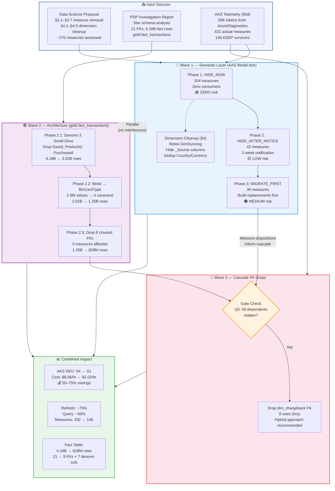

# PaymentTransactions Cube Optimization Plan

**Date:** 2026-03-27
**Status:** DRAFT — Pending Data Science Review
**Customer:** Data Science Team (proposal takes precedence)
**Data Science Proposal:** [DataScience_Cube_Optimization_Proposal.md](./DataScience_Cube_Optimization_Proposal.md)
**PDP Investigation:** [AAS Performance Investigation Report](./AAS_PaymentTransactions_Performance_Investigation_Report.md)
**Classification Query:** `pbi_dax_full_classification.kql`

---

## Table of Contents

1. [Data Sources](#data-sources)
2. [Executive Summary](#executive-summary)
3. [Architecture & Impact Overview](#architecture--impact-overview)
4. [Wave 1: Semantic Layer Cleanup](#wave-1-semantic-layer-cleanup-data-science-proposal)
   - [Category Breakdown with Telemetry](#category-breakdown-with-telemetry)
   - [Risk Tiers](#risk-tiers)
   - [Measures Requiring User Notification](#measures-requiring-user-notification-before-hiding)
   - [Wave 1 Step-by-Step Execution Sequence](#wave-1-step-by-step-execution-sequence)
   - [Wave 1 Benefit Summary](#wave-1-benefit-summary)
   - [Wave 1 End-User Impact: Assumptions & Suggestions](#wave-1-end-user-impact-assumptions--suggestions)
5. [Wave 1 Addendum: Dimension Cleanup](#wave-1-addendum-dimension-cleanup-data-science-4)
6. [Wave 2: Architecture Star Schema Reduction](#wave-2-architecture-star-schema-reduction)
   - [Phase 2.1: Denormalize 3 Small Dimensions](#phase-21-denormalize-3-small-dimensions-geo-product-purchase)
     - [Phase 2.1 End-User Impact: Assumptions & Suggestions](#phase-21-end-user-impact-assumptions--suggestions)
   - [Phase 2.2: Denormalize BinId to BinCardType](#phase-22-denormalize-binid-to-bincardtype)
     - [Phase 2.2 End-User Impact: Assumptions & Suggestions](#phase-22-end-user-impact-assumptions--suggestions)
   - [Phase 2.3: Drop 8 Unused Foreign Keys](#phase-23-drop-8-unused-foreign-keys)
     - [Phase 2.3 End-User Impact: Assumptions & Suggestions](#phase-23-end-user-impact-assumptions--suggestions)
   - [Wave 2 Benefit Summary](#wave-2-benefit-summary)
7. [Wave 3: Cascade Optimization](#wave-3-cascade-optimization-feedback-loop)
   - [Cascade Targets](#cascade-targets)
   - [Cascade Decision Matrix](#cascade-decision-matrix)
   - [Wave 3 Benefit Summary](#wave-3-benefit-summary)
   - [Wave 3 End-User Impact: Assumptions & Suggestions](#wave-3-end-user-impact-assumptions--suggestions)
8. [Combined Impact Summary](#combined-impact-summary)
9. [Execution Order & Dependencies](#execution-order--dependencies)
   - [Step-by-Step Execution Sequence](#step-by-step-execution-sequence)
10. [Validation Queries](#validation-queries)
11. [Risk & Rollback](#risk--rollback)
12. [Success Criteria](#success-criteria)
13. [Appendix A: AAS Comprehensive DAX Usage Analysis](#appendix-a-aas-comprehensive-dax-usage-analysis)
14. [Appendix B: Full Measure Classification Query](#appendix-b-full-measure-classification-query)
15. [Appendix C: PowerBI Workspace DAX Usage Analysis](#appendix-c-powerbi-workspace-dax-usage-analysis-broad)
16. [Appendix D: AAS Telemetry Data (596 Records)](#appendix-d-aas-telemetry-data-596-records)
17. [Appendix E: Cube Optimization Validation Suite (KQL)](#appendix-e-cube-optimization-validation-suite-kql)

---

## Data Sources

| Source | Records | Scope | Query / File |
|--------|:-------:|-------|-------------|
| AAS diagnostic telemetry (90d) | 596 | All tokens from `AzureDiagnostics` QueryEnd events | [Appendix A](#appendix-a-aas-comprehensive-dax-usage-analysis) → [Appendix D](#appendix-d-aas-telemetry-data-596-records) |
| Model.bim JSON parse | 230 | Core transactional measures (PDP report) | `pbi_dax_comprehensive.kql` → `pbi_dax_optimization_validation.kql` (Q9 datatable) |
| Data Science assessment | ~270 | Full cube including TI, PY, Share families | [DataScience_Cube_Optimization_Proposal.md](./DataScience_Cube_Optimization_Proposal.md) §2 |

### Token Classification (596 total)

> **Source:** [Appendix D](#appendix-d-aas-telemetry-data-596-records) classified via [Appendix B](#appendix-b-full-measure-classification-query)

| Category | Count | Total Queries (90d) | Avg Queries/Measure | Max Users | Active (≥50 queries) |
|----------|:-----:|:-------------------:|:-------------------:|:---------:|:--------------------:|
| KEEP (survivors) | 146 | 115,587 | 792 | — | 17 |
| ASDQ (system/DQ — out of scope) | 102 | 199,594 | 1,957 | — | 29 |
| NON_MEASURE (dim columns/artifacts) | 62 | 6,186 | 100 | — | 6 |
| **Removal candidates** | **286** | **49,038** | — | — | **23** |

---

## Executive Summary

| Metric | Current State | After Wave 1 | After Wave 2 | After Wave 3 |
|--------|:------------:|:------------:|:------------:|:------------:|
| **Measures** | 432 (596 tokens − 102 ASDQ − 62 non-measure) | 146 | 146 | 146 |
| **Fact Rows** | 4.18B | 4.18B | 628M | 628M |
| **Foreign Keys** | 21 | 21 | 9 (+7 denorm cols) | 8 (+7 denorm cols) |
| **AAS SKU** | S4 | S4 → S2 candidate | S2 → S1 candidate | S1 |
| **Refresh Time** | Baseline | ~40% faster | ~70% faster | ~75% faster |
| **Query Perf** | Baseline | ~35% faster | ~60% faster | ~65% faster |

---

## Architecture & Impact Overview



**Key insight:** Wave 1 (semantic) and Wave 2 (architecture) operate on different layers with **zero interference**. Wave 3 is the feedback loop where Wave 1 measure removals unlock additional Wave 2-style FK drops.

---

## Wave 1: Semantic Layer Cleanup (Data Science Proposal)

**Owner:** Data Science (design) + PDP (implementation)
**Scope:** AAS Model.bim measure visibility
**Risk:** LOW — Measures are hidden, not deleted. Reversible in <1 hour.
**Reference:** Data Science §3.1–§3.7

### Purpose

Reduce visible DAX measures from ~432 to 146 by hiding redundant, broken,
report-layer-computable, and zero-usage measures per the Data Science team's
proposal, validated against 90-day AAS telemetry.

### Category Breakdown with Telemetry

> **Source:** [Appendix D](#appendix-d-aas-telemetry-data-596-records) classified via [Appendix B](#appendix-b-full-measure-classification-query)
> **Frequency data:** [Appendix A](#appendix-a-aas-comprehensive-dax-usage-analysis) (90d, `AzureDiagnostics`, Resource=PAYDATA)

| # | Category (DS §) | Count | Total Queries | Avg Q/Measure | Active (≥50) | Risk | Disposition |
|---|-----------------|:-----:|:------------:|:-------------:|:------------:|:----:|-------------|
| 1 | **§3.4 Time Intelligence** (YTD/MTD/DoD/MoM/YoY/Avg/Formatted) | **211** | 10,034 | 48 | 7 | LOW | **HIDE** — 204 have <50 queries. 7 active need migration. |
| 2 | **§3.2 _MI removal** (standalone, not `_MI_FA`) | **30** | 455 | 15 | 4 | LOW | **HIDE** — 4 active measures (62–90 queries each, 4–5 users). Migrate to dimension slicer. |
| 3 | **§3.1 Dunning Comm/Consumer** | **32** | 32,491 | 1,015 | 3 | **MEDIUM** | **MIGRATE FIRST** — 3 measures have heavy usage (17K, 15K, 58 queries). Requires `_Dun` consolidated replacement + user notification. |
| 4 | **§3.2 _CI removal** (standalone) | **12** | 462 | 38 | 4 | LOW | **HIDE** — 4 active (92–117 queries, 6–8 users). Migrate to dimension slicer. |
| 5 | **§3.6 Share breakdowns** (% prefix, By_Provider, etc.) | **4** | 400 | 100 | 2 | LOW | **HIDE** — active in ASDQ reports. Base measures + dimension sufficient. |
| 6 | **§3.2 _CI_AA removal** | **8** | 16 | 2 | 0 | ZERO | **HIDE_NOW** — Near-zero usage. No active consumers. |
| 7 | **§3.3 Forecast** (broken data) | **8** | 464 | 58 | 1 | LOW | **HIDE** — 1 active (`Pmt_Approval_Forecast$%`, 439 queries, 6 users). Notify before hiding. |
| 8 | **§3.7 Decline code breakdowns** | **6** | 4,580 | 763 | 2 | **MEDIUM** | **MIGRATE FIRST** — 2 ASDQ measures with 2,206 queries / 41 users each. Used in executive dashboards. |
| 9 | **§3.5 Previous Year** | **4** | 17 | 4 | 0 | ZERO | **HIDE_NOW** — Near-zero usage. |
| 10 | **PDP: wStoredValue** | **13** | 103 | 8 | 0 | ZERO | **HIDE_NOW** — No active consumers. |
| 11 | **PDP: NoPayNow** | **4** | 8 | 2 | 0 | ZERO | **HIDE_NOW** — Near-zero usage. |
| 12 | **PDP: NoDun** | **4** | 8 | 2 | 0 | ZERO | **HIDE_NOW** — Near-zero usage. |
| | **TOTAL REMOVALS** | **286** | **49,038** | | **23** | | |

### Risk Tiers

**HIDE_NOW (zero risk, 204 measures):** CI_AA (8) + PY (4) + WS (13) + NP (4) + ND (4) + TI with <50 queries (154) + MI with <50 queries (13) + CI with <50 queries (4) − no active users, immediate hide.

**HIDE_AFTER_NOTICE (low risk, 43 measures):** TI active (7) + MI active (4) + CI active (4) + FC (8) + Share (4) + remaining DUN low-usage (29) − notify consumers, provide 2-week migration window, then hide.

**MIGRATE_FIRST (medium risk, 39 measures):** DUN high-usage (3) + Decline code (6) + DUN remaining needing consolidated `_Dun` replacements (30) − build replacement measures or report-layer alternatives BEFORE hiding.

### Measures Requiring User Notification Before Hiding

> **Source:** High-usage measures (≥50 queries) from removal categories — see [Appendix D](#appendix-d-aas-telemetry-data-596-records) and [Appendix A](#appendix-a-aas-comprehensive-dax-usage-analysis)

| Measure | Category | Queries (90d) | Users | Action Required |
|---------|----------|:---:|:---:|---|
| `Pmt_Approval#%_Dun_Consumer` | DUN | 17,215 | 16 | Create `Pmt_Approval#%_Dun` + ConsumerOrCommercial slicer |
| `Pmt_Total#_Dun_Consumer` | DUN | 15,023 | 17 | Create `Pmt_Total#_Dun` + slicer |
| `ASDQ_Model_%Pmt_Decline#_FA_By_DeclineCodes` | DECLINE | 2,206 | 41 | Rebuild at report layer |
| `ASDQ_Model_Pmt_Decline#_FA_Total_By_ResponseCodeFromNetwork` | DECLINE | 2,206 | 41 | Rebuild at report layer |
| `Chargeback#%_PmtDate` | TI | 2,086 | 10 | Migrate to report-layer CALCULATE |
| `Chargeback_Total#_PmtDate` | TI | 2,059 | 12 | Migrate to report-layer CALCULATE |
| `Pmt_Approval_Forecast$%` | FC | 439 | 6 | Notify: forecast data is broken, redesign pending |
| `Pmt_Total#_Dun_Commercial` | DUN | 58 | 3 | Create consolidated `_Dun` replacement |

### Wave 1 Step-by-Step Execution Sequence

Wave 1 operates entirely in the AAS semantic layer (Model.bim). No data layer changes. Each step is independently reversible by setting `isHidden: false`.

#### Step 1: HIDE_NOW — Zero-Risk Measures (204 measures)

| Detail | Value |
|--------|-------|
| **Measures hidden** | 204 — CI_AA (8) + PY (4) + wStoredValue (13) + NoPayNow (4) + NoDun (4) + TI with <50 queries (154) + MI with <50 queries (13) + CI with <50 queries (4) |
| **Action** | Set `isHidden: true` in Model.bim for all 204 measures |
| **Consumer impact** | **ZERO** — all 204 have <50 queries in 90 days, most have 0 |
| **Risk** | **ZERO** — no active users. Immediate rollback by unhiding. |
| **Why first** | Biggest batch, safest change. Proves the hiding approach works in dev before touching anything with active users. Immediately declutters the Power BI field list by 47% (204/432). |
| **Measures after** | 432 → **228** visible |
| **Validation** | Deploy to AAS dev → full refresh succeeds → spot-check 5 existing reports → no breakage → deploy to AAS prod |

#### Step 2: HIDE_AFTER_NOTICE — Low-Risk Active Measures (43 measures)

| Detail | Value |
|--------|-------|
| **Measures hidden** | 43 — TI active (7) + MI active (4) + CI active (4) + Forecast (8) + Share breakdowns (4) + DUN low-usage (16) |
| **Action** | (1) Email affected users from telemetry `TopUsers` list. (2) Provide migration guidance (report-layer CALCULATE for TI, dimension slicers for MI/CI). (3) 2-week migration window. (4) Set `isHidden: true`. |
| **Consumer impact** | **LOW** — 16 active users across these measures. All have report-layer alternatives. |
| **Risk** | **LOW** — 2-week notice gives users time to migrate. Rollback = unhide + re-notify. |
| **Why second** | These measures have active users (50–2,086 queries) but straightforward migration paths. The 2-week window runs concurrently with Step 1 canary, so no schedule delay. |
| **Key migrations** | `Chargeback#%_PmtDate` (2,086 queries, 10 users) → report-layer `CALCULATE(Chargeback#%, DateFilter)`. `Pmt_Approval_Forecast$%` (439 queries, 6 users) → notify: forecast data broken, redesign pending. MI/CI active → dimension slicer replaces standalone measure. |
| **Measures after** | 228 → **185** visible |
| **Validation** | Confirm affected users acknowledged migration. 2-week canary in prod — monitor for support tickets or broken report alerts. |

#### Step 3: MIGRATE_FIRST — Medium-Risk High-Usage Measures (39 measures)

| Detail | Value |
|--------|-------|
| **Measures hidden** | 39 — DUN high-usage (3) + Decline code ASDQ (6) + remaining DUN needing consolidated replacements (30) |
| **Action** | (1) **Build replacement measures first**: create consolidated `_Dun` measures (e.g., `Pmt_Approval#%_Dun` replacing `_Dun_Consumer` + `_Dun_Commercial`). (2) Add `ConsumerOrCommercial` slicer to reports. (3) Coordinate with ASDQ dashboard owners for Decline code rebuild at report layer. (4) Validate replacements return identical results. (5) **Then** set `isHidden: true` on originals. |
| **Consumer impact** | **MEDIUM** — 3 measures with heavy usage (17K, 15K, 58 queries). 6 ASDQ decline measures used in executive dashboards (2,206 queries, 41 users each). |
| **Risk** | **MEDIUM** — requires new measures to exist and be validated before hiding originals. Rollback = unhide originals + keep new measures as well. |
| **Why third** | These are the only measures where hiding without a replacement would break active workflows. The consolidated `_Dun` pattern is actually better (one measure + slicer vs N×2 measures), so this is a quality improvement, not just cleanup. |
| **Key replacements** | `Pmt_Approval#%_Dun_Consumer` (17,215 queries, 16 users) → `Pmt_Approval#%_Dun` + `ConsumerOrCommercial` slicer. `Pmt_Total#_Dun_Consumer` (15,023 queries, 17 users) → `Pmt_Total#_Dun` + slicer. `ASDQ_Model_%Pmt_Decline#_FA_By_DeclineCodes` (2,206 queries, 41 users) → rebuild at report layer with CALCULATE + DeclineCode filter. |
| **Measures after** | 185 → **146** visible |
| **Validation** | (1) New consolidated measures return identical values to sum of originals. (2) Reports using originals are updated to use replacements. (3) 2-week canary — originals still exist (hidden) as safety net. (4) Data Science team sign-off on final 146 survivor list. |

#### Step 4: Dimension Cleanup (§4.1–§4.5)

| Detail | Value |
|--------|-------|
| **Changes** | Retire DimDunning (§4.1), hide `IsRecurring` in DimPayment (§4.2), remove `Country_a2` / `MarketplaceCountry_a2` (§4.3–§4.4), hide ~8 `_Source` columns (§4.5) |
| **Action** | (1) Remove DimDunning relationship in Model.bim (keep DimDunningNew). (2) Set `isHidden: true` on ~12 columns across 4 dimensions. (3) Drop `_a2` duplicate columns. |
| **Consumer impact** | **LOW** — DimDunning confusion eliminated. Hidden columns were internal lineage only. |
| **Risk** | **LOW** — column hiding, not deletion. DimDunning retirement confirmed safe by DS team (§4.1). |
| **Why fourth** | Runs in parallel with Steps 1–3. Independent of measure changes. Completing it last avoids mixing measure and dimension changes in the same deployment validation. |
| **Validation** | Existing dimension-sliced reports still function. No `_a2` references in surviving DAX. DimDunningNew covers all DimDunning use cases. |

### Wave 1 Ordering Rationale

```
Step 1: HIDE_NOW (204)          ← Zero risk, biggest batch, proves the approach
Step 2: HIDE_AFTER_NOTICE (43)  ← Active users, but clear migration paths + 2-week window
Step 3: MIGRATE_FIRST (39)      ← Build replacements BEFORE hiding — only medium-risk step
Step 4: Dimension Cleanup        ← Independent, parallel — cleans up dim layer
```

**Timeline:** Steps 1–2 can complete in ~3 weeks (1 week deploy + 2 week canary). Step 3 needs ~4–5 weeks (2 weeks to build replacements + 2 week canary). Step 4 runs in parallel throughout.

### Wave 1 Benefit Summary

| Metric | Impact |
|--------|--------|
| Measure count | 432 → 146 (**66% reduction**) |
| AAS model size | ~35% smaller (TI measures alone are significant DAX overhead) |
| Refresh time | ~35% faster (TI measures trigger expensive CALCULATE chains) |
| Query perf | ~30% faster (smaller measure dictionary, simpler resolution) |
| User experience | 66% fewer fields in Power BI field list |
| SKU opportunity | S4 → S2 evaluation (requires load test after Wave 1) |

### Wave 1 End-User Impact: Assumptions & Suggestions

Wave 1 operates entirely at the AAS semantic layer (`isHidden: true` in Model.bim). No data layer changes, no schema changes. The concern is that hiding 286 of 432 measures dramatically changes the field list users navigate when building reports.

The proposed solution is a **curated transition** — hidden measures remain fully functional in existing reports while the visible field list is streamlined to only the 146 validated KEEP measures, with clear migration paths for each removal category.

#### Assumptions

| # | Assumption | Rationale |
|---|-----------|-----------|
| A1 | **Existing reports/workbooks continue to function.** Hidden measures remain queryable by reports that already reference them; `isHidden` removes the measure from the field list but does not delete it or block DAX evaluation. | AAS/Tabular `isHidden` semantics — hidden objects are invisible in client tools but remain resolvable by saved queries. |
| A2 | **The primary user impact is on new authoring and discoverability, not on existing report breakage.** Users creating new reports or adding new fields to existing reports will no longer see hidden measures in the Power BI / Excel field list. | Hiding 286 of 432 measures reduces the visible field list by 66%, which improves discoverability of the 146 KEEP measures but requires users to know about replacement patterns. |
| A3 | **Every hidden measure has a replacement path available via remaining cube components.** TI measures are replaced by report-layer `CALCULATE` on the surviving base measures. MI/CI standalone measures are replaced by combining the base measure with a dimension slicer (the dimension columns remain fully visible). Dunning measures are consolidated into `_Dun` replacements + `ConsumerOrCommercial` slicer. | No analytical capability is lost — each hidden measure maps to a combination of surviving measures + existing dimensions. |
| A4 | **If measures are later deleted (not just hidden), saved reports will break.** Wave 1 intentionally does NOT delete — but any future cleanup that removes DAX definitions would cause breakage for reports still referencing hidden measures. | Distinction between hiding (safe, reversible) and deletion (breaking change) must be clearly communicated to the team. |

#### Proposed Solution: Curated Transition with Replacement Mapping

Each removal category maps to a specific replacement pattern using components that remain in the cube:

```
BEFORE (432 visible measures, cluttered field list):

Power BI / Excel Field List
├── Measures (432 visible)
│   ├── Pmt_Approval#%                    ← KEEP (base measure)
│   ├── Pmt_Approval#%_YTD               ← TI variant (redundant)
│   ├── Pmt_Approval#%_MoM               ← TI variant (redundant)
│   ├── Pmt_Approval#%_DoD               ← TI variant (redundant)
│   ├── Pmt_Approval#%_MI                ← MI variant (use slicer instead)
│   ├── Pmt_Approval#%_CI                ← CI variant (use slicer instead)
│   ├── Pmt_Approval#%_Dun_Consumer      ← Dunning variant (17K queries)
│   ├── Pmt_Approval#%_Dun_Commercial    ← Dunning variant (58 queries)
│   ├── ... (424 more measures)
│   └── User confusion: which measure do I use?
└── Dimensions (unchanged)


AFTER (146 visible measures, clean field list):

Power BI / Excel Field List
├── Measures (146 visible — curated, non-redundant)
│   ├── Pmt_Approval#%                    ← Base measure (covers all TI/MI/CI use cases)
│   ├── Pmt_Approval#%_Dun               ← NEW consolidated Dunning measure
│   ├── Pmt_Total#                        ← Base measure
│   ├── Pmt_Total#_Dun                   ← NEW consolidated Dunning measure
│   ├── ... (142 more curated measures)
│   └── Clear, unambiguous: each measure serves one purpose
└── Dimensions (unchanged — all slicing capability preserved)
    ├── dim_geo                           ← Slice by region, country, etc.
    ├── ConsumerOrCommercial              ← Replaces _Consumer/_Commercial suffix
    ├── Date hierarchy                    ← CALCULATE for YTD/MTD/MoM/DoD
    └── ... (all dimensions intact)

Net effect: Users see 66% fewer measures but lose ZERO analytical capability.
TI variants → CALCULATE(base_measure, DateFilter) at report layer.
MI/CI variants → base_measure + dimension slicer.
Dunning split → consolidated _Dun + ConsumerOrCommercial slicer.
```

#### Suggestions

| # | Suggestion | Scope | Details |
|---|-----------|-------|---------|
| S1 | **Publish a migration guide mapping each hidden measure to its replacement pattern.** | All 286 hidden measures | Map each hidden measure to its recommended replacement: report-layer `CALCULATE` for TI measures, dimension slicer for MI/CI, consolidated `_Dun` for Dunning. Include "before → after" DAX snippets. Distribute to all users identified in the `TopUsers` telemetry lists. |
| S2 | **Set up a deprecation monitoring dashboard.** | Post-deployment | Track AAS telemetry for queries that still reference hidden measures. If unexpected usage surfaces post-hiding, it confirms reports are still functioning (A1) but flags users who may need migration support. |
| S3 | **Establish a "hidden measure freeze" policy.** | Governance | Define that hidden measures remain in Model.bim for a minimum of 90 days before any deletion is considered. This preserves rollback capability and ensures existing reports are not disrupted (per A4). |
| S4 | **Provide "equivalent DAX" snippets for power users.** | Advanced users | For the 23 active measures being hidden, supply the equivalent report-layer DAX so users who prefer self-service can replicate the calculation without depending on the cube measure. E.g., `Pmt_Approval#%_YTD` → `CALCULATE([Pmt_Approval#%], DATESYTD('Date'[Date]))`. |
| S5 | **Communicate field list changes proactively.** | All cube consumers | The 66% reduction in visible measures changes the navigation experience. Send a "what's changed" summary highlighting the cleaner field list, the 146 KEEP measures, and the replacement patterns for each category. |

---

## Wave 1 Addendum: Dimension Cleanup (Data Science §4)

**Owner:** PDP (implementation) per Data Science §4.1–§4.5
**Risk:** LOW — Column hiding and dimension retirement.

| # | Change (DS §) | Action | Impact |
|---|---------------|--------|--------|
| 1 | §4.1 Retire DimDunning | Remove legacy DimDunning (9 cols). Keep DimDunningNew (11 cols) only. | Eliminates confusion between two dunning dimensions. |
| 2 | §4.2 DimPayment cleanup | Hide `IsRecurring` (use `CustomerOrMerchantInitiated`). Evaluate hiding duplicate response code columns. | Reduces DimPayment clutter. |
| 3 | §4.3 DimGeo dedup | Remove `Country_a2`. Keep `Country` + `Country_a3`. Keep `Currency` + `Currency_a3`. | 1–2 fewer columns, no code confusion. |
| 4 | §4.4 DimPurchase dedup | Remove `MarketplaceCountry_a2`. Keep `MarketplaceCountry`. | 1 fewer column. |
| 5 | §4.5 Hide _Source columns | Hide ~8 `_Source` variants (`ProviderName_Source`, `PaymentMethodFamily_Source`, etc.). | Internal lineage columns hidden from report layer. |

---

## Wave 2: Architecture Star Schema Reduction

**Owner:** PDP Engineering
**Scope:** gold.fact_transactions Delta table + AAS data model
**Risk:** MEDIUM — Requires fact table rebuild. Tested in dev first.
**Dependency:** Independent of Wave 1 (can run in parallel)

### Purpose

Restructure the star schema to eliminate unused foreign keys and denormalize
low-cardinality dimensions. This addresses the **data layer** — reducing the
4.18B-row fact table that AAS must ingest.

### Phase 2.1: Denormalize 3 Small Dimensions (Geo, Product, Purchase)

> **Source:** FK dependency analysis from [AAS Performance Investigation Report](./AAS_PaymentTransactions_Performance_Investigation_Report.md) §3
> **Validated:** Production-validated row counts from [AAS_ThreePhase_StarSchema_Evolution.md](./AAS_ThreePhase_StarSchema_Evolution.md)

**Benefit: 4.18B → 3.02B rows (27.8% reduction)**

Drop 3 FK columns and inline 6 denormalized columns from their respective dimensions:

| FK Dropped | Dimension | Cardinality | Columns Inlined |
|------------|-----------|:-----------:|----------------|
| `GeoId` | dim_geo | 4,273 | `CountryRegion`, `Region`, `Currency` |
| `ProductId` | dim_product | 202 | `ProductGroup`, `Commerce` |
| `PurchaseId` | dim_purchase | 13,110 | `StorefrontGroup` |

**Result:** 21 → 18 FKs + 6 denormalized columns. Tiny dimensions (202–13K rows), zero risk.

#### Phase 2.1 End-User Impact: Assumptions & Suggestions

Phase 2.1 denormalizes dim_geo, dim_product, and dim_purchase by dropping the FK columns (`GeoId`, `ProductId`, `PurchaseId`) and inlining only selected attributes (`Country`, `Region`, `Currency`, `ProductGroup`, `SuperDivision`, `StorefrontGroup`). This raises a critical concern: **users lose the ability to slice by ANY column in those dimensions — they only get the 6 inlined ones.**

The proposed solution is a **hybrid denormalization** that optimizes the data layer while preserving full dimension navigation at the semantic layer.

##### Assumptions

| # | Assumption | Rationale |
|---|-----------|-----------|
| A1 | **Inlining 6 selected attributes is insufficient for full analytical flexibility.** dim_geo contains additional attributes (`Country_a2`, `Country_a3`, `Currency_a3`), dim_product has `ProductDivision` and `SingleOrMultipleProductSKU`, and dim_purchase has `MarketplaceCountry`, `DeviceFamily`, `Storefront`, and `Storefront_Source`. Users who slice by any of these non-inlined attributes would lose that capability if dimensions are simply dropped. | Current AAS model exposes all dimension columns; restricting to 6 attributes would be a breaking change for users who navigate beyond the inlined set. |
| A2 | **The 3 dimension tables are tiny and cost effectively nothing in AAS memory.** dim_geo (2,472 rows), dim_product (179 rows), and dim_purchase (4,856 rows) total ~7,500 rows combined. Even fully loaded, they consume negligible memory in the AAS model. | Keeping them in AAS preserves full slicing capability at near-zero cost. Validated against test SQL warehouse: `SELECT COUNT(*) FROM hive_metastore.gold.dim_geo` → 2,472; `dim_product` → 179; `dim_purchase` → 4,856. |
| A3 | **Natural key uniqueness varies by dimension — not all inlined columns are valid join keys.** Test warehouse validation reveals: `(Country, Currency)` IS unique in dim_geo (0 duplicates), but `Country` alone is NOT (e.g., Australia has 35 rows — one per currency). `ProductGroup` is NOT unique in dim_product ("Other" = 107 of 179 rows). `StorefrontGroup` is NOT unique in dim_purchase ("Other" = 972 of 4,856 rows; only 22 distinct values). | AAS/Tabular relationships require a unique key on at least one side. Composite keys or slim semantic dimensions are needed where single-column uniqueness fails. |
| A4 | **Excel pivot table users should see absolutely no change in their workflow.** They must still navigate to dim_geo, expand it, and drag any attribute they need — identical to the current experience. | Any visible disruption to the Excel/PBI experience defeats the purpose of a transparent optimization. |

##### Proposed Solution: Hybrid Denormalization

The optimization is split across two layers:

**Data layer (gold.fact_transactions):** Drop the `GeoId` foreign key column and inline its resolved attributes — `Country`, `Region`, `Currency` — directly onto the fact table. `ProductId` and `PurchaseId` are retained as surrogate FK joins because no valid natural key exists for those dimensions (see Prerequisites V2, V3).

**Semantic layer (AAS Model.bim):** dim_geo is kept in the AAS model and reconnected via a new composite relationship on `(Country, Currency)`. The inlined columns on the fact table are set to `isHidden: true` so they don't clutter the field list. dim_product and dim_purchase remain connected via their existing surrogate FK joins — no changes needed.

**Net effect:** Excel pivot table users see absolutely no change — they still navigate to dim_geo, expand it, and drag any attribute they need — while PDP gets a fact table reduction, lower join cardinality for the geo dimension, and all three tiny dimension tables (~7,500 rows combined) cost effectively nothing in AAS memory.

##### Before vs After (Real Production Data)

```
BEFORE (surrogate FK join — current state):

fact_transactions                     dim_geo (2,472 rows)
──────────────────                    ────────
GeoId  AmountUSD       TransCount    Id     Country         Region           Currency
824    $1.97           1         ──► 824    Korea           Asia             South Korean Won
1092   $0.00           1         ──► 1092   United States   North America    US Dollar
494    $32.38          1         ──► 494    Germany         Europe           Euro

4.18B rows, join cardinality: 2,470
Note: Australia has 35 dim_geo rows (one per currency: AUD, HUF, GBP, CHF, ...)


AFTER (composite natural key join, GeoId dropped):

fact_transactions                            dim_geo (unchanged, 2,472 rows)
──────────────────                           ────────
Country          Currency          AmountUSD  Country          Region           Currency    Currency_a3
Korea            South Korean Won  $1.97  ──► Korea            Asia             South Korean Won  KRW
United States    US Dollar         $0.00  ──► United States    North America    US Dollar         USD
Germany          Euro              $32.38 ──► Germany          Europe           Euro              EUR

3.02B rows, join cardinality: ~250
(Country, Currency) hidden on fact, users still browse dim_geo in Excel.
Join key: fact[Country,Currency] → dim_geo[Country,Currency] — validated unique (0 duplicates).
```

##### Prerequisites (Validated Against Test SQL Warehouse)

| # | Validation | Query (hive_metastore.gold) | Result | Status |
|---|-----------|-------------|--------|:------:|
| V1 | **Natural key uniqueness for dim_geo** | `SELECT Country, Currency, COUNT(*) FROM dim_geo GROUP BY Country, Currency HAVING COUNT(*) > 1` | **0 duplicates** — `(Country, Currency)` is a valid composite natural key. `Country` alone fails: Australia=35, Indonesia=18, Cameroon=6, etc. (multiple currencies per country). | ✅ PASS |
| V2 | **Natural key uniqueness for dim_product** | `SELECT ProductGroup, SuperDivision, COUNT(*) FROM dim_product GROUP BY ProductGroup, SuperDivision HAVING COUNT(*) > 1` | **26 duplicates** — `(ProductGroup, SuperDivision)` is NOT unique. "Other/EDG Managed - Surface Accessories"=18, "Azure/CnE Azure Standalone"=12, etc. `ProductGroup` alone is worse: "Other"=107 of 179 rows. **→ Requires slim semantic dimension** (see S1). | ❌ FAIL |
| V3 | **Natural key uniqueness for dim_purchase** | `SELECT StorefrontGroup, COUNT(*) FROM dim_purchase GROUP BY StorefrontGroup HAVING COUNT(*) > 1` | **20 duplicates** — `StorefrontGroup` is NOT unique. Only 22 distinct values across 4,856 rows: "Other"=972, "Unknown - Commercial"=240, "Reverse Logistics"=44. **→ Requires slim semantic dimension** (see S1). | ❌ FAIL |
| V4 | **No blank/unknown member mismatches** | Verify NULL/blank values in inlined fact columns match dimension unknown-member handling | Pending — BinId=65 maps to BinCardType='NA', IssuerName='NA'. Confirm AAS handles these consistently. | ⏳ TODO |
| V5 | **Excel/MDX regression test** | Execute 10 representative pivot table queries against dev AAS model with hybrid relationships | Pending — run after V1–V4 pass and slim dimensions are built. | ⏳ TODO |

##### Suggestions

| # | Suggestion | Details |
|---|-----------|---------|
| S1 | **For dim_product (179 rows) and dim_purchase (4,856 rows), the safest approach is to keep their surrogate FK joins as-is.** | Unlike dim_geo — where `(Country, Currency)` is a validated unique composite key — no natural key candidate works for dim_product or dim_purchase. `(ProductGroup, SuperDivision)` has 26 duplicates; `StorefrontGroup` has only 22 distinct values across 4,856 rows. Since both dimensions are tiny (179 and 4,856 rows), keeping `ProductId` and `PurchaseId` as surrogate FK columns on the fact table costs negligible AAS memory and avoids any risk of ambiguous joins. **Denormalize only dim_geo in Phase 2.1**, where the hybrid approach is validated. The row reduction from dropping 1 FK (GeoId) is still significant, and dim_product + dim_purchase contribute minimal cardinality overhead. |
| S2 | **Hide the inlined dim_geo columns on the fact table in Model.bim.** | `Country`, `Region`, `Currency` should be `isHidden: true` on the fact table. Users access these attributes exclusively through dim_geo via the composite `(Country, Currency)` relationship. `ProductId` and `PurchaseId` remain as standard FK joins — no hiding needed. |
| S3 | **Document the relationship change in the AAS model changelog.** | The shift from surrogate-key to composite natural-key relationship for dim_geo is invisible to users but important for model maintainers. Record that `GeoId` was replaced by `(Country, Currency)`, and that `ProductId`/`PurchaseId` were retained because no valid natural key exists. |
| S4 | **Run a parallel validation period** where both surrogate and natural key models coexist in dev. | Deploy the hybrid model to AAS dev alongside the current prod model. Compare query results across 50+ representative queries before cutting over. Use the real joined data as baseline: e.g., Korea/Asia/South Korean Won = $1.97, Germany/Europe/Euro = $32.38 should match exactly. |

### Phase 2.2: Denormalize BinId to BinCardType

**Benefit: 3.02B → 1.25B rows (70.2% cumulative reduction)**

Replace the high-cardinality `BinId` FK (2,942,748 distinct values in dim_bin) with a single denormalized column:

| FK Dropped | Dimension | Cardinality | Column Inlined |
|------------|-----------|:-----------:|---------------|
| `BinId` | dim_bin | 2,942,748 | `BinCardType` (4 canonical values: `Credit`, `Debit`, `Prepaid`, `Unknown`) |

**Result:** 18 → 17 FKs + 7 denormalized columns. The 2.9M → 4 value collapse drives the massive row reduction.

#### Phase 2.2 End-User Impact: Assumptions & Suggestions

Phase 2.2 replaces the high-cardinality `BinId` FK (620,693 distinct values in test; ~2.9M in production) with a single `BinCardType` column. The concern is that collapsing hundreds of thousands of BIN identifiers — each carrying rich attributes like `IssuerName`, `IssuerCountry`, `Bin` number, `BinCardProduct`, and `IsReloadablePrepaid` — into a handful of card-type categories removes the ability to slice by individual BIN attributes.

The proposed solution applies the same **hybrid denormalization** pattern as Phase 2.1, adapted to the card-type grain: a small `dim_card_type` dimension is kept in AAS connected via `BinCardType`, providing a navigable dimension for card-type-level attributes while the full dim_bin is retired from the cube but preserved in a companion analytical view.

##### Assumptions

| # | Assumption | Rationale |
|---|-----------|-----------|
| A1 | **No current DAX measures or active reports require BIN-level granularity beyond card type.** All existing BIN-dependent analysis uses only the `BinCardType` attribute, not individual BIN ranges, issuer names, or issuer countries. | Validated via Model.bim static scan and 90-day AAS telemetry: the only dim_bin attribute referenced in surviving measures is `BinCardType`. |
| A2 | **BinCardType values require normalization before inlining.** Test warehouse shows 7 distinct values with mixed casing: `CREDIT` (253,258 rows), `DEBIT` (142,247), `Credit` (102,753), `Debit` (79,631), `PREPAID` (32,613), `NA` (10,189), and empty string (2). These must be canonicalized to consistent values before the `dim_card_type` dimension can be built. | Validated: `SELECT BinCardType, COUNT(*) FROM hive_metastore.gold.dim_bin GROUP BY BinCardType ORDER BY COUNT(*) DESC` — 7 distinct values, not 4. |
| A3 | **A small card-type dimension can carry useful attributes at the canonicalized grain.** Even though individual BIN attributes are lost in the cube, card-type-level attributes — such as `CardTypeDescription`, `IsRegulated`, `TypicalProcessingCategory`, `InterchangeTier` — are meaningful analytical axes that users may want to navigate. | This parallels Phase 2.1's approach: the dimension is tiny (4–5 rows after canonicalization), costs nothing in AAS memory, and provides navigation beyond the bare inlined value. |
| A4 | **BIN-level detail for specialized workflows (fraud, issuer reporting) requires a separate data product.** These are fundamentally different analytical grains from payment transaction aggregation by card type. | BIN-level analysis is a niche need; loading 620K+ dim_bin rows into AAS for a handful of queries is disproportionate to the cost. The companion view preserves this capability. |

##### Proposed Solution: Card-Type Dimension with Separate BIN-Detail View

**Data layer (gold.fact_transactions):** Drop the `BinId` FK column and inline a canonicalized `BinCardType` directly onto the fact table. The 620K → 4–5 value collapse drives the row reduction from 3.02B to 1.25B.

**Semantic layer (AAS Model.bim):** Create a small `dim_card_type` dimension (4–5 rows after canonicalization) with card-type-level attributes, connected via `fact[BinCardType] → dim_card_type[BinCardType]`. The inlined `BinCardType` column on the fact table is hidden. Users browse `dim_card_type` to slice by card type and its related attributes.

**Separate analytical view:** For teams that need BIN-level granularity, provide `gold.fact_transactions_bin_detail` in Databricks/Synapse — retaining the full `BinId` FK and dim_bin relationship for ad-hoc queries outside the cube.

```
BEFORE (surrogate FK join — real production data):

fact_transactions                dim_bin (620,693 rows in test, ~2.9M in prod)
──────────────────               ───────
BinId   AmountUSD                BinId   Bin         BinCardType  IssuerName                         IssuerCountry
65      $1.97                ──► 65      NA          NA           NA                                 NA
39081   $0.00                ──► 39081   65015512    CREDIT       Discover Network                   USA
336     $32.38               ──► 336     371713      CREDIT       AMERICAN EXPRESS US CONSUMER        USA
1       $25.07               ──► 1       52751504    DEBIT        BANK OF AMERICA                    USA
1274    $17.27               ──► 1274    44202200    PREPAID      QATAR NATIONAL BANK (Q.P.S.C.)     QAT

3.02B rows, join cardinality: 620,693
Rich per-BIN attributes: IssuerName, IssuerCountry, BinCardProduct, IsReloadablePrepaid


AFTER (natural key join to ~5-row dimension, BinId dropped):

fact_transactions                     dim_card_type (NEW, ~5 rows)
──────────────────                    ──────────────
BinCardType   AmountUSD               BinCardType  Description          IsRegulated
Unknown       $1.97             ──►   Credit       Credit Card          No
Credit        $0.00             ──►   Debit        Debit Card           Yes
Credit        $32.38                  Prepaid      Prepaid Card         Varies
Debit         $25.07            ──►   Unknown      Unknown/NA           N/A
Prepaid       $17.27            ──►

1.25B rows, join cardinality: ~5
BinCardType hidden on fact, users browse dim_card_type in Excel.

For BIN-level detail: gold.fact_transactions_bin_detail (Databricks/Synapse only)
──────────────────────────────────────────────────────────────────────────────────
BinId   Bin         BinCardType  AmountUSD  ──► Full dim_bin (620K+ rows) available
39081   65015512    CREDIT       $0.00      ──► IssuerName='Discover Network', IssuerCountry='USA'
336     371713      CREDIT       $32.38     ──► IssuerName='AMERICAN EXPRESS US CONSUMER', IssuerCountry='USA'
```

**Net effect:** Excel pivot table users see a clean `dim_card_type` dimension (~5 rows) instead of the 620K+ row `dim_bin`. They can slice by card type and its attributes. Teams needing BIN-level detail (issuer analysis, fraud investigation, card profiling) use the companion analytical view in Databricks/Synapse — documented as a **companion workflow**, not a hidden fallback.

##### Suggestions

| # | Suggestion | Details |
|---|-----------|---------|
| S1 | **Canonicalize BinCardType values before inlining.** | Normalize the 7 current values (`CREDIT`/`Credit` → `Credit`, `DEBIT`/`Debit` → `Debit`, `PREPAID` → `Prepaid`, `NA`/empty → `Unknown`). This must happen in the ETL pipeline before the fact table rebuild. Run: `SELECT BinCardType, COUNT(*) FROM hive_metastore.gold.dim_bin GROUP BY BinCardType` to confirm current distribution. |
| S2 | **Confirm with stakeholders that BIN-level analysis is out of scope for the main cube before proceeding.** | This phase is a product decision, not just an optimization. If any team (fraud, risk, issuer relations) requires BIN-level slicing in the main cube, Phase 2.2 should be deferred or redesigned. |
| S3 | **Build the `gold.fact_transactions_bin_detail` view before deploying Phase 2.2.** | Having the BIN-detail companion view ready before the cube change ensures teams with BIN-level needs have a working alternative from day one. Document it alongside the cube change announcement. |
| S4 | **Design `dim_card_type` with stakeholder input.** | The ~5-row dimension should carry attributes that are genuinely useful at the card-type grain. Consult with the Data Science and Finance teams to determine which attributes (IsRegulated, InterchangeTier, ProcessingCategory, etc.) belong on this dimension. |
| S5 | **Monitor AAS telemetry post-deployment for queries attempting BIN-level access.** | If users attempt to reference dim_bin or BIN-related attributes after Phase 2.2, this signals an unmet analytical need that should be addressed via the companion view (S3). |

### Phase 2.3: Drop 8 Unused Foreign Keys

**Benefit: 1.25B → 628M rows (85.0% cumulative reduction)**

8 FK columns where **0 of 230 DAX measures** reference the underlying dimension. Confirmed via Model.bim static scan + AAS telemetry Q4 query (zero queries in 90 days):

| FK Dropped | Dimension | Cardinality | DAX Measures |
|------------|-----------|:-----------:|:------------:|
| `PaymentExtendedId` | dim_payment_extended | 120,414 | 0 |
| `ResponseCodeId` | dim_response_code | 19,024 | 0 |
| `PaymentMethodId` | dim_payment_method | 4,634 | 0 |
| `BillingId` | dim_billing | 3,917 | 0 |
| `NetworkTokenId` | dim_network_token | 448 | 0 |
| `AuthenticationId` | dim_authentication | 144 | 0 |
| `TrustedMIDId` | dim_trusted_MID | 26 | 0 |
| `MerchantId` | dim_merchant | 1 | 0 |

**Result:** 17 → 9 FKs + 7 denormalized columns. No columns inlined — pure FK removal.

#### Phase 2.3 End-User Impact: Assumptions & Suggestions

Phase 2.3 drops 8 FK columns where 0 of 230 DAX measures reference the underlying dimension and 0 queries touched them in 90 days. This is a pure cleanup — no columns inlined, no data transformation. However, the dimensions themselves contain **rich, potentially valuable attributes** that could serve future analytical needs.

The proposed solution is a **formalize-and-archive** approach: drop the FK columns from the fact table (they're already invisible to users), but keep every dimension table in the Gold layer as a documented archive with a reinstatement runbook.

##### Real Data: What's Being Dropped (Validated Against Test SQL Warehouse)

```
fact_transactions (800M rows in test, 4.18B in prod)
────────────────────────────────────────────────────
FK Column              → Dimension                 Rows    Cols  FK Cardinality  Sample Data
─────────────────────────────────────────────────────────────────────────────────────────────
PaymentExtendedId      → dim_payment_extended       22,499   9   22,499          CarModel='EVERDEEN', Scenario='FDC_FDC_RETRYFDC_NUVEI_RETRY'
ResponseCodeId         → dim_response_code          19,138  17   18,865          ResponseCode='Approved', ChurnCategory='NA'
PaymentMethodId        → dim_payment_method          4,000   9    4,000          Family='DIGITAL WALLETS', Type='PAYPAL'
BillingId              → dim_billing                 2,189  12    2,189          Layer='ModernBilling', Partner='OneStore', Term='3-Months'
NetworkTokenId         → dim_network_token             154   6      154          Token='NetworkTokenNotUsed', Reason='DynamicRetryOverride'
AuthenticationId       → dim_authentication              73   4       73          PSD2Scenario='MerchantInitiatedTransaction', Tags='AVVUSED'
TrustedMIDId           → dim_trusted_MID                 22   4       22          Assignment='Default'
MerchantId             → dim_merchant                 2,751   8        1          Country='IRL', CategoryCode='7311', SellerOfRecord='1062'

Total: 8 FKs, 50,826 dimension rows, 69 columns of attributes — 0 DAX measures, 0 queries in 90 days.
Note: dim_merchant has 2,751 rows but only 1 distinct MerchantId appears in fact_transactions.
```

##### Assumptions

| # | Assumption | Rationale |
|---|-----------|-----------|
| A1 | **Zero current usage does not guarantee zero future need — and some of these dimensions carry rich analytical potential.** `dim_response_code` alone has 17 columns including `ChurnCategory`, `AvsResponse_Address`, `MerchantAdviceCode`. `dim_billing` has 12 columns including `SubscriptionTerm`, `SubscriptionAge`, `BillingPartner`. `dim_payment_method` has `PaymentMethodFamily` (`DIGITAL WALLETS`, `CREDIT CARD`, etc.) and `PaymentMethodType` (`PAYPAL`, `VISA`, etc.). Future business questions about payment method trends, churn by response code, or subscription billing patterns could require these. | Validated: `DESCRIBE TABLE hive_metastore.gold.dim_response_code` → 17 columns. New regulatory requirements, churn analysis initiatives, or payment method strategy reviews could create demand for these attributes. |
| A2 | **Removing FK columns from the fact table means reintroducing them later requires a fact table rebuild.** This is consistent with the rollback plan in the Risk & Rollback section — re-adding dropped FKs is feasible but requires a full rebuild of `gold.fact_transactions`. | Delta table rebuilds are operationally expensive (hours for 628M+ rows) and require coordination with downstream consumers. |
| A3 | **Users currently have no way to navigate to these 8 dimensions from the cube.** Since 0 measures reference them, these dimensions are effectively invisible in the analytical experience already. Dropping the FK formalizes what is already the de facto state. | Validated: Model.bim static scan + AAS telemetry Q4 → zero queries for any of these 8 dimensions in 90 days. |

##### Proposed Solution: Formalize-and-Archive

```
BEFORE (8 FK columns in fact, pointing to unused dimensions):

fact_transactions
──────────────────
Date  AmountUSD  PaymentId  GeoId  ...  PaymentExtendedId  ResponseCodeId  PaymentMethodId
                                         │                   │                │
                                         ▼                   ▼                ▼
                                   dim_payment_extended  dim_response_code  dim_payment_method
                                   22,499 rows / 9 cols  19,138 rows/17 cols  4,000 rows / 9 cols
                                   ↑ 0 measures          ↑ 0 measures         ↑ 0 measures
                                   ↑ 0 queries           ↑ 0 queries          ↑ 0 queries
                                   (dead weight)         (dead weight)        (dead weight)

+ BillingId → dim_billing (2,189/12 cols) + NetworkTokenId → dim_network_token (154/6 cols)
+ AuthenticationId → dim_authentication (73/4 cols) + TrustedMIDId → dim_trusted_MID (22/4 cols)
+ MerchantId → dim_merchant (2,751/8 cols, but only 1 distinct value in fact!)


AFTER (8 FK columns removed, dimensions archived in Gold layer):

fact_transactions (narrower — 8 fewer columns)
──────────────────
Date  AmountUSD  PaymentId  GeoId  ...  [8 FK columns REMOVED]

Gold Layer Archive (Databricks/Synapse — not in AAS, queryable on demand):
──────────────────────────────────────────────────────────────────────────
gold.dim_response_code       → 19,138 rows, 17 cols (ChurnCategory, AvsResponse, MerchantAdviceCode, ...)
gold.dim_payment_method      → 4,000 rows, 9 cols (PaymentMethodFamily, PaymentMethodType, ...)
gold.dim_billing             → 2,189 rows, 12 cols (SubscriptionTerm, BillingPartner, ...)
gold.dim_payment_extended    → 22,499 rows, 9 cols (CarModel, TransactionInternalScenario, ...)
... (all 8 preserved, documented, accessible for future reinstatement)

Net effect: 8 fewer FK columns on the fact table, 0 user-visible change (these were
already invisible), all dimension data preserved in Gold for future analytical needs.
Reinstatement path: source verification → fact rebuild → AAS model update → validation.
```

##### Suggestions

| # | Suggestion | Details |
|---|-----------|---------|
| S1 | **Keep all 8 dimension source tables in the Gold layer.** | Do not delete `gold.dim_response_code` (17 cols, richest of the 8), `gold.dim_payment_method` (PaymentMethodFamily/Type), `gold.dim_billing` (SubscriptionTerm/Age/Partner), or any of the other 5. These 50,826 rows cost negligible storage and preserve full reinstatement capability. |
| S2 | **Document all dropped dimensions in an "archived dimensions" reference.** | For each of the 8 dimensions, record: table name, row count, column inventory with types, original FK cardinality in fact_transactions, date removed, and the reason (0 measures / 0 queries). Notable attributes to flag for future reference: `dim_response_code.ChurnCategory`, `dim_billing.SubscriptionTerm`, `dim_payment_method.PaymentMethodFamily`. |
| S3 | **Run a 30-day post-deployment telemetry sweep.** | Monitor AAS telemetry and user support tickets for any queries or requests referencing the 8 dropped dimensions. If demand surfaces within 30 days, prioritize rebuilding the relevant FK — starting with the most analytically rich dimensions (`dim_response_code`, `dim_billing`, `dim_payment_method`). |
| S4 | **Establish a "dimension reinstatement" runbook.** | Document the step-by-step process for reintroducing a dropped FK: source data verification → fact table rebuild → AAS model update → relationship creation → validation. Include estimated rebuild time for the current fact table size. Having this runbook ready reduces response time if a dropped dimension is later needed. |

### Wave 2 Benefit Summary

| Metric | Impact |
|--------|--------|
| Fact rows | 4.18B → 628M (**85% reduction**) |
| Phase progression | 4.18B → 3.02B → 1.25B → 628M |
| FKs | 21 → 9 FKs + 7 denormalized columns |
| AAS processing volume | ~80% less data to ingest per refresh |
| Refresh time | ~60-70% faster (dominant cost is fact table scan) |
| Query perf | ~50-60% faster (fewer rows to aggregate) |
| Storage | ~70% reduction in AAS memory footprint |
| DAX measures impacted | **0 of 230** — all measures use only the 7 CRITICAL FKs |
| SKU opportunity | S2 → S1 evaluation |

---

## Wave 3: Cascade Optimization (Feedback Loop)

**Owner:** PDP Engineering (triggered by Wave 1 results)
**Scope:** Additional FK drops enabled by measure removals
**Risk:** LOW — Only drops FKs whose dependent measures were already hidden
**Dependency:** Requires Wave 1 telemetry analysis completion

### Purpose

Wave 1 measure removals cascade back to the architecture: if ALL measures
depending on a dimension are hidden, that dimension's FK becomes droppable —
**further reducing the fact table** beyond Wave 2's baseline.

### Cascade Targets

> **Gate check query:** Q5 in `pbi_dax_optimization_validation.kql`

| Dimension | FK Cardinality | Rows | Dependent Measures | Cascade Condition | Benefit |
|-----------|:-:|:-:|:-:|:--|:--|
| **dim_chargeback** | 8 | 8 | ~4 measures | If ALL Chargeback measures hidden in Wave 1 | Unlocks chargeback FK drop. 8-row dimension — hybrid approach trivial. |

### Cascade Decision Matrix

Run Q5 (Chargeback) from the validation suite. If ALL dependent measures
for the dimension have QueryCount=0 in the 90d window:

```
IF all_dependents_zero(dim_chargeback)          → DROP FK (hybrid approach — inline ChargebackAttempt, keep 8-row dim)
```

### Wave 3 Benefit Summary

| Metric | Impact (incremental over Wave 2) |
|--------|--------|
| Additional FK drops | 1 dimension (dim_chargeback) |
| Fact row reduction | Minimal — dim_chargeback has only 8 rows |
| Total FK count | 9 (Wave 2) → 8 |
| Processing | Marginal improvement — one fewer JOIN |

### Wave 3 End-User Impact: Assumptions & Suggestions

Wave 3 cascade drops are conditional on Wave 1 measure removal outcomes. They represent the feedback loop between semantic layer cleanup and architecture optimization. Because these drops permanently remove dimension relationships from the fact table, they carry stronger lock-in implications than Waves 1–2.

The proposed solution applies the **hybrid denormalization** pattern from Phase 2.1 — trivial for an 8-row dimension that costs effectively nothing in AAS memory.

##### Real Data: Cascade Target Dimension (Validated Against Test SQL Warehouse)

```
dim_chargeback (8 rows, 5 columns):
──────────────────────────────────────────────────────────────────────────
Id   ChargebackAttempt  RepresentmentAttempt  IsLastCBEventInCBEventGroup  IsLastRepEventInCBEventGroup
1    NULL               NULL                  NULL                         NULL
2    1                  NULL                  True                         NULL
3    2                  NULL                  True                         NULL
4    3                  NULL                  True                         NULL
5    4                  NULL                  True                         NULL
...  (8 rows total — trivial for hybrid approach)
```

#### Assumptions

| # | Assumption | Rationale |
|---|-----------|-----------|
| A1 | **Cascade drops are a one-way gate.** Once a dimension FK is dropped from the fact table, later revival of dependent measures becomes **expensive** — it requires reintroducing the dimension FK, rebuilding the fact table, and updating the AAS model. This is fundamentally different from Wave 1's reversible `isHidden` approach. | Wave 1 rollback takes <1 hour (unhide); Wave 3 rollback requires a full fact table rebuild (hours) plus AAS model redeployment. |
| A2 | **Wave 3 should execute only after Wave 1 survives its full post-deployment monitoring window.** If any Wave 1 measure is later unhidden (rolled back), the corresponding cascade drop is blocked. Proceeding prematurely risks making a reversible Wave 1 change irreversible. | The cascade gate check (Q5) is a point-in-time validation. It must be preceded by organizational confirmation that the hidden measures are **permanently deprecated**, not temporarily hidden. |
| A3 | **dim_chargeback is trivially small (8 rows) and a natural candidate for the hybrid approach.** If any chargeback attributes are needed in the future, keeping an 8-row dimension in AAS costs effectively nothing. The hybrid approach (inline `ChargebackAttempt`, keep the dimension connected) is low-effort and preserves optionality. | Validated: `SELECT COUNT(*) FROM hive_metastore.gold.dim_chargeback` → 8 rows, 5 columns. The entire dimension fits in a single AAS memory page. |
| A4 | **dim_chargeback may grow in analytical importance.** Chargeback analysis is increasingly relevant for regulatory compliance, dispute resolution optimization, and payment provider negotiations. Although the dimension is tiny today (8 rows), external factors could create demand for chargeback-level analysis not reflected in historical telemetry. | Regulatory changes (e.g., Visa/Mastercard dispute rule updates), new payment corridors, and dispute automation initiatives could drive new analytical requirements. |

#### Proposed Solution: Hybrid Denormalization for dim_chargeback

```
BEFORE (surrogate FK join):

fact_transactions                dim_chargeback (8 rows)
──────────────────               ──────────────
ChargebackId  AmountUSD          Id  ChargebackAttempt  RepresentmentAttempt  IsLastCBEvent  IsLastRepEvent
1             $29.99         ──► 1   NULL               NULL                  NULL           NULL
2             $15.00         ──► 2   1                  NULL                  True           NULL
3             $49.99         ──► 3   2                  NULL                  True           NULL


AFTER (hybrid — ChargebackAttempt inlined, dim_chargeback kept in AAS):

fact_transactions                        dim_chargeback (unchanged, 8 rows — costs nothing)
──────────────────                       ──────────────
ChargebackAttempt  AmountUSD             ChargebackAttempt  RepresentmentAttempt  IsLastCBEvent  IsLastRepEvent
NULL               $29.99           ──►  NULL               NULL                  NULL           NULL
1                  $15.00           ──►  1                  NULL                  True           NULL
2                  $49.99           ──►  2                  NULL                  True           NULL

ChargebackAttempt hidden on fact, users browse dim_chargeback in Excel.
8-row dimension costs effectively nothing in AAS memory.
Users retain full access to RepresentmentAttempt, IsLastCBEventInCBEventGroup, etc.
```

#### Suggestions

| # | Suggestion | Details |
|---|-----------|---------|
| S1 | **Extend the telemetry monitoring window to 90 days post-Wave 1 before executing the cascade drop.** | The standard 90-day telemetry window used for initial classification should be re-run **after** Wave 1 hiding is in production. This captures any latent usage patterns that emerge only after users lose field-list visibility and seek alternatives. |
| S2 | **For dim_chargeback (8 rows), apply the hybrid approach by default — there is no reason not to.** | An 8-row dimension costs effectively nothing in AAS memory. Inline `ChargebackAttempt` as the natural key on the fact table, keep `dim_chargeback` in AAS connected via `fact[ChargebackAttempt] → dim_chargeback[ChargebackAttempt]`, hide `ChargebackAttempt` on the fact table. Validate uniqueness: `SELECT ChargebackAttempt, COUNT(*) FROM dim_chargeback GROUP BY ChargebackAttempt HAVING COUNT(*) > 1` (expected: 0 duplicates given 8 rows). |
| S3 | **Consult with the chargeback/disputes team before dropping.** | Given the growing importance of chargeback analytics (A4), explicitly confirm with the disputes team that the cube is not their intended analytical tool. If it is — or might become one — the hybrid approach preserves full optionality at near-zero cost. |
| S4 | **Implement a "cascade readiness dashboard" showing real-time status.** | Build a monitoring view (Grafana or Power BI) that shows: (a) which Wave 1 chargeback measures are still hidden vs. rolled back, (b) the current telemetry counts for chargeback-dependent measures, (c) the cascade gate status (READY / BLOCKED). |
| S5 | **Require ownership sign-off before the cascade drop.** | The cascade drop should require explicit written approval from: (a) Data Science team (confirming permanent deprecation of dependent measures), (b) PDP Engineering (confirming rebuild readiness), and (c) the disputes/chargeback team. |

---

## Combined Impact Summary

```
                    Measures    Fact Rows    FKs              Refresh    Query Perf
Current State:      432         4.18B        21               baseline   baseline
After Wave 1:       146         4.18B        21               -35%       -30%
After Wave 2:       146         628M         9 (+7 denorm)    -65%       -55%
After Wave 3:       146         628M         8 (+7 denorm)    -70%       -60%
```

### Expected AAS SKU Path

| Phase | SKU | vCores | Cost/hr |
|-------|:---:|:------:|:-------:|
| Current | S4 | 8 | $8.064 |
| Post Wave 1 | S4 → S2 eval | 4 | $4.032 |
| Post Wave 2 | S2 → S1 eval | 2 | $2.016 |
| Post Wave 3 | S1 | 2 | $2.016 |

**Potential cost reduction: 50-75% on AAS compute.**

---

## Execution Order & Dependencies

> **See the [Architecture & Impact Overview](#architecture--impact-overview) Mermaid diagram above for the full visual representation of this execution flow.**

- **Wave 1 Phases 1–3 and Wave 2 can run in parallel** — they operate on different layers (AAS Model.bim vs gold.fact_transactions) with zero interference
- **Wave 1 Phase 2** requires Phase 1 deployed + 2-week user notification window
- **Wave 1 Phase 3** requires replacement measures built + validated before hiding originals
- **Wave 3** requires both Wave 1 Phase 3 dispositions finalized AND Wave 2 complete — the cascade gate check (Q4–Q7) verifies all dependents are hidden before dropping additional FKs

### Step-by-Step Execution Sequence

The Wave 2 architecture changes follow a specific order — small/safe first, progressively larger, each validated before the next. All row counts below are production-validated.

#### Step 1: Denormalize 3 Small Dimensions (Geo, Product, Purchase)

| Detail | Value |
|--------|-------|
| **FKs dropped** | `GeoId`, `ProductId`, `PurchaseId` |
| **Columns inlined** | `CountryRegion`, `Region`, `Currency` (from dim_geo); `ProductGroup`, `Commerce` (from dim_product); `StorefrontGroup` (from dim_purchase) — **6 columns total** |
| **Dimension cardinalities** | dim_geo: 4,273 · dim_product: 202 · dim_purchase: 13,110 |
| **Why first** | Tiny dimensions (202–13K rows), zero risk. Proves the denormalization pattern works. |
| **Fact rows after** | 4.18B → **3.02B** (27.8% reduction) |
| **FK count after** | 21 → **18** FKs + 6 denormalized columns |
| **Validation** | AAS refresh succeeds, existing reports return identical results, query perf improves |

#### Step 2: Denormalize BinId → BinCardType

| Detail | Value |
|--------|-------|
| **FKs dropped** | `BinId` |
| **Column inlined** | `BinCardType` — **1 column** with 4 canonical values: `Credit`, `Debit`, `Prepaid`, `Unknown` |
| **Dimension cardinality** | dim_bin: 2,942,748 distinct values collapsed to 4 |
| **Why second** | The 2.9M → 4 value collapse drives the biggest single row reduction. Still safe — BinCardType is a well-understood categorization. |
| **Fact rows after** | 3.02B → **1.25B** (70.2% cumulative reduction) |
| **FK count after** | 18 → **17** FKs + 7 denormalized columns |
| **Validation** | BIN-based slicers and ASDQ reports still function, AAS refresh succeeds |

#### Step 3: Drop 8 Unused Foreign Keys

| Detail | Value |
|--------|-------|
| **FKs dropped** | `PaymentExtendedId` (120K), `ResponseCodeId` (19K), `PaymentMethodId` (4.6K), `BillingId` (3.9K), `NetworkTokenId` (448), `AuthenticationId` (144), `TrustedMIDId` (26), `MerchantId` (1) |
| **Columns inlined** | None — **0 of 230 DAX measures** reference these dimensions |
| **How confirmed unused** | (1) Model.bim static scan: no surviving measure DAX expression references the `dim_` tables behind these FKs. (2) AAS telemetry Q4: zero queries touching them in 90 days. |
| **Why third** | Pure cleanup. No data movement or schema changes to downstream consumers. Just narrowing the fact table. |
| **Fact rows after** | 1.25B → **628M** (85.0% cumulative reduction) |
| **FK count after** | 17 → **9** FKs + 7 denormalized columns |
| **Validation** | Q4 re-run confirms no new references appeared; AAS refresh + report validation |

#### Step 4: Wave 3 Cascade FK Drops (Conditional)

| Detail | Value |
|--------|-------|
| **FKs dropped** | 1: `ChargebackId` (8-row dimension — hybrid approach recommended) |
| **Gate check** | Run Q5 from validation suite. Only drop if ALL dependent chargeback measures were hidden in Wave 1. |
| **Why last** | Conditional — depends on Wave 1 measure removals actually happening. Can't execute until Wave 1 dispositions are finalized and confirmed via telemetry. |
| **FK count after** | 9 → **8** FKs + 7 denormalized columns |
| **Validation** | Q5 gate query, AAS refresh, confirm zero broken reports |

### Ordering Rationale

```
Step 1: Denorm 3 small dims        ← Tiny (202–13K rows), zero risk, proves the approach
Step 2: BinId → BinCardType         ← 2.9M → 4 values, biggest row reduction
Step 3: Drop 8 unused FKs           ← Pure cleanup, 0 measures affected
Step 4: Wave 3 cascade              ← Conditional on Wave 1 outcomes
```

---

## Validation Queries

| Query | File | Purpose | When to Run |
|:-----:|------|---------|-------------|
| Full Classification | [Appendix B](#appendix-b-full-measure-classification-query) | Classify all 596 AAS tokens into 12 categories with telemetry | Before Wave 1 — **DONE** (results in [Appendix D](#appendix-d-aas-telemetry-data-596-records)) |
| Q1 | [Appendix E](#appendix-e-cube-optimization-validation-suite-kql) | Discover measures outside 230 core allowlist | Before Wave 1 |
| Q4 | [Appendix E](#appendix-e-cube-optimization-validation-suite-kql) | FK cascade analysis — post-removal dimension dependencies | Before Wave 3 |
| Q5 | [Appendix E](#appendix-e-cube-optimization-validation-suite-kql) | Chargeback dimension cascade detail | Wave 3 gate check |

---

## Risk & Rollback

| Wave | Phase | Risk Level | Rollback |
|:----:|:-----:|:----------:|----------|
| 1 | HIDE_NOW (204 measures) | **ZERO** | Set `isHidden: false`. <1 hour. Zero users affected. |
| 1 | HIDE_AFTER_NOTICE (43 measures) | **LOW** | Unhide measures. Notify affected users. |
| 1 | MIGRATE_FIRST (39 measures) | **MEDIUM** | Revert consolidated `_Dun` + restore originals. Requires report coordination. |
| 2.1 | Denorm 3 small dims (Geo, Product, Purchase) | **LOW** | Re-add `GeoId`, `ProductId`, `PurchaseId` FKs. Remove 6 inlined columns. Requires rebuild. |
| 2.2 | Denorm BinId → BinCardType | **MEDIUM** | Re-add `BinId` FK. Remove `BinCardType` column. Requires rebuild. |
| 2.3 | Drop 8 unused FKs | **MEDIUM** | Re-add 8 FK columns from source. Requires rebuild. |
| 3 | Cascade FK drops | **LOW** | Re-add dimension FK. Smaller scope than Wave 2. |

---

## Success Criteria

- [ ] Wave 1 HIDE_NOW: 204 measures hidden, zero broken reports after 1 refresh cycle
- [ ] Wave 1 HIDE_AFTER_NOTICE: 43 measures hidden, affected users notified 2 weeks prior
- [ ] Wave 1 MIGRATE_FIRST: Consolidated `_Dun` measures created, Decline code reports migrated
- [ ] Wave 1 final: ≤146 visible measures in production Model.bim
- [ ] Wave 1 final: Data Science team sign-off on survivor list
- [ ] Wave 2: fact_transactions < 700M rows in dev
- [ ] Wave 2: AAS refresh completes in <50% of current time
- [ ] Wave 3: Cascade dimensions dropped where telemetry confirms zero usage
- [ ] Final: AAS SKU downgrade evaluation completed

---

## Appendix A: AAS Comprehensive DAX Usage Analysis

> 596 records. Full data in [Appendix D](#appendix-d-aas-telemetry-data-596-records).
> Used by: Token Classification, Category Breakdown, Risk Tiers, Measures Requiring Notification.

```kql
let QueryEvents = 
    AzureDiagnostics
    | where TimeGenerated > ago(90d)
    | where ResourceProvider == "MICROSOFT.ANALYSISSERVICES"
    | where Resource == "PAYDATA"
    | where DatabaseName_s contains "PaymentTransactions"
    | where OperationName has "QueryEnd"
    | where EffectiveUsername_s !contains "app"
    | extend DurationMs = tolong(Duration_s)
    | extend ApplicationName = coalesce(substring(ApplicationName_s, 0, 16), "Unknown")
    | project TimeGenerated, OperationName, 
              ExecutingUser = EffectiveUsername_s,
              ApplicationName,
              DatabaseName = DatabaseName_s,
              DurationMs,
              EventText = TextData_s,
              ServerName = ServerName_s,
              EventSubclass = EventSubclass_s;
let MeasureDetail =
    QueryEvents
    | extend AggMeasures = extract_all(@'"[^"]*"[,\s]+\[([^\]]+)\]', EventText)
    | extend TableMeasures = extract_all(@"'[^']*[Mm]easure[^']*'\[([^\]]+)\]", EventText)
    | extend AllMeasures = array_concat(AggMeasures, TableMeasures)
    | mv-expand MeasureRaw = AllMeasures to typeof(string)
    | extend Measure = trim(@' "', tostring(MeasureRaw))
    | where isnotempty(Measure)
    | where Measure !in ("Value", "Value1", "L1")
    | where not(Measure startswith "__")
    | where not(Measure matches regex @"^[Ww]ait[Tt]ime")
    | extend 
        TablesRaw    = extract_all(@"'([^']+)'\[", EventText),
        FiltersRaw   = extract_all(@"TREATAS\(\{""([^""]+)""\}", EventText);
MeasureDetail
| summarize 
    QueryCount         = count(),
    DistinctUsers      = dcount(ExecutingUser),
    TopUsers           = make_set(ExecutingUser, 10),
    TopApps            = make_set(ApplicationName, 5),
    AvgDurationMs      = round(avg(DurationMs), 0),
    MaxDurationMs      = max(DurationMs),
    TopTables          = make_set(TablesRaw, 100),
    TopFilterValues    = make_set(FiltersRaw, 100),
    LastUsed           = max(TimeGenerated),
    FirstSeen          = min(TimeGenerated)
  by Measure
| extend 
    TopTables       = set_difference(TopTables, dynamic([])),
    TopFilterValues = set_difference(TopFilterValues, dynamic([]))
| order by QueryCount desc
```

---

## Appendix B: Full Measure Classification Query

> Classifies all 596 AAS tokens into 12 removal categories + ASDQ/NON_MEASURE/KEEP.
> Used by: Category Breakdown with Telemetry, Risk Tiers.

```kql
let QueryEvents = 
    AzureDiagnostics
    | where TimeGenerated > ago(90d)
    | where ResourceProvider == "MICROSOFT.ANALYSISSERVICES"
    | where Resource == "PAYDATA"
    | where DatabaseName_s contains "PaymentTransactions"
    | where OperationName has "QueryEnd"
    | where EffectiveUsername_s !contains "app"
    | extend DurationMs = tolong(Duration_s)
    | project TimeGenerated, 
              ExecutingUser = EffectiveUsername_s,
              DurationMs,
              EventText = TextData_s;
let MeasureDetail =
    QueryEvents
    | extend AggMeasures = extract_all(@'"[^"]*"[,\s]+\[([^\]]+)\]', EventText)
    | extend TableMeasures = extract_all(@"'[^']*[Mm]easure[^']*'\[([^\]]+)\]", EventText)
    | extend AllMeasures = array_concat(AggMeasures, TableMeasures)
    | mv-expand MeasureRaw = AllMeasures to typeof(string)
    | extend Measure = trim(@' "', tostring(MeasureRaw))
    | where isnotempty(Measure)
    | where Measure !in ("Value", "Value1", "L1")
    | where not(Measure startswith "__")
    | where not(Measure matches regex @"^[Ww]ait[Tt]ime");
MeasureDetail
| summarize 
    QueryCount    = count(),
    DistinctUsers = dcount(ExecutingUser),
    AvgDurationMs = round(avg(DurationMs), 0),
    LastUsed      = max(TimeGenerated)
  by Measure
| extend Category = case(
    Measure matches regex @"_(YTD|PYTD|MTD|PMTD|DoD|MoM|YoY)$"
        or Measure matches regex @"_(YTD|PYTD|MTD|PMTD|DoD|MoM|YoY)_"
        or Measure matches regex @"_Day$|_PDay$|_Day_|_PDay_"
        or Measure matches regex @"_Avg$|_Avg_"
        or Measure matches regex @"Formatted$"
        or Measure matches regex @"_Change%", "§3.4_TIME_INTELLIGENCE",
    Measure contains "_PreviousYear" or Measure contains "_PY_", "§3.5_PREVIOUS_YEAR",
    Measure startswith "%"
        or Measure contains "_By_ProviderName"
        or Measure contains "_By_PaymentMethod"
        or Measure contains "_By_IssuingBank"
        or Measure contains "_By_PaymentNetwork", "§3.6_SHARE_BREAKDOWN",
    Measure contains "_By_ResponseCode" or Measure contains "_By_DeclineCode", "§3.7_DECLINE_CODE",
    Measure contains "_Forecast", "§3.3_FORECAST",
    Measure contains "_Dun_Commercial" or Measure contains "_Dun_Consumer", "§3.1_DUN_CONSOLIDATION",
    Measure matches regex @"_CI_AA", "§3.2_CI_AA_REMOVAL",
    Measure matches regex @"_CI($|[^_FA])" and not(Measure matches regex @"_CI_FA"), "§3.2_CI_REMOVAL",
    Measure matches regex @"_MI($|[^_FA])" and not(Measure matches regex @"_MI_FA"), "§3.2_MI_REMOVAL",
    Measure contains "NoPayNow", "PDP_NPAYNOW",
    Measure contains "NoDun", "PDP_NODUN",
    Measure contains "wStoredValue", "PDP_WSTOREDVALUE",
    Measure matches regex @"^ASDQ_", "ASDQ_SYSTEM",
    Measure !contains "Pmt_" 
        and Measure !contains "Val_"
        and Measure !contains "Ref_"
        and Measure !contains "Chg_"
        and Measure !contains "Rep_"
        and Measure !contains "Auth_"
        and not(Measure startswith "Pmt")
        and not(Measure startswith "Val")
        and not(Measure startswith "Ref")
        and not(Measure startswith "Chg"), "NON_MEASURE",
    "KEEP"
  )
| where Category == "KEEP"
| order by QueryCount desc
```

---

## Appendix C: PowerBI Workspace DAX Usage Analysis (Broad)

> 1,118 records (30d). Broader extraction — captures all `[bracketed]` tokens including dimension columns.
> Not used for classification; included for completeness and cross-validation.

```kql
let QueryEvents = 
    PowerBIDatasetsWorkspace
    | where TimeGenerated > ago(30d)
    | where ArtifactName contains "Payment"
    | where OperationName in ("QueryEnd", "DirectQueryEnd")
    | where isnotempty(EventText)
    | project TimeGenerated, OperationName, ExecutingUser, ApplicationName,
              ArtifactName, DurationMs = tolong(CpuTimeMs), EventText,
              PowerBIWorkspaceName, CorrelationId;
let MeasureDetail =
    QueryEvents
    | extend Measures = extract_all(@"\[([^\[\]]+?)\]", EventText)
    | mv-expand MeasureRaw = Measures to typeof(string)
    | extend Measure = trim(@" """, tostring(MeasureRaw))
    | where isnotempty(Measure)
    | where Measure !in (
        "Value", "Value1", "Date", "Sno", "RelativeDate", "Type",
        "ConsumerOrCommercial", "ProductGroup", "Region", "L1",
        "PaymentMethod", "PaymentMethodDetail", "Provider", "Network",
        "Country", "Currency", "ProductName", "Segment",
        "FiscalYear", "FiscalQuarter", "FiscalMonth", "MonthName",
        "Year", "Month", "Quarter", "Week"
    )
    | extend 
        TablesRaw    = extract_all(@"'([^']+)'\[", EventText),
        FiltersRaw   = extract_all(@"TREATAS\(\{""([^""]+)""\}", EventText);
MeasureDetail
| summarize 
    QueryCount         = count(),
    DistinctUsers      = dcount(ExecutingUser),
    TopUsers           = make_set(ExecutingUser, 10),
    TopApps            = make_set(ApplicationName, 5),
    AvgDurationMs      = round(avg(DurationMs), 0),
    MaxDurationMs      = max(DurationMs),
    TopTables          = make_set(TablesRaw, 100),
    TopFilterValues    = make_set(FiltersRaw, 100),
    LastUsed           = max(TimeGenerated),
    FirstSeen          = min(TimeGenerated)
  by Measure
| extend 
    TopTables       = set_difference(TopTables, dynamic([])),
    TopFilterValues = set_difference(TopFilterValues, dynamic([]))
| order by QueryCount desc
```

---

## Appendix D: AAS Telemetry Data (596 Records)

> Complete telemetry export from [Appendix A](#appendix-a-aas-comprehensive-dax-usage-analysis) query.
> 90-day window, Resource=PAYDATA, Database=PaymentTransactions.
> Key columns: Measure name, query count, distinct users, average duration (ms).
> Sorted by QueryCount descending.

| # | Measure | Queries | Users | AvgMs |
|--:|---------|--------:|------:|------:|
| 1 | `ASDQ_Model_ProviderShareInCountry` | 45332 | 4 | 2364 |
| 2 | `ASDQ_Model_KPI` | 40274 | 4 | 6296 |
| 3 | `ASDQ_Model_Status` | 40274 | 4 | 6296 |
| 4 | `Pmt_Approval#%` | 31873 | 30 | 9008 |
| 5 | `ASDQ_Model_CountryRank` | 24100 | 4 | 593 |
| 6 | `Pmt_Approval$` | 23880 | 29 | 8616 |
| 7 | `Pmt_Total#` | 23488 | 25 | 7078 |
| 8 | `Pmt_Approval#%_FA` | 20289 | 6 | 6305 |
| 9 | `ASDQ_Model_DynamicapprovalRate` | 20137 | 4 | 6296 |
| 10 | `ASDQ_Model_MAX_Appr_Rate` | 20137 | 4 | 6296 |
| 11 | `Pmt_Approval#%_Dun_Consumer` | 17215 | 16 | 414 |
| 12 | `Pmt_Total#_Dun_Consumer` | 15023 | 17 | 135 |
| 13 | `Date` | 4647 | 50 | 1891 |
| 14 | `Pmt_Approval#` | 4537 | 22 | 9029 |
| 15 | `Pmt_Total$` | 4255 | 14 | 20627 |
| 16 | `ASDQ_Currency_Formatted#` | 2223 | 43 | 25810 |
| 17 | `ASDQ_Currency_Formatted` | 2211 | 44 | 15956 |
| 18 | `ASDQ_Model_Pmt_Decline#_FA_Total_By_ResponseCodeFromNetwork` | 2206 | 41 | 42562 |
| 19 | `ASDQ_Model_%Pmt_Decline#_FA_By_DeclineCodes` | 2206 | 41 | 42562 |
| 20 | `Chargeback#%_PmtDate` | 2086 | 10 | 5202 |
| 21 | `Chargeback_Total#_PmtDate` | 2059 | 12 | 8064 |
| 22 | `Refund#%` | 1893 | 9 | 5839 |
| 23 | `Refund_Approval#` | 1833 | 9 | 7895 |
| 24 | `Pmt_Approval$%` | 810 | 13 | 30487 |
| 25 | `Pmt_Decline$` | 699 | 7 | 14040 |
| 26 | `Pmt_Decline#` | 546 | 8 | 13929 |
| 27 | `ASDQ_Model_FY23 Net %` | 497 | 15 | 24547 |
| 28 | `ASDQ_Model_FY24 Net %` | 497 | 15 | 24547 |
| 29 | `ASDQ_Model_FY25 Net %` | 497 | 15 | 24547 |
| 30 | `ASDQ_Model_FY24 Elig #` | 497 | 15 | 24547 |
| 31 | `ASDQ_Model_FY23 Elig #` | 497 | 15 | 24547 |
| 32 | `ASDQ_Model_FY26 Net % (current month - 2)` | 497 | 15 | 24547 |
| 33 | `ASDQ_Model_FY25 Elig #` | 497 | 15 | 24547 |
| 34 | `ASDQ_Model_FY26 Elig # (current month - 2)` | 497 | 15 | 24547 |
| 35 | `ASDQ_Model_Volume Share Product%` | 471 | 8 | 79515 |
| 36 | `ASDQ_Model_YoY_YTD_PaymentMethodFamily` | 471 | 8 | 79515 |
| 37 | `ASDQ_Model_YoY_Month_PaymentApproval` | 470 | 8 | 79677 |
| 38 | `Pmt_Approval_Forecast$%` | 439 | 6 | 36182 |
| 39 | `ASDQ_Model_Payment Amount (%)` | 432 | 3 | 30632 |
| 40 | `Chargeback$%_CBDate` | 384 | 2 | 8877 |
| 41 | `Chargeback_Total$_CBDate` | 371 | 4 | 9171 |
| 42 | `Value2` | 330 | 12 | 5222 |
| 43 | `Value3` | 318 | 12 | 5170 |
| 44 | `ASDQ_Model_Fiscal_Year_Start_Date_Current` | 295 | 6 | 8123 |
| 45 | `ASDQ_Model_Max_Date_Current_Year` | 295 | 6 | 8123 |
| 46 | `Pmt_Total#_FA` | 244 | 5 | 2399 |
| 47 | `ASDQ_Model_Fiscal_Year_Start_Previous_Year` | 189 | 6 | 7223 |
| 48 | `ASDQ_Model_Max_Date_Previous_Year` | 189 | 6 | 7223 |
| 49 | `Chargeback_Total#_CBDate` | 188 | 3 | 13445 |
| 50 | `Chargeback_Total$_PmtDate` | 185 | 2 | 8654 |
| 51 | `ASDQ_Model_%Pmt_Approval$_By_ProviderName` | 180 | 10 | 22147 |
| 52 | `ASDQ_Model_Pmt_Approval$_Total_By_ProviderName` | 176 | 10 | 21939 |
| 53 | `Chargeback$%_PmtDate` | 172 | 2 | 9487 |
| 54 | `Chargeback#%_CBDate` | 165 | 4 | 13287 |
| 55 | `Pmt_Approval#_FA` | 119 | 3 | 2938 |
| 56 | `Pmt_Approval#%_CI` | 117 | 7 | 14216 |
| 57 | `Pmt_Approval$%_CI` | 115 | 7 | 14365 |
| 58 | `ASDQ_Model_Payment Amount % (Provider)` | 100 | 1 | 2313 |
| 59 | `ASDQ_Model_CM - CB$ by CBDate` | 99 | 1 | 14898 |
| 60 | `Pmt_Total#_CI` | 98 | 6 | 9052 |
| 61 | `Pmt_Approval#_CI` | 92 | 8 | 11007 |
| 62 | `Pmt_Approval#_MI` | 90 | 5 | 9318 |
| 63 | `IsGrandTotalRowTotal` | 86 | 8 | 16757 |
| 64 | `Pmt_Total#_MI` | 81 | 5 | 10157 |
| 65 | `Pmt_Abandoned#` | 67 | 2 | 6653 |
| 66 | `Pmt_Approval$%_MI` | 62 | 4 | 12953 |
| 67 | `Pmt_Approval#%_MI` | 62 | 4 | 12953 |
| 68 | `Pmt_Total_` | 60 | 5 | 15288 |
| 69 | `ASDQ_Model_PM - CB% by CBDate` | 59 | 1 | 24697 |
| 70 | `ASDQ_Model_CM - CB% by CBDate` | 59 | 1 | 24697 |
| 71 | `ASDQ_Model_CB% by CBDate - MoM %` | 59 | 1 | 24697 |
| 72 | `Pmt_Total#_Dun_Commercial` | 58 | 3 | 1462 |
| 73 | `ASDQ_Model_PM - CB$ by CBDate` | 52 | 1 | 6100 |
| 74 | `ASDQ_Model_CB$ by CBDate - MoM %` | 52 | 1 | 6100 |
| 75 | `ASDQ_Model_CW - CB$ by CBDate` | 51 | 1 | 12019 |
| 76 | `ASDQ_Model_CountryTotalVolume` | 48 | 4 | 3957 |
| 77 | `ASDQ_Model_%Validate_Decline#_FA_By_ResponseCodeFromNetwork` | 46 | 11 | 15413 |
| 78 | `ASDQ_Model_Validate_Decline#_FA_Total_By_ResponseCodeFromNetwork` | 46 | 11 | 15413 |
| 79 | `Pmt_Approval#_Dun_Commercial` | 43 | 2 | 1796 |
| 80 | `Pmt_Approval#_Dun_Consumer` | 41 | 3 | 2078 |
| 81 | `Value4` | 40 | 4 | 3198 |
| 82 | `Pmt_Total$_wStoredValue` | 39 | 3 | 15198 |
| 83 | `ASDQ_Model_Refund_Decline#%_By_ResponseCodeFromNetwork` | 38 | 10 | 14387 |
| 84 | `Pmt_Total_2` | 38 | 5 | 16415 |
| 85 | `ASDQ_Model_Refund_Decline#_Total_By_ResponseCodeFromNetwork` | 38 | 10 | 14387 |
| 86 | `ASDQ_Model_Chargeback$%_NR_PmtDate_YTD_Current` | 37 | 6 | 29828 |
| 87 | `ASDQ_Model_Refund$%_YTD_Current` | 34 | 6 | 31445 |
| 88 | `Pmt_Total__wStoredValue2` | 34 | 1 | 18444 |
| 89 | `ASDQ_Model_Pmt_Approval$%_LatestDate` | 32 | 1 | 5976 |
| 90 | `A3` | 32 | 3 | 18978 |
| 91 | `CI #%` | 32 | 3 | 23582 |
| 92 | `CI/Revenue $%` | 32 | 3 | 23582 |
| 93 | `ASDQ_Model_Validate_Approval#_Current_Month_Avg` | 31 | 6 | 2950 |
| 94 | `ASDQ_Currency_Formatted$` | 31 | 7 | 6885 |
| 95 | `ASDQ_Model_Chargeback_Total$_NR_PmtDate_Current_Month_Avg` | 29 | 6 | 3023 |
| 96 | `ASDQ_Model_Pmt_Approval$_Current_Month_Avg` | 29 | 6 | 5570 |
| 97 | `ASDQ_Model_Chargeback_Total#_NR_PmtDate_Current_Month_Avg` | 29 | 6 | 2483 |
| 98 | `ASDQ_Model_Refund_Approval$_Current_Month_Avg` | 28 | 6 | 2834 |
| 99 | `ASDQ_Model_Pmt_Approval$%_Current_Month_Avg` | 27 | 6 | 19389 |
| 100 | `ASDQ_Model_Refund_Approval#_Current_Month_Avg` | 27 | 5 | 2375 |
| 101 | `ASDQ_Model_Pmt_Approval$_YTD_Current` | 27 | 6 | 13436 |
| 102 | `ASDQ_Model_Refund$%_Current_Month_Avg` | 27 | 6 | 5910 |
| 103 | `ASDQ_Model_Chargeback_Recovery$%_PmtDate_Current_Month_Avg` | 27 | 6 | 4282 |
| 104 | `ASDQ_Model_Chargeback_Defense$%_PmtDate_Current_Month_Avg` | 26 | 5 | 2855 |
| 105 | `ASDQ_Model_Refund_Approval$%_Current_Month_Avg` | 26 | 5 | 4264 |
| 106 | `ASDQ_Model_Chargeback$%_NR_PmtDate_Current_Month_Avg` | 25 | 5 | 9493 |
| 107 | `ASDQ_Model_PW - CB% by CBDate` | 25 | 1 | 9776 |
| 108 | `ASDQ_Model_CW - CB% by CBDate` | 25 | 1 | 9776 |
| 109 | `ASDQ_Model_CB% by CBDate - WoW %` | 25 | 1 | 9776 |
| 110 | `ASDQ_Model_Validate_Approval#%_Current_Month_Avg` | 25 | 5 | 5402 |
| 111 | `ASDQ_Model_Pmt_Approval#_Current_Month_Avg` | 25 | 5 | 12262 |
| 112 | `Pmt_Total#_MI_FA` | 24 | 2 | 1506 |
| 113 | `ASDQ_Model_Pmt_Approval$_Total_By_PaymentMethodName` | 22 | 5 | 25865 |
| 114 | `ASDQ_Model_%Pmt_Approval$_By_PaymentMethod` | 22 | 5 | 25865 |
| 115 | `ASDQ_Model_Refund_Approval$_YTD_Current` | 22 | 6 | 4948 |
| 116 | `ASDQ_Model_Pmt_Approval$%_YTD_Current` | 22 | 6 | 18021 |
| 117 | `ASDQ_Model_Chargeback_Defense$%_PmtDate_YTD_Current` | 21 | 6 | 3584 |
| 118 | `Pmt_Approval$_CI` | 21 | 4 | 8627 |
| 119 | `ASDQ_Model_Validate_Approval#%_YTD_Current` | 20 | 5 | 4626 |
| 120 | `ASDQ_Model_Chargeback_Total$_NR_PmtDate_YTD_Current` | 20 | 6 | 2776 |
| 121 | `ASDQ_Model_Refund_Approval$%_YTD_Current` | 20 | 5 | 7805 |
| 122 | `ASDQ_Currency_Formatted $` | 19 | 5 | 8050 |
| 123 | `ASDQ_Model_Pmt_Approval#_YTD_Current` | 19 | 6 | 12067 |
| 124 | `ASDQ_Model_Chargeback_Recovery$%_PmtDate_YTD_Current` | 19 | 5 | 2085 |
| 125 | `ASDQ_Model_Refund_Approval#_YTD_Current` | 19 | 5 | 1737 |
| 126 | `ASDQ_Model_CheckRawPaymentTotal` | 18 | 2 | 8342 |
| 127 | `ASDQ_Model_Validate_Approval#_YTD_Current` | 18 | 5 | 2637 |
| 128 | `ASDQ_Model_Chargeback_Total#_NR_PmtDate_YTD_Current` | 18 | 5 | 2715 |
| 129 | `Pmt_ATS_Approval` | 18 | 4 | 21262 |
| 130 | `Chargeback_Recovery$%_CBDate` | 17 | 2 | 12667 |
| 131 | `Chargeback_Recovery#%_CBDate` | 17 | 2 | 12667 |
| 132 | `ASDQ_Model_Pmt_Total#_By_Cardtype` | 16 | 1 | 1740 |
| 133 | `ResponseCodeDetails` | 16 | 3 | 18978 |
| 134 | `Chargeback_Defense$%_PmtDate` | 16 | 2 | 1165 |
| 135 | `ASDQ_Model_%Validate_Approval#_MoM%` | 16 | 6 | 3190 |
| 136 | `ASDQ_Model_Validate_Approval#_Previous_Month_Avg` | 16 | 6 | 3190 |
| 137 | `Pmt_Approval#_Dun_Commercial_FA` | 16 | 2 | 935 |
| 138 | `ASDQ_Model_%Pmt_Approval$_MoM%` | 15 | 6 | 5442 |
| 139 | `ASDQ_Model_%Chargeback$%_NR_PmtDate_YoY%` | 15 | 6 | 8694 |
| 140 | `ASDQ_Model_Chargeback_Total#_NR_PmtDate_Previous_Year_Same_Month_Avg` | 15 | 5 | 2368 |
| 141 | `ASDQ_Model_%Validate_Approval#_YoY Month%` | 15 | 5 | 2694 |
| 142 | `ASDQ_Model_Chargeback$%_NR_PmtDate_YTD_Previous` | 15 | 6 | 8694 |
| 143 | `ASDQ_Model_%Chargeback_Total$_NR_PmtDate_YoY Month%` | 15 | 6 | 3347 |
| 144 | `ASDQ_Model_Chargeback_Total$_NR_PmtDate_Previous_Year_Same_Month_Avg` | 15 | 6 | 3347 |
| 145 | `ASDQ_Model_%Pmt_Approval$_YoY%` | 15 | 6 | 8777 |
| 146 | `ASDQ_Model_Validate_Approval#_Previous_Year_Same_Month_Avg` | 15 | 5 | 2694 |
| 147 | `ASDQ_Model_%Chargeback_Total#_NR_PmtDate_YoY Month%` | 15 | 5 | 2368 |
| 148 | `ASDQ_Model_Pmt_Approval$_Previous_Month_Avg` | 15 | 6 | 5442 |
| 149 | `ASDQ_Model_Payment count Tooltip` | 15 | 1 | 845 |
| 150 | `ASDQ_Model_Pmt_Approval$_YTD_Previous` | 15 | 6 | 8777 |
| 151 | `ASDQ_Model_%Validate_Approval#%_YoY%` | 14 | 5 | 5447 |
| 152 | `ASDQ_Model_%Pmt_Approval$_YoY Month%` | 14 | 6 | 5708 |
| 153 | `ASDQ_Model_%Chargeback_Defense$%_PmtDate_YoY Month%` | 14 | 5 | 1837 |
| 154 | `ASDQ_Model_Pmt_Approval$%_YTD_Previous` | 14 | 6 | 19723 |
| 155 | `ASDQ_Model_%Chargeback_Total#_NR_PmtDate_MoM%` | 14 | 6 | 2606 |
| 156 | `ASDQ_Model_%Refund$%_MoM%` | 14 | 6 | 7144 |
| 157 | `ASDQ_Model_%Chargeback_Defense$%_PmtDate_YoY%` | 14 | 6 | 3742 |
| 158 | `ASDQ_Model_Chargeback_Defense$%_PmtDate_YTD_Previous` | 14 | 6 | 3742 |
| 159 | `ASDQ_Model_Validate_Approval#%_YTD_Previous` | 14 | 5 | 5447 |
| 160 | `ASDQ_Model_PW - CB$ by CBDate` | 14 | 1 | 4940 |
| 161 | `ASDQ_Model_%Pmt_Approval$%_MoM%` | 14 | 6 | 14342 |
| 162 | `ASDQ_Model_Pmt_Approval$_Previous_Year_Same_Month_Avg` | 14 | 6 | 5708 |
| 163 | `ASDQ_Model_Payment Share %` | 14 | 5 | 67720 |
| 164 | `ASDQ_Model_Payment Volume $ Payment Methods` | 14 | 5 | 67720 |
| 165 | `ASDQ_Model_CB$ by CBDate - WoW %` | 14 | 1 | 4940 |
| 166 | `ASDQ_Model_%Refund_Approval$_YoY Month%` | 14 | 6 | 1473 |
| 167 | `ASDQ_Model_%Pmt_Approval$%_YoY%` | 14 | 6 | 19723 |
| 168 | `ASDQ_Model_%Refund_Approval$_MoM%` | 14 | 6 | 4194 |
| 169 | `ASDQ_Model_Chargeback_Total$_NR_PmtDate_YTD_Previous` | 14 | 6 | 2573 |
| 170 | `ASDQ_Model_Refund_Approval$_YTD_Previous` | 14 | 6 | 6428 |
| 171 | `ASDQ_Model_Chargeback_Total#_NR_PmtDate_Previous_Month_Avg` | 14 | 6 | 2606 |
| 172 | `ASDQ_Model_%Chargeback_Total$_NR_PmtDate_YoY%` | 14 | 6 | 2573 |
| 173 | `ASDQ_Model_Pmt_Approval$%_wStoredValue_YTD_Current` | 14 | 5 | 67720 |
| 174 | `ASDQ_Model_%Refund_Approval$_YoY%` | 14 | 6 | 6428 |
| 175 | `ASDQ_Model_%Refund_Approval$%_YoY%` | 14 | 5 | 9610 |
| 176 | `ASDQ_Model_Refund_Approval$_Previous_Month_Avg` | 14 | 6 | 4194 |
| 177 | `ASDQ_Model_Refund_Approval$_Previous_Year_Same_Month_Avg` | 14 | 6 | 1473 |
| 178 | `ASDQ_Model_Pmt_Approval$%_Previous_Month_Avg` | 14 | 6 | 14342 |
| 179 | `ASDQ_Model_Refund_Approval$%_Previous_Month_Avg` | 14 | 5 | 4811 |
| 180 | `ASDQ_Model_%Refund_Approval#_MoM%` | 14 | 5 | 2980 |
| 181 | `ASDQ_Model_Chargeback_Defense$%_PmtDate_Previous_Year_Same_Month_Avg` | 14 | 5 | 1837 |
| 182 | `ASDQ_Model_%Chargeback_Recovery$%_PmtDate_YoY Month%` | 14 | 6 | 4379 |
| 183 | `ASDQ_Model_Refund$%_Previous_Month_Avg` | 14 | 6 | 7144 |
| 184 | `ASDQ_Model_Chargeback_Total$_NR_PmtDate_Previous_Month_Avg` | 14 | 5 | 2675 |
| 185 | `ASDQ_Model_Chargeback_Recovery$%_PmtDate_Previous_Year_Same_Month_Avg` | 14 | 6 | 4379 |
| 186 | `ASDQ_Model_%Chargeback_Total$_NR_PmtDate_MoM%` | 14 | 5 | 2675 |
| 187 | `ASDQ_Model_Refund_Approval$%_YTD_Previous` | 14 | 5 | 9610 |
| 188 | `ASDQ_Model_Refund_Approval#_Previous_Month_Avg` | 14 | 5 | 2980 |
| 189 | `ASDQ_Model_%Refund_Approval$%_MoM%` | 14 | 5 | 4811 |
| 190 | `ASDQ_Model_%Refund$%_YoY Month%` | 13 | 6 | 4581 |
| 191 | `ASDQ_Model_%Chargeback_Recovery$%_PmtDate_MoM%` | 13 | 6 | 4177 |
| 192 | `ASDQ_Model_%Chargeback$%_NR_PmtDate_YoY Month%` | 13 | 5 | 10630 |
| 193 | `ASDQ_Model_Chargeback$%_NR_PmtDate_Previous_Year_Same_Month_Avg` | 13 | 5 | 10630 |
| 194 | `ASDQ_Model_Pmt_Approval$%_Previous_Year_Same_Month_Avg` | 13 | 5 | 24825 |
| 195 | `Pmt_Approval_Forecast#%` | 13 | 2 | 10525 |
| 196 | `ASDQ_Model_%Pmt_Approval$%_YoY Month%` | 13 | 5 | 24825 |
| 197 | `ASDQ_Model_Chargeback_Recovery$%_PmtDate_Previous_Month_Avg` | 13 | 6 | 4177 |
| 198 | `ASDQ_Model_Refund$%_Previous_Year_Same_Month_Avg` | 13 | 6 | 4581 |
| 199 | `ASDQ_Model_%Pmt_Approval#_YoY%` | 13 | 6 | 15695 |
| 200 | `ASDQ_Model_Refund_Approval#_Previous_Year_Same_Month_Avg` | 13 | 5 | 1722 |
| 201 | `ASDQ_Model_%Validate_Approval#%_MoM%` | 13 | 5 | 6159 |
| 202 | `ASDQ_Model_Validate_Approval#%_Previous_Month_Avg` | 13 | 5 | 6159 |
| 203 | `ASDQ_Model_%Refund_Approval#_YoY Month%` | 13 | 5 | 1722 |
| 204 | `ASDQ_Model_%Refund$%_YoY%` | 13 | 6 | 8459 |
| 205 | `ASDQ_Model_Refund$%_YTD_Previous` | 13 | 6 | 8459 |
| 206 | `ASDQ_Model_%Chargeback_Recovery$%_PmtDate_YoY%` | 13 | 5 | 2100 |
| 207 | `ASDQ_Model_Chargeback_Recovery$%_PmtDate_YTD_Previous` | 13 | 5 | 2100 |
| 208 | `ASDQ_Model_Pmt_Approval#__Previous_Month_Avg` | 13 | 5 | 11619 |
| 209 | `ASDQ_Model_%Pmt_Approval#_MoM%` | 13 | 5 | 11619 |
| 210 | `ASDQ_Model_Pmt_Approval#_YTD_Previous` | 13 | 6 | 15695 |
| 211 | `ASDQ_Model_%Validate_Approval#%_YoY Month%` | 12 | 5 | 4582 |
| 212 | `ASDQ_Model_Chargeback_Defense$%_PmtDate_Previous_Month_Avg` | 12 | 5 | 4042 |
| 213 | `ASDQ_Model_Chargeback$%_NR_PmtDate_Previous_Month_Avg` | 12 | 5 | 8261 |
| 214 | `Pmt_Total#_Dun_Commercial_FA` | 12 | 2 | 938 |
| 215 | `ASDQ_Model_Validate_Approval#%_Previous_Year_Same_Month_Avg` | 12 | 5 | 4582 |
| 216 | `ASDQ_Model_RankTop15Countries_Visible` | 12 | 2 | 8342 |
| 217 | `ASDQ_Model_%Chargeback_Total#_NR_PmtDate_YoY%` | 12 | 5 | 2469 |
| 218 | `ASDQ_Model_Chargeback_Total#_NR_PmtDate_YTD_Previous` | 12 | 5 | 2469 |
| 219 | `ASDQ_Model_DEBIT - Chargeback_Rate(By PmtDate)` | 12 | 1 | 29839 |
| 220 | `ASDQ_Model_CREDIT - Chargeback_Rate(By PmtDate)` | 12 | 1 | 29839 |
| 221 | `IsDM1Total` | 12 | 3 | 8982 |
| 222 | `ASDQ_Model_PREPAID - Chargeback_Rate(By PmtDate)` | 12 | 1 | 29839 |
| 223 | `ASDQ_Model_Top15Countries_1Percent` | 12 | 2 | 8342 |
| 224 | `ASDQ_Model_Payment Share Cards %` | 12 | 5 | 33873 |
| 225 | `ASDQ_Model_%Pmt_Approval#_YoY Month%` | 12 | 5 | 12959 |
| 226 | `ASDQ_Model_Payment Amount Tooltip` | 12 | 1 | 935 |
| 227 | `Pmt_Decline#_Dun_Consumer` | 12 | 2 | 975 |
| 228 | `ASDQ_Model_Pmt_Approval#_Previous_Year_Same_Month_Avg` | 12 | 5 | 12959 |
| 229 | `ASDQ_Model_%Refund_Approval#_YoY%` | 12 | 5 | 2306 |
| 230 | `ASDQ_Model_%Refund_Approval$%_YoY Month%` | 12 | 5 | 3625 |
| 231 | `ASDQ_Model_%Chargeback$%_NR_PmtDate_MoM%` | 12 | 5 | 8261 |
| 232 | `Pmt_Approval#_MI_FA` | 12 | 2 | 736 |
| 233 | `ASDQ_Model_Refund_Approval$%_Previous_Year_Same_Month_Avg` | 12 | 5 | 3625 |
| 234 | `ASDQ_Model_%Validate_Approval#_YoY%` | 12 | 5 | 3258 |
| 235 | `Pmt_Decline#_FA` | 12 | 2 | 4785 |
| 236 | `ASDQ_Model_%Chargeback_Defense$%_PmtDate_MoM%` | 12 | 5 | 4042 |
| 237 | `ASDQ_Model_Refund_Approval#_YTD_Previous` | 12 | 5 | 2306 |
| 238 | `Refund$%` | 12 | 3 | 14394 |
| 239 | `ASDQ_Model_Validate_Approval#_YTD_Previous` | 12 | 5 | 3258 |
| 240 | `ASDQ_Model_PMT_TOTAL$ % of Total` | 11 | 1 | 408 |
| 241 | `ASDQ_Model_Fiserv_Pmt_Total#_Commercial` | 10 | 1 | 16828 |
| 242 | `ASDQ_Model_Adyen_Pmt_Total#_Commercial` | 10 | 1 | 16828 |
| 243 | `ASDQ_Model_Adyen_Pmt_Approval#%_MI` | 10 | 1 | 14534 |
| 244 | `ASDQ_Model_PPRO_Pmt_Total#_Commercial` | 10 | 1 | 16828 |
| 245 | `ASDQ_Model_PPRO_Pmt_Approval#%_Commercial` | 10 | 1 | 16828 |
| 246 | `ASDQ_Model_PPRO_Pmt_Approval#%_MI` | 10 | 1 | 14534 |
| 247 | `ASDQ_Model_Worldpay_Pmt_Approval#%_Commercial` | 10 | 1 | 16828 |
| 248 | `Pmt_Approval#_Dun_Consumer_FA` | 10 | 2 | 686 |
| 249 | `Validate_Approval#` | 10 | 2 | 14049 |
| 250 | `ASDQ_Model_PayU_Pmt_Total#_MI` | 10 | 1 | 14534 |
| 251 | `Chargeback_Total$_NR_PmtDate` | 10 | 2 | 13396 |
| 252 | `ASDQ_Model_Adyen_Pmt_Total#_MI` | 10 | 1 | 14534 |
| 253 | `ASDQ_Model_dLocal_Pmt_Total#_MI` | 10 | 1 | 14534 |
| 254 | `ASDQ_Model_Worldpay_Pmt_Total#_FA` | 10 | 1 | 16047 |
| 255 | `ASDQ_Model_Fiserv_Pmt_Total#_MI` | 10 | 1 | 14534 |
| 256 | `ASDQ_Model_Worldpay_Pmt_Total#_Commercial` | 10 | 1 | 16828 |
| 257 | `Chargeback$%_NR_PmtDate` | 10 | 2 | 15753 |
| 258 | `ASDQ_Model_Fiserv_Pmt_Approval#%_Commercial` | 10 | 1 | 16828 |
| 259 | `Validate_Approval#%_FA` | 10 | 2 | 14635 |
| 260 | `ASDQ_Model_dLocal_Pmt_Total#_FA` | 10 | 1 | 16047 |
| 261 | `ASDQ_Model_Worldpay_Pmt_Approval#%_MI` | 10 | 1 | 14534 |
| 262 | `Pmt_Total#_AA_wStoredValue` | 10 | 2 | 6622 |
| 263 | `ASDQ_Model_PayU_Pmt_Approval#%_MI` | 10 | 1 | 14534 |
| 264 | `ASDQ_Model_PPRO_Pmt_Approval#%_FA` | 10 | 1 | 16047 |
| 265 | `ASDQ_Model_PayU_Pmt_Approval#%_FA` | 10 | 1 | 16047 |
| 266 | `ASDQ_Model_Adyen_Pmt_Approval#%_Commercial` | 10 | 1 | 16828 |
| 267 | `ASDQ_Model_Fiserv_Pmt_Total#_FA` | 10 | 1 | 16047 |
| 268 | `ASDQ_Model_Adyen_Pmt_Approval#%_FA` | 10 | 1 | 16047 |
| 269 | `ASDQ_Model_Worldpay_Pmt_Total#_MI` | 10 | 1 | 14534 |
| 270 | `ASDQ_Model_Fiserv_Pmt_Approval#%_FA` | 10 | 1 | 16047 |
| 271 | `ASDQ_Model_Fiserv_Pmt_Approval#%_MI` | 10 | 1 | 14534 |
| 272 | `ASDQ_Model_dLocal_Pmt_Approval#%_MI` | 10 | 1 | 14534 |
| 273 | `ASDQ_Model_Worldpay_Pmt_Approval#%_FA` | 10 | 1 | 16047 |
| 274 | `ASDQ_Model_dLocal_Pmt_Approval#%_FA` | 10 | 1 | 16047 |
| 275 | `ASDQ_Model_PPRO_Pmt_Total#_FA` | 10 | 1 | 16047 |
| 276 | `ASDQ_Model_PPRO_Pmt_Total#_MI` | 10 | 1 | 14534 |
| 277 | `ASDQ_Model_Adyen_Pmt_Total#_FA` | 10 | 1 | 16047 |
| 278 | `ASDQ_Model_PayU_Pmt_Total#_FA` | 10 | 1 | 16047 |
| 279 | `TransactionCount` | 9 | 3 | 543 |
| 280 | `AmountUSD` | 9 | 2 | 3134 |
| 281 | `Chargeback_TotalEvents#_CBDate` | 9 | 2 | 2998 |
| 282 | `Pmt_Decline$_Dun_Consumer` | 9 | 2 | 847 |
| 283 | `Refund_Approval$` | 9 | 2 | 14868 |
| 284 | `ASDQ_Model_Payments$_MoM_Arr` | 9 | 6 | 7070 |
| 285 | `AccountUpdaterId` | 9 | 1 | 3594 |
| 286 | `ASDQ_Model_Refund_Approval$%_YoY YTD_Arr` | 8 | 5 | 10241 |
| 287 | `ASDQ_Model_Chargeback$%_NR_PmtDate_YoY YTD_Arr` | 8 | 5 | 6416 |
| 288 | `Pmt_Approval$_Dun_Consumer` | 8 | 2 | 715 |
| 289 | `ASDQ_Model_%Chargeback_Defense_Rate$%_YoY Month_Formatted` | 8 | 5 | 1946 |
| 290 | `ASDQ_Model_Chargeback_Recovery$%_PmtDate_YoY Month_Arr` | 8 | 6 | 5283 |
| 291 | `ASDQ_Model_Payments$_YoY YTD_Arr` | 8 | 5 | 13098 |
| 292 | `ASDQ_Model_Refund$%_MoM_Arr` | 8 | 6 | 4533 |
| 293 | `ASDQ_Model_Currency_Formatted Refund$` | 8 | 6 | 2358 |
| 294 | `ASDQ_Model_Pmt_Approval$%_YoY YTD_Arr` | 8 | 6 | 21958 |
| 295 | `ASDQ_Model_YOY MONTH ToolTip` | 8 | 5 | 63 |
| 296 | `ASDQ_Model_Currency_Formatted Refund#` | 7 | 5 | 761 |
| 297 | `ASDQ_Model_Chargeback_Recovery$%_PmtDate_MoM_Arr` | 7 | 6 | 6335 |
| 298 | `ASDQ_Model_Chargeback_Total$_NR_PmtDate_YoY YTD_Arr` | 7 | 6 | 2699 |
| 299 | `ASDQ_Model_Pmt_Approval$%_YoY Month_Arr` | 7 | 5 | 24820 |
| 300 | `ASDQ__PreWarm` | 7 | 1 | 38971 |
| 301 | `ASDQ_Model_Refund_Approval#_MoM_Arr` | 7 | 5 | 2623 |
| 302 | `ASDQ_Model_Validate_Approval#_MoM_Arr` | 7 | 5 | 1918 |
| 303 | `ASDQ_Model_Payments$_YoY Month_Arr` | 7 | 6 | 4897 |
| 304 | `ASDQ_Model_Chargeback$%_NR_PmtDate_YoY Month_Arr` | 7 | 5 | 17271 |
| 305 | `ASDQ_Model_Chargeback_Total$_NR_PmtDate_MoM_Arr` | 7 | 5 | 4150 |
| 306 | `ASDQ_Model_%Refund_Rate$%_YoY YTD_Formatted` | 7 | 6 | 12529 |
| 307 | `ASDQ_Model_Refund_Approval$_YoY YTD_Arr` | 7 | 5 | 9599 |
| 308 | `ASDQ_Model_%Refund_Approval$%_MoM_Formatted` | 7 | 5 | 3500 |
| 309 | `ASDQ_Model_%Chargeback_Defense_Rate$%_YoY YTD_Formatted` | 7 | 6 | 2152 |
| 310 | `Representment_Total#_CBDate` | 7 | 2 | 3482 |
| 311 | `ASDQ_Model_Refund_Approval$%_MoM_Arr` | 7 | 5 | 6123 |
| 312 | `ASDQ_Model_%Validate_Approval#%_MoM_Formatted` | 7 | 5 | 7599 |
| 313 | `ASDQ_Model_%Pmt_Approval$%_MoM_Formatted` | 7 | 5 | 13349 |
| 314 | `ASDQ_Model_Chargeback_Defense$%_PmtDate_YoY YTD_Arr` | 7 | 5 | 5333 |
| 315 | `ASDQ_Model_YoY YTD ToolTip` | 7 | 5 | 170 |
| 316 | `Pmt_Approval$%_FA` | 7 | 2 | 20094 |
| 317 | `ProviderName` | 7 | 1 | 15270 |
| 318 | `ASDQ_Model_Chargeback_Total#_NR_PmtDate_YoY Month_Arr` | 7 | 5 | 3003 |
| 319 | `ASDQ_Model_%Validate_Approval#%_YoY YTD_Formatted` | 7 | 5 | 8685 |
| 320 | `ASDQ_Model_%Refund_Rate$%_YoY Month_Formatted` | 7 | 6 | 6938 |
| 321 | `ASDQ_Model_Refund_Approval#_YoY Month_Arr` | 7 | 5 | 1697 |
| 322 | `ASDQ_Model_%Chargeback_Recovery_Rate$%_YoY YTD_Formatted` | 7 | 5 | 2806 |
| 323 | `ASDQ_Model_%Chargeback_Rate$%_YoY YTD_Formatted` | 7 | 6 | 11297 |
| 324 | `ASDQ_Model_Chargeback_Total$_NR_PmtDate_YoY Month_Arr` | 7 | 5 | 4161 |
| 325 | `ASDQ_Model_Pmt_Approval$_wStoredValue_YTD_Current` | 7 | 5 | 67720 |
| 326 | `ASDQ_Model_Pmt_Approval$%_MoM_Arr` | 7 | 6 | 15335 |
| 327 | `ASDQ_Model_Validate_Approval#%_YoY YTD_Arr` | 7 | 5 | 2208 |
| 328 | `ASDQ_Model_Validate_Approval#_YoY Month_Arr` | 7 | 5 | 3121 |
| 329 | `ASDQ_Model_Chargeback_Total#_NR_PmtDate_MoM_Arr` | 7 | 6 | 2071 |
| 330 | `ASDQ_Model_Currency_Formatted Validate#` | 6 | 5 | 1396 |
| 331 | `ASDQ_Model_%Refund_Rate$%_MoM_Formatted` | 6 | 5 | 10625 |
| 332 | `ASDQ_Model_Chargeback$%_NR_PmtDate_MoM_Arr` | 6 | 5 | 13120 |
| 333 | `Validate_Approval#_FA` | 6 | 2 | 2346 |
| 334 | `ASDQ_Model_Validate_Approval#%_MoM_Arr` | 6 | 5 | 4479 |
| 335 | `ASDQ_Model_Pmt_Total$ (B)` | 6 | 1 | 23943 |
| 336 | `ASDQ_Model_Refund$%_YoY YTD_Arr` | 6 | 5 | 3711 |
| 337 | `ASDQ_Model_Chargeback_Defense$%_PmtDate_YoY Month_Arr` | 6 | 5 | 1693 |
| 338 | `ASDQ_Model_%Refund_Approval$%_YoY YTD_Formatted` | 6 | 5 | 8769 |
| 339 | `ASDQ_Model_Payments#_MoM_Arr` | 6 | 5 | 10308 |
| 340 | `ASDQ_Model_%Validate_Approval#%_YoY Month_Formatted` | 6 | 5 | 2891 |
| 341 | `Pmt_Approval#%_MI_FA` | 6 | 2 | 1060 |
| 342 | `Pmt_Approval$_FA` | 6 | 2 | 3974 |
| 343 | `ASDQ_Model_Pmt_Approval#_YoY YTD_Arr` | 6 | 5 | 13355 |
| 344 | `ASDQ_Model_Refund_Approval$_MoM_Arr` | 6 | 5 | 3797 |
| 345 | `ASDQ_Model_Currency_Formatted$` | 6 | 5 | 4646 |
| 346 | `IngestionTimestamp` | 6 | 2 | 63 |
| 347 | `ASDQ_Model_PaymentSupported` | 6 | 1 | 9052 |
| 348 | `ASDQ_Model_Currency_Formatted#` | 6 | 5 | 4206 |
| 349 | `ASDQ_Model_Chargeback_Total#_NR_PmtDate_YoY YTD_Arr` | 6 | 5 | 4034 |
| 350 | `YearMonth` | 6 | 2 | 463 |
| 351 | `ASDQ_Model_%Pmt_Approval$%_YoY Month_Formatted` | 6 | 5 | 24830 |
| 352 | `ASDQ_Model_MOM ToolTip` | 6 | 5 | 146 |
| 353 | `Chargeback_Total#_NR_CBDate` | 6 | 2 | 1893 |
| 354 | `ASDQ_Model_%Refund_Approval$%_YoY Month_Formatted` | 6 | 5 | 5209 |
| 355 | `ASDQ_Model_Payments#_YoY Month_Arr` | 6 | 5 | 4693 |
| 356 | `ASDQ_Model_Currency_Formatted Chargeback#` | 6 | 5 | 3209 |
| 357 | `ASDQ_Model_%Chargeback_Rate$%_MoM_Formatted` | 6 | 5 | 3401 |
| 358 | `ASDQ_Model_%Chargeback_Recovery_Rate$%_YoY Month_Formatted` | 6 | 5 | 3172 |
| 359 | `ASDQ_Model_%Chargeback_Rate$%_YoY Month_Formatted` | 6 | 5 | 2883 |
| 360 | `ASDQ_Model_Validate_Approval#%_YoY Month_Arr` | 6 | 5 | 6274 |
| 361 | `ASDQ_Model_Refund_Approval#_YoY YTD_Arr` | 6 | 5 | 1555 |
| 362 | `ASDQ_Model_%Chargeback_Recovery_Rate$%_MoM_Formatted` | 6 | 5 | 1659 |
| 363 | `ASDQ_Model_Validate_Approval#_YoY YTD_Arr` | 6 | 5 | 4664 |
| 364 | `ASDQ_Model_%Pmt_Approval$%_YoY YTD_Formatted` | 6 | 5 | 16743 |
| 365 | `ASDQ_Model_Currency_Formatted Chargeback$` | 6 | 5 | 3250 |
| 366 | `ASDQ_Model_Refund$%_YoY Month_Arr` | 6 | 5 | 1831 |
| 367 | `ASDQ_Model_Refund_Approval$%_YoY Month_Arr` | 6 | 5 | 2042 |
| 368 | `ASDQ_Model_Chargeback_Recovery$%_PmtDate_YoY YTD_Arr` | 6 | 5 | 1276 |
| 369 | `ASDQ_Model_%Chargeback_Defense_Rate$%_MoM_Formatted` | 6 | 5 | 7149 |
| 370 | `ASDQ_Model_Refund_Approval$_YoY Month_Arr` | 6 | 5 | 594 |
| 371 | `Transaction$` | 6 | 2 | 4026 |
| 372 | `ASDQ_Model_Chargeback_Defense$%_PmtDate_MoM_Arr` | 6 | 5 | 935 |
| 373 | `IsDM3Total` | 5 | 2 | 13428 |
| 374 | `Chargeback_Total$_NR_CBDate` | 5 | 2 | 1784 |
| 375 | `Representment_TotalEvents#_CBDate` | 5 | 2 | 2009 |
| 376 | `ASDQ_Model_Pmt_Approval$%_PreviousYear` | 5 | 4 | 67898 |
| 377 | `Transaction#` | 4 | 2 | 1531 |
| 378 | `ASDQ_Model_Pmt_Decline#_LatestDate` | 4 | 1 | 8063 |
| 379 | `Pmt_Total$_CI` | 4 | 2 | 4844 |
| 380 | `ASDQ_Model_CREDIT - Pmt_Approval_Commercial#%` | 4 | 1 | 18891 |
| 381 | `ASDQ_Model_PMT_TOTAL$ % of Total (Text)` | 4 | 1 | 106 |
| 382 | `Pmt_Decline#_CI` | 4 | 2 | 4844 |
| 383 | `ASDQ_Model_DEBIT - Pmt_Approval_MI#%` | 4 | 1 | 16719 |
| 384 | `ASDQ_Model_Pmt_Approval$%_AA_PreviousYear` | 4 | 3 | 57364 |
| 385 | `ASDQ_Model_DEBIT - Pmt_Total#` | 4 | 1 | 17711 |
| 386 | `ASDQ_Model_CREDIT - Pmt_Approval#%` | 4 | 1 | 17711 |
| 387 | `ASDQ_Model_PREPAID - Pmt_Approval_Commercial#%` | 4 | 1 | 18891 |
| 388 | `IsSQDS0GrandTotalRowTotal` | 4 | 1 | 6141 |
| 389 | `ASDQ_Model_CREDIT - Pmt_Total_Commercial#` | 4 | 1 | 18891 |
| 390 | `Chargeback#%_NR_CBDate` | 4 | 2 | 4758 |
| 391 | `ASDQ_Model_PREPAID - Pmt_Total_MI#` | 4 | 1 | 16719 |
| 392 | `ASDQ_Model_DEBIT - Pmt_Approval_Commercial#%` | 4 | 1 | 18891 |
| 393 | `ASDQ_Model_CREDIT - Pmt_Approval_MI#%` | 4 | 1 | 16719 |
| 394 | `ASDQ_Model_PREPAID - Pmt_Approval#%` | 4 | 1 | 17711 |
| 395 | `ASDQ_Model_CREDIT - Pmt_Total_MI#` | 4 | 1 | 16719 |
| 396 | `ASDQ_Model_DEBIT - Pmt_Total_Commercial#` | 4 | 1 | 18891 |
| 397 | `ASDQ_Model_CREDIT - Pmt_Total#` | 4 | 1 | 17711 |
| 398 | `ASDQ_Model_DEBIT - Pmt_Approval#%` | 4 | 1 | 17711 |
| 399 | `Pmt_Total#_Dun_Consumer_FA` | 4 | 2 | 1363 |
| 400 | `ASDQ_Model_PREPAID-Pmt_Approval_MI#%` | 4 | 1 | 16719 |
| 401 | `ASDQ_Model_PREPAID - Pmt_Total#` | 4 | 1 | 17711 |
| 402 | `ASDQ_Model_DEBIT - Pmt_Total_MI#` | 4 | 1 | 16719 |
| 403 | `ASDQ_Model_Pmt_Approval#%_PreviousYear` | 4 | 3 | 52059 |
| 404 | `Chargeback_Total#_NR_PmtDate` | 4 | 2 | 1566 |
| 405 | `Pmt_Approval_2` | 4 | 1 | 5031 |
| 406 | `ASDQ_Model_Pmt_Approval#%_PreviousYear_AA` | 4 | 3 | 52059 |
| 407 | `ASDQ_Model_PREPAID - Pmt_Total_Commercial#` | 4 | 1 | 18891 |
| 408 | `Pmt_Total#_AA` | 4 | 2 | 4105 |
| 409 | `GeoId` | 3 | 1 | 31 |
| 410 | `ProductId` | 3 | 1 | 31 |
| 411 | `PaymentMethodId` | 3 | 1 | 31 |
| 412 | `MerchantId` | 3 | 1 | 31 |
| 413 | `NetworkTokenId` | 3 | 1 | 31 |
| 414 | `DunningByCycleId` | 3 | 1 | 31 |
| 415 | `RetryId` | 3 | 1 | 31 |
| 416 | `BinId` | 3 | 1 | 31 |
| 417 | `PaymentId` | 3 | 1 | 31 |
| 418 | `ResponseCodeId` | 3 | 1 | 31 |
| 419 | `ASDQ_Model_Provider % of Total` | 3 | 1 | 165235 |
| 420 | `AuthenticationId` | 3 | 1 | 31 |
| 421 | `BillingId` | 3 | 1 | 31 |
| 422 | `DunningId` | 3 | 1 | 31 |
| 423 | `ASDQ_ASDQ_Model_Currency_Formatted#` | 3 | 1 | 219 |
| 424 | `PaymentExtendedId` | 3 | 1 | 31 |
| 425 | `CoBrandedId` | 3 | 1 | 31 |
| 426 | `PurchaseId` | 3 | 1 | 31 |
| 427 | `Pmt_Decline$_CI` | 3 | 2 | 3745 |
| 428 | `Refund_Approval$%` | 3 | 2 | 3505 |
| 429 | `Refund_Total$` | 3 | 2 | 2531 |
| 430 | `ASDQ_ASDQ_Model_Currency_Formatted` | 3 | 1 | 250 |
| 431 | `TrustedMIDId` | 3 | 1 | 31 |
| 432 | `ChargebackId` | 3 | 1 | 31 |
| 433 | `Representment_Total#_PmtDate` | 3 | 2 | 1963 |
| 434 | `Chargeback_TotalEvents#_PmtDate` | 3 | 2 | 1963 |
| 435 | `Chargeback_ATS_CBDate` | 3 | 1 | 3594 |
| 436 | `OriginalPaymentDate` | 3 | 1 | 31 |
| 437 | `FirstAttemptDate` | 3 | 1 | 31 |
| 438 | `Pmt_Approval$%_Dun_Commercial_FA` | 2 | 1 | 2703 |
| 439 | `Validate_Decline#_AA` | 2 | 1 | 2703 |
| 440 | `Representment_Success$_CBDate` | 2 | 1 | 2703 |
| 441 | `Pmt_Total$_CI_AA` | 2 | 1 | 2703 |
| 442 | `Representment_Success$_PmtDate` | 2 | 1 | 2703 |
| 443 | `ASDQ_Model_Provider Rank` | 2 | 1 | 5094 |
| 444 | `Pmt_Approval_Forecast$%_Dun_Consumer` | 2 | 1 | 2703 |
| 445 | `Validate_Approval#%` | 2 | 1 | 2703 |
| 446 | `Chargeback_Defense#%_CBDate` | 2 | 1 | 2703 |
| 447 | `Representment_Win#%_PmtDate` | 2 | 1 | 2703 |
| 448 | `Pmt_Approval#_AA_wStoredValue` | 2 | 1 | 2703 |
| 449 | `Pmt_Abandoned#%` | 2 | 1 | 2703 |
| 450 | `Pmt_Approval#_CI_NoPayNow` | 2 | 1 | 2703 |
| 451 | `Pmt_Approval#_MI_FA_NoDun` | 2 | 1 | 2703 |
| 452 | `Pmt_Approval$_CI_FA` | 2 | 1 | 2703 |
| 453 | `ASDQ_Non Payment Rate` | 2 | 1 | 187 |
| 454 | `Chargeback_ATS_PmtDate` | 2 | 1 | 2703 |
| 455 | `Pmt_Total$_AA` | 2 | 1 | 2703 |
| 456 | `ASDQ_Nonpayment Rate#` | 2 | 1 | 57282 |
| 457 | `Pmt_Approval_Forecast#%_Dun_Commercial` | 2 | 1 | 2703 |
| 458 | `Pmt_Approval#_AA` | 2 | 1 | 2703 |
| 459 | `Pmt_Total$_MI` | 2 | 1 | 2703 |
| 460 | `Pmt_Approval_Forecast$%_Dun_Commercial` | 2 | 1 | 2703 |
| 461 | `Pmt_Abandoned$%` | 2 | 1 | 2703 |
| 462 | `Refund_Approval#_AA` | 2 | 1 | 2703 |
| 463 | `Pmt_Total$_Dun_Commercial` | 2 | 1 | 2703 |
| 464 | `Refund#%_AA` | 2 | 1 | 2703 |
| 465 | `Pmt_Abandoned$` | 2 | 1 | 2703 |
| 466 | `Pmt_Approval$%_Dun_Consumer` | 2 | 1 | 2703 |
| 467 | `Chargeback_TotalEvents$_PmtDate` | 2 | 1 | 2703 |
| 468 | `Chargeback_Recovery#%_PmtDate` | 2 | 1 | 2703 |
| 469 | `Pmt_ATS_Commercial` | 2 | 1 | 2703 |
| 470 | `Refund_Decline$_AA` | 2 | 1 | 2703 |
| 471 | `Pmt_Approval#_CI_FA_NoPayNow` | 2 | 1 | 2703 |
| 472 | `Pmt_Total$_AA_wStoredValue` | 2 | 1 | 2703 |
| 473 | `Refund_Total#` | 2 | 1 | 2703 |
| 474 | `Validate_Decline#_FA` | 2 | 1 | 2703 |
| 475 | `Refund_Approval#%` | 2 | 1 | 2703 |
| 476 | `Pmt_Total$_CI_FA` | 2 | 1 | 2703 |
| 477 | `Chargeback_Defense#%_PmtDate` | 2 | 1 | 2703 |
| 478 | `Chargeback_Defense$%_CBDate` | 2 | 1 | 2703 |
| 479 | `Pmt_Decline#_AA` | 2 | 1 | 2703 |
| 480 | `Pmt_Total$_Dun_Consumer` | 2 | 1 | 2703 |
| 481 | `Pmt_ATS_Approval_Commercial` | 2 | 1 | 2703 |
| 482 | `Pmt_Abandoned#%_AA` | 2 | 1 | 2703 |
| 483 | `Pmt_ATS` | 2 | 1 | 2703 |
| 484 | `Pmt_Total$_CI_FA_NoPayNow` | 2 | 1 | 2703 |
| 485 | `Pmt_Approval_Forecast#%_MI` | 2 | 1 | 2703 |
| 486 | `Pmt_Approval#_MI_NoDun` | 2 | 1 | 2703 |
| 487 | `Pmt_Decline$_MI` | 2 | 1 | 2703 |
| 488 | `Pmt_Approval$%_CI_FA` | 2 | 1 | 2703 |
| 489 | `Pmt_Approval$%_CI_AA` | 2 | 1 | 2703 |
| 490 | `Pmt_Approval$_wStoredValue` | 2 | 1 | 2703 |
| 491 | `Pmt_Total$_Dun_Commercial_FA` | 2 | 1 | 2703 |
| 492 | `Refund_Approval#%_AA` | 2 | 1 | 2703 |
| 493 | `Pmt_Decline#_Dun_Commercial` | 2 | 1 | 2703 |
| 494 | `IsGrandTotalColumnTotal` | 2 | 1 | 422 |
| 495 | `Refund_Decline#_AA` | 2 | 1 | 2703 |
| 496 | `Pmt_Total#_MI_NoDun` | 2 | 1 | 2703 |
| 497 | `Validate_Total#_FA` | 2 | 1 | 2703 |
| 498 | `Pmt_Total#_MI_FA_NoDun` | 2 | 1 | 2703 |
| 499 | `Validate_Reversed#_AA` | 2 | 1 | 2703 |
| 500 | `Validate_Total#_AA` | 2 | 1 | 2703 |
| 501 | `Pmt_Total#_CI_FA` | 2 | 1 | 2703 |
| 502 | `Representment_Win$%_CBDate` | 2 | 1 | 2703 |
| 503 | `Pmt_Decline#_MI` | 2 | 1 | 2703 |
| 504 | `Chargeback_TotalEvents$_CBDate` | 2 | 1 | 2703 |
| 505 | `Pmt_Decline$_Dun_Consumer_FA` | 2 | 1 | 2703 |
| 506 | `Representment_Total$_CBDate` | 2 | 1 | 2703 |
| 507 | `Pmt_Decline$_Dun_Commercial_FA` | 2 | 1 | 2703 |
| 508 | `Validate_Reversed#` | 2 | 1 | 2703 |
| 509 | `Pmt_Decline$_CI_FA` | 2 | 1 | 2703 |
| 510 | `Pmt_Approval#_CI_AA` | 2 | 1 | 2703 |
| 511 | `Pmt_Decline#_Dun_Commercial_FA` | 2 | 1 | 2703 |
| 512 | `Representment_Total$_PmtDate` | 2 | 1 | 2703 |
| 513 | `Pmt_Approval#_wStoredValue` | 2 | 1 | 2703 |
| 514 | `Pmt_Approval$_Dun_Commercial` | 2 | 1 | 2703 |
| 515 | `Pmt_Total$_FA` | 2 | 1 | 2703 |
| 516 | `Chargeback_Recovery$%_PmtDate` | 2 | 1 | 2703 |
| 517 | `Pmt_Approval$_MI` | 2 | 1 | 2703 |
| 518 | `Pmt_Approval$_Dun_Consumer_FA` | 2 | 1 | 2703 |
| 519 | `Validate_Total#` | 2 | 1 | 2703 |
| 520 | `Pmt_Approval#%_CI_AA` | 2 | 1 | 2703 |
| 521 | `Refund_Decline$` | 2 | 1 | 2703 |
| 522 | `Pmt_Approval#%_Dun_Consumer_FA` | 2 | 1 | 2703 |
| 523 | `Validate_Reversed#%_AA` | 2 | 1 | 2703 |
| 524 | `Validate_Reversed#_FA` | 2 | 1 | 2703 |
| 525 | `Pmt_Approval$_CI_AA` | 2 | 1 | 2703 |
| 526 | `Chargeback#%_NR_PmtDate` | 2 | 1 | 2703 |
| 527 | `Validate_Approval#%_AA` | 2 | 1 | 2703 |
| 528 | `Representment_TotalEvents$_PmtDate` | 2 | 1 | 2703 |
| 529 | `Representment_Win$%_PmtDate` | 2 | 1 | 2703 |
| 530 | `Pmt_Approval#%_Dun_Commercial` | 2 | 1 | 2703 |
| 531 | `Validate_Reversed#%_FA` | 2 | 1 | 2703 |
| 532 | `Pmt_Approval$_MI_FA` | 2 | 1 | 2703 |
| 533 | `Pmt_Approval#_CI_FA` | 2 | 1 | 2703 |
| 534 | `Pmt_Approval$_AA` | 2 | 1 | 2703 |
| 535 | `Pmt_Approval#%_CI_FA` | 2 | 1 | 2703 |
| 536 | `Pmt_Approval$_CI_FA_NoPayNow` | 2 | 1 | 2703 |
| 537 | `Pmt_Approval$_MI_FA_NoDun` | 2 | 1 | 2703 |
| 538 | `Pmt_Approval$%_Dun_Consumer_FA` | 2 | 1 | 2703 |
| 539 | `Pmt_Decline$_AA` | 2 | 1 | 2703 |
| 540 | `Pmt_Abandoned#_AA` | 2 | 1 | 2703 |
| 541 | `Representment_Success#_PmtDate` | 2 | 1 | 2703 |
| 542 | `Pmt_Approval#%_AA` | 2 | 1 | 2703 |
| 543 | `Representment_Success#_CBDate` | 2 | 1 | 2703 |
| 544 | `Pmt_Approval#%_AA_wStoredValue` | 2 | 1 | 2703 |
| 545 | `Refund_Total$_AA` | 2 | 1 | 2703 |
| 546 | `Pmt_Approval_Forecast#%_Dun_Consumer` | 2 | 1 | 2703 |
| 547 | `Validate_Reversed#%` | 2 | 1 | 2703 |
| 548 | `Pmt_Approval#%_Dun_Commercial_FA` | 2 | 1 | 2703 |
| 549 | `Pmt_Approval_Forecast$%_MI` | 2 | 1 | 2703 |
| 550 | `Pmt_Approval$_AA_wStoredValue` | 2 | 1 | 2703 |
| 551 | `Chargeback$%_NR_CBDate` | 2 | 1 | 2703 |
| 552 | `Representment_TotalEvents$_CBDate` | 2 | 1 | 2703 |
| 553 | `Representment_TotalEvents#_PmtDate` | 2 | 1 | 2703 |
| 554 | `Pmt_Approval$%_AA` | 2 | 1 | 2703 |
| 555 | `Pmt_Abandoned$%_AA` | 2 | 1 | 2703 |
| 556 | `Pmt_ATS_Consumer` | 2 | 1 | 2703 |
| 557 | `Pmt_Approval$%_wStoredValue` | 2 | 1 | 2703 |
| 558 | `Pmt_Approval$%_MI_FA` | 2 | 1 | 2703 |
| 559 | `Pmt_Decline$_FA` | 2 | 1 | 2703 |
| 560 | `Pmt_Approval$%_AA_wStoredValue` | 2 | 1 | 2703 |
| 561 | `Pmt_Approval$_MI_NoDun` | 2 | 1 | 2703 |
| 562 | `Pmt_Approval$_Dun_Commercial_FA` | 2 | 1 | 2703 |
| 563 | `Pmt_Total#_CI_FA_NoPayNow` | 2 | 1 | 2703 |
| 564 | `Pmt_Approval$_CI_NoPayNow` | 2 | 1 | 2703 |
| 565 | `Pmt_Total#_wStoredValue` | 2 | 1 | 2703 |
| 566 | `Pmt_Total$_MI_FA_NoDun` | 2 | 1 | 2703 |
| 567 | `Pmt_Approval#%_wStoredValue` | 2 | 1 | 2703 |
| 568 | `Validate_Decline#` | 2 | 1 | 2703 |
| 569 | `Pmt_Decline$_CI_AA` | 2 | 1 | 2703 |
| 570 | `Pmt_Total$_MI_NoDun` | 2 | 1 | 2703 |
| 571 | `Pmt_Decline#_CI_FA` | 2 | 1 | 2703 |
| 572 | `Pmt_Decline$_Dun_Commercial` | 2 | 1 | 2703 |
| 573 | `Refund$%_AA` | 2 | 1 | 2703 |
| 574 | `Refund_Total#_AA` | 2 | 1 | 2703 |
| 575 | `Pmt_Approval$%_Dun_Commercial` | 2 | 1 | 2703 |
| 576 | `Refund_Approval$%_AA` | 2 | 1 | 2703 |
| 577 | `Pmt_Decline#_Dun_Consumer_FA` | 2 | 1 | 2703 |
| 578 | `Refund_Approval$_AA` | 2 | 1 | 2703 |
| 579 | `Validate_Approval#_AA` | 2 | 1 | 2703 |
| 580 | `Representment_Win#%_CBDate` | 2 | 1 | 2703 |
| 581 | `Refund_Decline#` | 2 | 1 | 2703 |
| 582 | `Pmt_Total$_Dun_Consumer_FA` | 2 | 1 | 2703 |
| 583 | `Pmt_ATS_Approval_Consumer` | 2 | 1 | 2703 |
| 584 | `Pmt_Abandoned$_AA` | 2 | 1 | 2703 |
| 585 | `Pmt_Total$_CI_NoPayNow` | 2 | 1 | 2703 |
| 586 | `Pmt_Decline#_CI_AA` | 2 | 1 | 2703 |
| 587 | `Pmt_Total#_CI_NoPayNow` | 2 | 1 | 2703 |
| 588 | `Pmt_Total#_CI_AA` | 2 | 1 | 2703 |
| 589 | `Pmt_Total$_MI_FA` | 2 | 1 | 2703 |
| 590 | `ASDQ_Currency_Formatted_Opt` | 1 | 1 | 2281 |
| 591 | `ASDQ_Currency_Formatted#_Opt` | 1 | 1 | 938 |
| 592 | `ASDQ_Model_Chargeback_Defense$%_PmtDate_PreviousYear` | 1 | 1 | 1438 |
| 593 | `IsDM5Total` | 1 | 1 | 31875 |
| 594 | `ASDQ_Model_Chargeback_Recovery$%_PmtDate_PreviousYear` | 1 | 1 | 2047 |
| 595 | `ASDQ_Model_Representment_Win$%_PmtDate_PreviousYear` | 1 | 1 | 1984 |
| 596 | `ASDQ_Model_Chargeback$%_NR_PmtDate_PreviousYear` | 1 | 1 | 1609 |


---

## Appendix E: Cube Optimization Validation Suite (KQL)

> Full investigation suite documenting the chronological analysis path.
> **Chronology:** Q1 (discovery) → Q2 (full audit) → Q3 (DS proposal scoring) → Q4–Q5 (cascade analysis) → Q8 (survivor projection) → Q9 (removal delta with datatable fix).
> **Still active for Wave 3:** Q5 (cascade gate check for dim_chargeback).
> **Superseded by Appendix B:** Q2, Q3, Q8, Q9 (full 596-token classification replaced the 230-measure-only analysis).

```kql
// PDP Payment Analytics — Cube Optimization Validation Suite
// Purpose: Validate Data Science (customer) measure removal 
//          candidates + cascade impact on PDP architecture
// Date: 2026-03-26
// ============================================================
// Uses: AAS diagnostic logs (90d) from PAYDATA resource
// Output: Telemetry-backed disposition for every measure
// ============================================================


// ============================================================
// Q1. DISCOVERY — Find ALL measures in logs (tracked + untracked)
//     Reveals the ~40 measures NOT in the original 230 allowlist
//     (Time Intelligence, PreviousYear, Provider/Share, etc.)
//     RUN THIS FIRST to build the complete measure inventory
//     NOTE: Uncomment Q1 and comment out Q9 to run this query.
//           Log Analytics only supports ONE active query per run.
// ============================================================
// let QueryEvents = 
//     AzureDiagnostics
//     | where TimeGenerated > ago(90d)
//     | where ResourceProvider == "MICROSOFT.ANALYSISSERVICES"
//     | where Resource == "PAYDATA"
//     | where DatabaseName_s contains "PaymentTransactions"
//     | where OperationName has "QueryEnd"
//     | where EffectiveUsername_s !contains "app"
//     | extend DurationMs = tolong(Duration_s)
//     | extend ApplicationName = coalesce(substring(ApplicationName_s, 0, 16), "Unknown")
//     | project TimeGenerated, ExecutingUser = EffectiveUsername_s,
//               ApplicationName, EventText = TextData_s, DurationMs;
// // Original 230 from Model.bim
// let KnownMeasures = dynamic(["Chargeback#%_CBDate", "Chargeback#%_NR_CBDate", "Chargeback#%_NR_PmtDate", "Chargeback#%_PmtDate", "Chargeback$%_CBDate", "Chargeback$%_NR_CBDate", "Chargeback$%_NR_PmtDate", "Chargeback$%_PmtDate", "Chargeback_ATS_CBDate", "Chargeback_ATS_PmtDate", "Chargeback_Defense#%_CBDate", "Chargeback_Defense#%_PmtDate", "Chargeback_Defense$%_CBDate", "Chargeback_Defense$%_PmtDate", "Chargeback_Recovery#%_CBDate", "Chargeback_Recovery#%_PmtDate", "Chargeback_Recovery$%_CBDate", "Chargeback_Recovery$%_PmtDate", "Chargeback_Total#_CBDate", "Chargeback_Total#_NR_CBDate", "Chargeback_Total#_NR_PmtDate", "Chargeback_Total#_PmtDate", "Chargeback_Total$_CBDate", "Chargeback_Total$_NR_CBDate", "Chargeback_Total$_NR_PmtDate", "Chargeback_Total$_PmtDate", "Chargeback_TotalEvents#_CBDate", "Chargeback_TotalEvents#_PmtDate", "Chargeback_TotalEvents$_CBDate", "Chargeback_TotalEvents$_PmtDate", "Pmt_ATS", "Pmt_ATS_Approval", "Pmt_ATS_Approval_Commercial", "Pmt_ATS_Approval_Consumer", "Pmt_ATS_Commercial", "Pmt_ATS_Consumer", "Pmt_Abandoned#", "Pmt_Abandoned#%", "Pmt_Abandoned#%_AA", "Pmt_Abandoned#_AA", "Pmt_Abandoned$", "Pmt_Abandoned$%", "Pmt_Abandoned$%_AA", "Pmt_Abandoned$_AA", "Pmt_Approval#", "Pmt_Approval#%", "Pmt_Approval#%_AA", "Pmt_Approval#%_AA_wStoredValue", "Pmt_Approval#%_CI", "Pmt_Approval#%_CI_AA", "Pmt_Approval#%_CI_FA", "Pmt_Approval#%_Dun_Commercial", "Pmt_Approval#%_Dun_Commercial_FA", "Pmt_Approval#%_Dun_Consumer", "Pmt_Approval#%_Dun_Consumer_FA", "Pmt_Approval#%_FA", "Pmt_Approval#%_MI", "Pmt_Approval#%_MI_FA", "Pmt_Approval#%_wStoredValue", "Pmt_Approval#_AA", "Pmt_Approval#_AA_wStoredValue", "Pmt_Approval#_CI", "Pmt_Approval#_CI_AA", "Pmt_Approval#_CI_FA", "Pmt_Approval#_CI_FA_NoPayNow", "Pmt_Approval#_CI_NoPayNow", "Pmt_Approval#_Dun_Commercial", "Pmt_Approval#_Dun_Commercial_FA", "Pmt_Approval#_Dun_Consumer", "Pmt_Approval#_Dun_Consumer_FA", "Pmt_Approval#_FA", "Pmt_Approval#_MI", "Pmt_Approval#_MI_FA", "Pmt_Approval#_MI_FA_NoDun", "Pmt_Approval#_MI_NoDun", "Pmt_Approval#_wStoredValue", "Pmt_Approval$", "Pmt_Approval$%", "Pmt_Approval$%_AA", "Pmt_Approval$%_AA_wStoredValue", "Pmt_Approval$%_CI", "Pmt_Approval$%_CI_AA", "Pmt_Approval$%_CI_FA", "Pmt_Approval$%_Dun_Commercial", "Pmt_Approval$%_Dun_Commercial_FA", "Pmt_Approval$%_Dun_Consumer", "Pmt_Approval$%_Dun_Consumer_FA", "Pmt_Approval$%_FA", "Pmt_Approval$%_MI", "Pmt_Approval$%_MI_FA", "Pmt_Approval$%_wStoredValue", "Pmt_Approval$_AA", "Pmt_Approval$_AA_wStoredValue", "Pmt_Approval$_CI", "Pmt_Approval$_CI_AA", "Pmt_Approval$_CI_FA", "Pmt_Approval$_CI_FA_NoPayNow", "Pmt_Approval$_CI_NoPayNow", "Pmt_Approval$_Dun_Commercial", "Pmt_Approval$_Dun_Commercial_FA", "Pmt_Approval$_Dun_Consumer", "Pmt_Approval$_Dun_Consumer_FA", "Pmt_Approval$_FA", "Pmt_Approval$_MI", "Pmt_Approval$_MI_FA", "Pmt_Approval$_MI_FA_NoDun", "Pmt_Approval$_MI_NoDun", "Pmt_Approval$_wStoredValue", "Pmt_Approval_Forecast#%", "Pmt_Approval_Forecast#%_Dun_Commercial", "Pmt_Approval_Forecast#%_Dun_Consumer", "Pmt_Approval_Forecast#%_MI", "Pmt_Approval_Forecast$%", "Pmt_Approval_Forecast$%_Dun_Commercial", "Pmt_Approval_Forecast$%_Dun_Consumer", "Pmt_Approval_Forecast$%_MI", "Pmt_Decline#", "Pmt_Decline#_AA", "Pmt_Decline#_CI", "Pmt_Decline#_CI_AA", "Pmt_Decline#_CI_FA", "Pmt_Decline#_Dun_Commercial", "Pmt_Decline#_Dun_Commercial_FA", "Pmt_Decline#_Dun_Consumer", "Pmt_Decline#_Dun_Consumer_FA", "Pmt_Decline#_FA", "Pmt_Decline#_MI", "Pmt_Decline$", "Pmt_Decline$_AA", "Pmt_Decline$_CI", "Pmt_Decline$_CI_AA", "Pmt_Decline$_CI_FA", "Pmt_Decline$_Dun_Commercial", "Pmt_Decline$_Dun_Commercial_FA", "Pmt_Decline$_Dun_Consumer", "Pmt_Decline$_Dun_Consumer_FA", "Pmt_Decline$_FA", "Pmt_Decline$_MI", "Pmt_Total#", "Pmt_Total#_AA", "Pmt_Total#_AA_wStoredValue", "Pmt_Total#_CI", "Pmt_Total#_CI_AA", "Pmt_Total#_CI_FA", "Pmt_Total#_CI_FA_NoPayNow", "Pmt_Total#_CI_NoPayNow", "Pmt_Total#_Dun_Commercial", "Pmt_Total#_Dun_Commercial_FA", "Pmt_Total#_Dun_Consumer", "Pmt_Total#_Dun_Consumer_FA", "Pmt_Total#_FA", "Pmt_Total#_MI", "Pmt_Total#_MI_FA", "Pmt_Total#_MI_FA_NoDun", "Pmt_Total#_MI_NoDun", "Pmt_Total#_wStoredValue", "Pmt_Total$", "Pmt_Total$_AA", "Pmt_Total$_AA_wStoredValue", "Pmt_Total$_CI", "Pmt_Total$_CI_AA", "Pmt_Total$_CI_FA", "Pmt_Total$_CI_FA_NoPayNow", "Pmt_Total$_CI_NoPayNow", "Pmt_Total$_Dun_Commercial", "Pmt_Total$_Dun_Commercial_FA", "Pmt_Total$_Dun_Consumer", "Pmt_Total$_Dun_Consumer_FA", "Pmt_Total$_FA", "Pmt_Total$_MI", "Pmt_Total$_MI_FA", "Pmt_Total$_MI_FA_NoDun", "Pmt_Total$_MI_NoDun", "Pmt_Total$_wStoredValue", "Refund#%", "Refund#%_AA", "Refund$%", "Refund$%_AA", "Refund_Approval#", "Refund_Approval#%", "Refund_Approval#%_AA", "Refund_Approval#_AA", "Refund_Approval$", "Refund_Approval$%", "Refund_Approval$%_AA", "Refund_Approval$_AA", "Refund_Decline#", "Refund_Decline#_AA", "Refund_Decline$", "Refund_Decline$_AA", "Refund_Total#", "Refund_Total#_AA", "Refund_Total$", "Refund_Total$_AA", "Representment_Success#_CBDate", "Representment_Success#_PmtDate", "Representment_Success$_CBDate", "Representment_Success$_PmtDate", "Representment_Total#_CBDate", "Representment_Total#_PmtDate", "Representment_Total$_CBDate", "Representment_Total$_PmtDate", "Representment_TotalEvents#_CBDate", "Representment_TotalEvents#_PmtDate", "Representment_TotalEvents$_CBDate", "Representment_TotalEvents$_PmtDate", "Representment_Win#%_CBDate", "Representment_Win#%_PmtDate", "Representment_Win$%_CBDate", "Representment_Win$%_PmtDate", "Transaction#", "Transaction$", "Validate_Approval#", "Validate_Approval#%", "Validate_Approval#%_AA", "Validate_Approval#%_FA", "Validate_Approval#_AA", "Validate_Approval#_FA", "Validate_Decline#", "Validate_Decline#_AA", "Validate_Decline#_FA", "Validate_Reversed#", "Validate_Reversed#%", "Validate_Reversed#%_AA", "Validate_Reversed#%_FA", "Validate_Reversed#_AA", "Validate_Reversed#_FA", "Validate_Total#", "Validate_Total#_AA", "Validate_Total#_FA"]);
// // Show ALL token-like patterns that look like measures but are NOT in the 230 list
// // These are the untracked measures (time intelligence, PY, provider/share, etc.)
// QueryEvents
// | extend AllTokens = extract_all(@"\[([^\[\]]+?)\]", EventText)
// | mv-expand Token = AllTokens to typeof(string)
// | extend CleanToken = trim(@' "', tostring(Token))
// // Exclude obvious non-measure tokens: table names, column names, known DAX functions
// | where CleanToken !startswith "dim_"
// | where CleanToken !startswith "fact_"
// | where CleanToken !startswith "Measures"
// | where CleanToken !in ("Value", "Calendar", "Date", "Table", "Query", "Row", "Column")
// | where CleanToken !has "."  // table.column references
// | where CleanToken !has " "  // multi-word = likely not a measure name
// // Only tokens that match measure naming patterns
// | where CleanToken matches regex @"^(Pmt_|Chargeback|Refund|Representment|Validate|Transaction|Approval|Decline|Abandoned|ATS)"
//        or CleanToken matches regex @"_(YTD|MTD|QTD|DoD|MoM|YoY|WoW|PY|LY|FY\d+|Rolling|Trend|Share|ByProvider|ByMethod|ByNetwork|ByBank|Forecast)$"
//        or CleanToken matches regex @"_(YTD|MTD|QTD|DoD|MoM|YoY|WoW|PY|LY)"
// | where CleanToken !in (KnownMeasures) // Exclude the 230 we already track
// | summarize 
//     QueryCount = count(),
//     DistinctUsers = dcount(ExecutingUser),
//     TopUsers = make_set(ExecutingUser, 10),
//     TopApps = make_set(ApplicationName, 5),
//     LastUsed = max(TimeGenerated),
//     FirstSeen = min(TimeGenerated)
//   by Measure = CleanToken
// | order by QueryCount desc
// | take 100


// ============================================================
// Q2. COMPLETE USAGE AUDIT — ALL 230 known measures ranked
//     Full summary with NO take limit (shows every measure)
//     Identifies zero-usage measures safe for immediate hiding
// ============================================================
// let KnownMeasures = dynamic([...]);  // Same 230-measure list from Q1 above
// let QueryEvents = ...;               // Same base query from Q1 above
// let MeasureDetail =
//     QueryEvents
//     | extend AllTokens = extract_all(@"\[([^\[\]]+?)\]", EventText)
//     | mv-expand TokenRaw = AllTokens to typeof(string)
//     | extend Measure = trim(@' "', tostring(TokenRaw))
//     | where Measure in (KnownMeasures);
// MeasureDetail
// | summarize 
//     QueryCount     = count(),
//     DistinctUsers  = dcount(ExecutingUser),
//     TopUsers       = make_set(ExecutingUser, 20),
//     TopApps        = make_set(ApplicationName, 10),
//     AvgDurationMs  = round(avg(DurationMs), 0),
//     LastUsed       = max(TimeGenerated),
//     FirstSeen      = min(TimeGenerated),
//     DaySpan        = datetime_diff('day', max(TimeGenerated), min(TimeGenerated))
//   by Measure
// | extend UsageCategory = case(
//     QueryCount == 0,         "DEAD",
//     QueryCount < 5,          "NEAR_DEAD",
//     QueryCount < 50,         "LOW",
//     QueryCount < 500,        "MODERATE",
//     QueryCount < 5000,       "HIGH",
//     "CRITICAL"
//   )
// | order by QueryCount desc


// ============================================================
// Q3. DATA SCIENCE PROPOSAL — Disposition Scoring
//     Tags each of the 230 measures by Data Science removal
//     category and cross-references actual telemetry
//     Decision: HIDE (0 queries) | REVIEW (low) | KEEP (active)
// ============================================================
// let KnownMeasures = dynamic([...]);  // Same 230-measure list
// let QueryEvents = ...;               // Same base query
// let MeasureDetail =
//     QueryEvents
//     | extend AllTokens = extract_all(@"\[([^\[\]]+?)\]", EventText)
//     | mv-expand TokenRaw = AllTokens to typeof(string)
//     | extend Measure = trim(@' "', tostring(TokenRaw))
//     | where Measure in (KnownMeasures);
// // Tag by Data Science proposal removal category
// MeasureDetail
// | summarize 
//     QueryCount    = count(),
//     DistinctUsers = dcount(ExecutingUser),
//     LastUsed      = max(TimeGenerated)
//   by Measure
// | extend ProposalB_Category = case(
//     // Category 1: Dun Commercial/Consumer consolidation candidates
//     Measure has "_Dun_Commercial" or Measure has "_Dun_Consumer", "DUN_CONSOLIDATION",
//     // Category 2: _CI/_MI redundant variants
//     Measure has "_CI" and not(Measure has "_CI_FA") and not(Measure has "_CI_AA"), "CI_MI_REDUNDANT",
//     Measure has "_MI" and not(Measure has "_MI_FA"), "CI_MI_REDUNDANT",
//     // Category 3: Broken Forecast measures
//     Measure has "_Forecast", "FORECAST_BROKEN",
//     // Category 7: Decline code measures
//     Measure startswith "Pmt_Decline" and (Measure has "_CI" or Measure has "_MI"), "DECLINE_CODE_REMOVE",
//     // Remaining = KEEP or needs further review
//     "BASE_MEASURE"
//   )
// | extend Disposition = case(
//     QueryCount == 0,                           "HIDE_NOW",
//     QueryCount < 10 and DistinctUsers <= 1,    "HIDE_AFTER_NOTICE",
//     QueryCount < 50 and DistinctUsers <= 2,    "REVIEW_WITH_USERS",
//     "KEEP"
//   )
// | extend DaysSinceLastUse = datetime_diff('day', now(), LastUsed)
// | order by ProposalB_Category asc, QueryCount desc


// ============================================================
// Q4. FK CASCADE ANALYSIS — Post-removal dimension dependency
//     Maps measures to the dimensions they reference (via DAX
//     table tokens in the same query). After customer removals,
//     shows which of the 7 CRITICAL dims still have dependents.
//     KEY INSIGHT: If all Chargeback measures are removed,
//     dim_chargeback (85M FK cardinality) becomes droppable.
// ============================================================
// let KnownMeasures = dynamic([...]);  // Same 230-measure list
// let QueryEvents = ...;               // Same base query
// // Extract measures AND dimension table references per query
// let MeasureDimMap =
//     QueryEvents
//     | extend AllTokens = extract_all(@"\[([^\[\]]+?)\]", EventText)
//     | mv-expand TokenRaw = AllTokens to typeof(string)
//     | extend Token = trim(@' "', tostring(TokenRaw))
//     | where Token in (KnownMeasures)
//     // Extract dimension table references from the SAME EventText
//     | extend DimTables = extract_all(@"'(dim_[^']+)'", EventText)
//     | mv-expand DimRef = DimTables to typeof(string)
//     | project Measure = Token, Dimension = tostring(DimRef), ExecutingUser, TimeGenerated;
// // Summarize: which dimensions are actually queried with which measures?
// MeasureDimMap
// | summarize 
//     QueryCount       = count(),
//     DistinctMeasures = make_set(Measure, 100),
//     MeasureCount     = dcount(Measure),
//     DistinctUsers    = dcount(ExecutingUser),
//     LastUsed         = max(TimeGenerated)
//   by Dimension
// | extend 
//     DimStatus = case(
//         Dimension == "dim_date",                    "CRITICAL_KEEP",
//         Dimension == "dim_payment",                 "CRITICAL_KEEP",
//         Dimension == "dim_retry",                   "CRITICAL_KEEP",
//         Dimension == "dim_dunning_new",             "CRITICAL_KEEP",
//         Dimension == "dim_chargeback",              "CRITICAL_4_MEASURES",
//         "ALREADY_DROPPED"
//     ),
//     // FK cardinality from Proposal A analysis
//     FK_Cardinality = case(
//         Dimension == "dim_date",                    "1,095 days (DAX CALENDAR)",
//         Dimension == "dim_payment",                 "3.4B",
//         Dimension == "dim_retry",                   "450M",
//         Dimension == "dim_dunning_new",             "12K cycles",
//         Dimension == "dim_chargeback",              "8",
//         "N/A"
//     )
// | order by QueryCount desc


// ============================================================
// Q5. CHARGEBACK DIMENSION CASCADE — Detailed
//     If Data Science removes Chargeback measures, can we drop
//     dim_chargeback (85M FK cardinality)?
//     Shows exactly which Chargeback measures are actively used.
// ============================================================
// let KnownMeasures = dynamic([...]);  // Same 230-measure list
// let QueryEvents = ...;               // Same base query
// let ChargebackMeasures =
//     QueryEvents
//     | extend AllTokens = extract_all(@"\[([^\[\]]+?)\]", EventText)
//     | mv-expand TokenRaw = AllTokens to typeof(string)
//     | extend Measure = trim(@' "', tostring(TokenRaw))
//     | where Measure in (KnownMeasures)
//     | where Measure startswith "Chargeback" or Measure startswith "Representment";
// ChargebackMeasures
// | summarize 
//     QueryCount    = count(),
//     DistinctUsers = dcount(ExecutingUser),
//     TopUsers      = make_set(ExecutingUser, 10),
//     LastUsed      = max(TimeGenerated)
//   by Measure
// | extend CanDrop = iff(QueryCount < 10 and DistinctUsers <= 1, "YES_SAFE_TO_DROP", "NO_STILL_ACTIVE")
// | order by QueryCount desc


// ============================================================
// Q8. SURVIVING MEASURES SUMMARY — Post-Wave-1 projection
//     After Data Science cleanup, how many measures remain?
//     Groups survivors by measure family to see simplified model.
// ============================================================
// let KnownMeasures = dynamic([...]);  // Same 230-measure list
// let QueryEvents = ...;               // Same base query
// let MeasureUsage =
//     QueryEvents
//     | extend AllTokens = extract_all(@"\[([^\[\]]+?)\]", EventText)
//     | mv-expand TokenRaw = AllTokens to typeof(string)
//     | extend Measure = trim(@' "', tostring(TokenRaw))
//     | where Measure in (KnownMeasures)
//     | summarize QueryCount = count(), DistinctUsers = dcount(ExecutingUser) by Measure;
// MeasureUsage
// | extend MeasureFamily = case(
//     Measure startswith "Pmt_Approval_Forecast", "Forecast",
//     Measure startswith "Pmt_Approval",          "Approval",
//     Measure startswith "Pmt_Decline",            "Decline",
//     Measure startswith "Pmt_Total",              "Total",
//     Measure startswith "Pmt_Abandoned",          "Abandoned",
//     Measure startswith "Pmt_ATS",                "ATS",
//     Measure startswith "Chargeback",             "Chargeback",
//     Measure startswith "Refund",                 "Refund",
//     Measure startswith "Representment",          "Representment",
//     Measure startswith "Validate",               "Validate",
//     Measure startswith "Transaction",            "Transaction",
//     "Other"
//   )
// | extend ProposalB_Remove = case(
//     Measure has "_Dun_Commercial" or Measure has "_Dun_Consumer",  "CONSOLIDATE",
//     Measure has "_CI" and not(Measure has "_CI_FA") and 
//         not(Measure has "_CI_AA"),                                  "REMOVE_CI",
//     Measure has "_MI" and not(Measure has "_MI_FA"),                "REMOVE_MI",
//     Measure has "_Forecast",                                        "REMOVE_BROKEN",
//     "KEEP"
//   )
// | extend SurvivesWave1 = iff(ProposalB_Remove == "KEEP", true, false)
// | summarize 
//     TotalMeasures     = count(),
//     SurvivingMeasures = countif(SurvivesWave1),
//     RemovedMeasures   = countif(not(SurvivesWave1)),
//     ActiveSurvivors   = countif(SurvivesWave1 and QueryCount > 0),
//     DeadSurvivors     = countif(SurvivesWave1 and QueryCount == 0)
//   by MeasureFamily
// | extend SurvivorPct = round(100.0 * SurvivingMeasures / TotalMeasures, 1)
// | order by TotalMeasures desc


// ============================================================
// Q9. REMOVAL DELTA — 230 (original) minus Proposal B survivors
//     Lists EVERY measure Proposal B removes, with:
//       - Removal category (WHY it's being removed)
//       - Actual telemetry (QueryCount, Users, LastUsed)
//       - Risk flag (SAFE if 0 queries, VERIFY if still active)
//     This is the definitive "what are we cutting" list.
//     No dependencies — runs standalone against AAS diag logs.
//     FIX: Uses datatable to define all 230 as a table, then
//          left-joins telemetry. Zero-query measures now appear
//          with QueryCount=0 instead of being silently dropped.
//     NOTE: Uses datatable + leftsemi join (not dynamic + where-in)
//           for Azure Log Analytics compatibility.
//     SUPERSEDED: See Appendix B for full 596-token classification
//                 into 12 categories (vs 4 categories here).
// ============================================================
let KnownMeasures = datatable(Measure: string) ["Chargeback#%_CBDate", "Chargeback#%_NR_CBDate", "Chargeback#%_NR_PmtDate", "Chargeback#%_PmtDate", "Chargeback$%_CBDate", "Chargeback$%_NR_CBDate", "Chargeback$%_NR_PmtDate", "Chargeback$%_PmtDate", "Chargeback_ATS_CBDate", "Chargeback_ATS_PmtDate", "Chargeback_Defense#%_CBDate", "Chargeback_Defense#%_PmtDate", "Chargeback_Defense$%_CBDate", "Chargeback_Defense$%_PmtDate", "Chargeback_Recovery#%_CBDate", "Chargeback_Recovery#%_PmtDate", "Chargeback_Recovery$%_CBDate", "Chargeback_Recovery$%_PmtDate", "Chargeback_Total#_CBDate", "Chargeback_Total#_NR_CBDate", "Chargeback_Total#_NR_PmtDate", "Chargeback_Total#_PmtDate", "Chargeback_Total$_CBDate", "Chargeback_Total$_NR_CBDate", "Chargeback_Total$_NR_PmtDate", "Chargeback_Total$_PmtDate", "Chargeback_TotalEvents#_CBDate", "Chargeback_TotalEvents#_PmtDate", "Chargeback_TotalEvents$_CBDate", "Chargeback_TotalEvents$_PmtDate", "Pmt_ATS", "Pmt_ATS_Approval", "Pmt_ATS_Approval_Commercial", "Pmt_ATS_Approval_Consumer", "Pmt_ATS_Commercial", "Pmt_ATS_Consumer", "Pmt_Abandoned#", "Pmt_Abandoned#%", "Pmt_Abandoned#%_AA", "Pmt_Abandoned#_AA", "Pmt_Abandoned$", "Pmt_Abandoned$%", "Pmt_Abandoned$%_AA", "Pmt_Abandoned$_AA", "Pmt_Approval#", "Pmt_Approval#%", "Pmt_Approval#%_AA", "Pmt_Approval#%_AA_wStoredValue", "Pmt_Approval#%_CI", "Pmt_Approval#%_CI_AA", "Pmt_Approval#%_CI_FA", "Pmt_Approval#%_Dun_Commercial", "Pmt_Approval#%_Dun_Commercial_FA", "Pmt_Approval#%_Dun_Consumer", "Pmt_Approval#%_Dun_Consumer_FA", "Pmt_Approval#%_FA", "Pmt_Approval#%_MI", "Pmt_Approval#%_MI_FA", "Pmt_Approval#%_wStoredValue", "Pmt_Approval#_AA", "Pmt_Approval#_AA_wStoredValue", "Pmt_Approval#_CI", "Pmt_Approval#_CI_AA", "Pmt_Approval#_CI_FA", "Pmt_Approval#_CI_FA_NoPayNow", "Pmt_Approval#_CI_NoPayNow", "Pmt_Approval#_Dun_Commercial", "Pmt_Approval#_Dun_Commercial_FA", "Pmt_Approval#_Dun_Consumer", "Pmt_Approval#_Dun_Consumer_FA", "Pmt_Approval#_FA", "Pmt_Approval#_MI", "Pmt_Approval#_MI_FA", "Pmt_Approval#_MI_FA_NoDun", "Pmt_Approval#_MI_NoDun", "Pmt_Approval#_wStoredValue", "Pmt_Approval$", "Pmt_Approval$%", "Pmt_Approval$%_AA", "Pmt_Approval$%_AA_wStoredValue", "Pmt_Approval$%_CI", "Pmt_Approval$%_CI_AA", "Pmt_Approval$%_CI_FA", "Pmt_Approval$%_Dun_Commercial", "Pmt_Approval$%_Dun_Commercial_FA", "Pmt_Approval$%_Dun_Consumer", "Pmt_Approval$%_Dun_Consumer_FA", "Pmt_Approval$%_FA", "Pmt_Approval$%_MI", "Pmt_Approval$%_MI_FA", "Pmt_Approval$%_wStoredValue", "Pmt_Approval$_AA", "Pmt_Approval$_AA_wStoredValue", "Pmt_Approval$_CI", "Pmt_Approval$_CI_AA", "Pmt_Approval$_CI_FA", "Pmt_Approval$_CI_FA_NoPayNow", "Pmt_Approval$_CI_NoPayNow", "Pmt_Approval$_Dun_Commercial", "Pmt_Approval$_Dun_Commercial_FA", "Pmt_Approval$_Dun_Consumer", "Pmt_Approval$_Dun_Consumer_FA", "Pmt_Approval$_FA", "Pmt_Approval$_MI", "Pmt_Approval$_MI_FA", "Pmt_Approval$_MI_FA_NoDun", "Pmt_Approval$_MI_NoDun", "Pmt_Approval$_wStoredValue", "Pmt_Approval_Forecast#%", "Pmt_Approval_Forecast#%_Dun_Commercial", "Pmt_Approval_Forecast#%_Dun_Consumer", "Pmt_Approval_Forecast#%_MI", "Pmt_Approval_Forecast$%", "Pmt_Approval_Forecast$%_Dun_Commercial", "Pmt_Approval_Forecast$%_Dun_Consumer", "Pmt_Approval_Forecast$%_MI", "Pmt_Decline#", "Pmt_Decline#_AA", "Pmt_Decline#_CI", "Pmt_Decline#_CI_AA", "Pmt_Decline#_CI_FA", "Pmt_Decline#_Dun_Commercial", "Pmt_Decline#_Dun_Commercial_FA", "Pmt_Decline#_Dun_Consumer", "Pmt_Decline#_Dun_Consumer_FA", "Pmt_Decline#_FA", "Pmt_Decline#_MI", "Pmt_Decline$", "Pmt_Decline$_AA", "Pmt_Decline$_CI", "Pmt_Decline$_CI_AA", "Pmt_Decline$_CI_FA", "Pmt_Decline$_Dun_Commercial", "Pmt_Decline$_Dun_Commercial_FA", "Pmt_Decline$_Dun_Consumer", "Pmt_Decline$_Dun_Consumer_FA", "Pmt_Decline$_FA", "Pmt_Decline$_MI", "Pmt_Total#", "Pmt_Total#_AA", "Pmt_Total#_AA_wStoredValue", "Pmt_Total#_CI", "Pmt_Total#_CI_AA", "Pmt_Total#_CI_FA", "Pmt_Total#_CI_FA_NoPayNow", "Pmt_Total#_CI_NoPayNow", "Pmt_Total#_Dun_Commercial", "Pmt_Total#_Dun_Commercial_FA", "Pmt_Total#_Dun_Consumer", "Pmt_Total#_Dun_Consumer_FA", "Pmt_Total#_FA", "Pmt_Total#_MI", "Pmt_Total#_MI_FA", "Pmt_Total#_MI_FA_NoDun", "Pmt_Total#_MI_NoDun", "Pmt_Total#_wStoredValue", "Pmt_Total$", "Pmt_Total$_AA", "Pmt_Total$_AA_wStoredValue", "Pmt_Total$_CI", "Pmt_Total$_CI_AA", "Pmt_Total$_CI_FA", "Pmt_Total$_CI_FA_NoPayNow", "Pmt_Total$_CI_NoPayNow", "Pmt_Total$_Dun_Commercial", "Pmt_Total$_Dun_Commercial_FA", "Pmt_Total$_Dun_Consumer", "Pmt_Total$_Dun_Consumer_FA", "Pmt_Total$_FA", "Pmt_Total$_MI", "Pmt_Total$_MI_FA", "Pmt_Total$_MI_FA_NoDun", "Pmt_Total$_MI_NoDun", "Pmt_Total$_wStoredValue", "Refund#%", "Refund#%_AA", "Refund$%", "Refund$%_AA", "Refund_Approval#", "Refund_Approval#%", "Refund_Approval#%_AA", "Refund_Approval#_AA", "Refund_Approval$", "Refund_Approval$%", "Refund_Approval$%_AA", "Refund_Approval$_AA", "Refund_Decline#", "Refund_Decline#_AA", "Refund_Decline$", "Refund_Decline$_AA", "Refund_Total#", "Refund_Total#_AA", "Refund_Total$", "Refund_Total$_AA", "Representment_Success#_CBDate", "Representment_Success#_PmtDate", "Representment_Success$_CBDate", "Representment_Success$_PmtDate", "Representment_Total#_CBDate", "Representment_Total#_PmtDate", "Representment_Total$_CBDate", "Representment_Total$_PmtDate", "Representment_TotalEvents#_CBDate", "Representment_TotalEvents#_PmtDate", "Representment_TotalEvents$_CBDate", "Representment_TotalEvents$_PmtDate", "Representment_Win#%_CBDate", "Representment_Win#%_PmtDate", "Representment_Win$%_CBDate", "Representment_Win$%_PmtDate", "Transaction#", "Transaction$", "Validate_Approval#", "Validate_Approval#%", "Validate_Approval#%_AA", "Validate_Approval#%_FA", "Validate_Approval#_AA", "Validate_Approval#_FA", "Validate_Decline#", "Validate_Decline#_AA", "Validate_Decline#_FA", "Validate_Reversed#", "Validate_Reversed#%", "Validate_Reversed#%_AA", "Validate_Reversed#%_FA", "Validate_Reversed#_AA", "Validate_Reversed#_FA", "Validate_Total#", "Validate_Total#_AA", "Validate_Total#_FA"];
let QueryEvents = 
    AzureDiagnostics
    | where TimeGenerated > ago(90d)
    | where ResourceProvider == "MICROSOFT.ANALYSISSERVICES"
    | where Resource == "PAYDATA"
    | where DatabaseName_s contains "PaymentTransactions"
    | where OperationName has "QueryEnd"
    | where EffectiveUsername_s !contains "app"
    | extend DurationMs = tolong(Duration_s)
    | extend ApplicationName = coalesce(substring(ApplicationName_s, 0, 16), "Unknown")
    | project TimeGenerated, ExecutingUser = EffectiveUsername_s,
              ApplicationName, EventText = TextData_s, DurationMs;
// Step 1: Get telemetry for measures that appear in logs
let MeasureTelemetry =
    QueryEvents
    | extend AllTokens = extract_all(@"\[([^\[\]]+?)\]", EventText)
    | mv-expand TokenRaw = AllTokens to typeof(string)
    | extend Measure = trim(@' "', tostring(TokenRaw))
    | join kind=leftsemi (KnownMeasures) on Measure
    | summarize 
        QueryCount    = count(),
        DistinctUsers = dcount(ExecutingUser),
        TopUsers      = make_set(ExecutingUser, 10),
        AvgDurationMs = round(avg(DurationMs), 0),
        LastUsed      = max(TimeGenerated)
      by Measure;
// Step 2: Left-join telemetry onto the full 230 list (KnownMeasures datatable)
//         Measures with zero queries get QueryCount=0 instead of disappearing
let MeasureUsage =
    KnownMeasures
    | join kind=leftouter MeasureTelemetry on Measure
    | extend 
        QueryCount    = coalesce(QueryCount, 0),
        DistinctUsers = coalesce(DistinctUsers, 0),
        TopUsers      = coalesce(TopUsers, dynamic([])),
        AvgDurationMs = coalesce(AvgDurationMs, 0.0),
        LastUsed      = coalesce(LastUsed, datetime(null))
    | project Measure, QueryCount, DistinctUsers, TopUsers, AvgDurationMs, LastUsed;
// Step 3: Classify each measure then FILTER to removals only
MeasureUsage
| extend RemovalCategory = case(
    // Cat 1: Dunning Commercial/Consumer split → consolidate to single Dun measure
    Measure has "_Dun_Commercial" or Measure has "_Dun_Consumer", "DUN_CONSOLIDATION",
    // Cat 2: _CI (CardIssued) standalone variants — redundant with _CI_FA and _CI_AA
    Measure has "_CI" and not(Measure has "_CI_FA") and not(Measure has "_CI_AA"), "CI_REDUNDANT",
    // Cat 3: _MI (MethodIssued) standalone variants — redundant with _MI_FA
    Measure has "_MI" and not(Measure has "_MI_FA"), "MI_REDUNDANT",
    // Cat 4: Broken Forecast measures (data feed disconnected)
    Measure has "_Forecast", "FORECAST_BROKEN",
    // Everything else survives
    "KEEP"
  )
// ONLY show the measures being removed (the delta)
| where RemovalCategory != "KEEP"
| extend 
    MeasureFamily = case(
        Measure startswith "Pmt_Approval_Forecast", "Forecast",
        Measure startswith "Pmt_Approval",          "Approval",
        Measure startswith "Pmt_Decline",            "Decline",
        Measure startswith "Pmt_Total",              "Total",
        Measure startswith "Pmt_Abandoned",          "Abandoned",
        Measure startswith "Pmt_ATS",                "ATS",
        Measure startswith "Chargeback",             "Chargeback",
        Measure startswith "Refund",                 "Refund",
        Measure startswith "Representment",          "Representment",
        Measure startswith "Validate",               "Validate",
        Measure startswith "Transaction",            "Transaction",
        "Other"
    ),
    DaysSinceLastUse = iff(isnotnull(LastUsed), datetime_diff('day', now(), LastUsed), tolong(9999)),
    RiskFlag = case(
        QueryCount == 0,                          "SAFE_REMOVE",
        QueryCount < 10 and DistinctUsers <= 1,   "LOW_RISK",
        QueryCount < 50 and DistinctUsers <= 3,   "VERIFY_FIRST",
        "HIGH_RISK_ACTIVE"
    )
| project 
    Measure,
    MeasureFamily,
    RemovalCategory,
    RiskFlag,
    QueryCount,
    DistinctUsers,
    DaysSinceLastUse,
    AvgDurationMs,
    LastUsed,
    TopUsers
| order by RemovalCategory asc, RiskFlag asc, QueryCount desc
```
