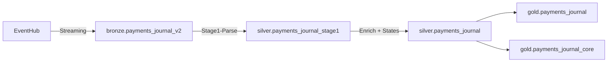
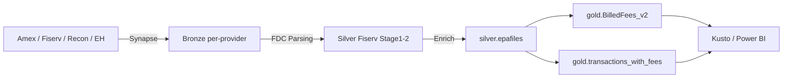
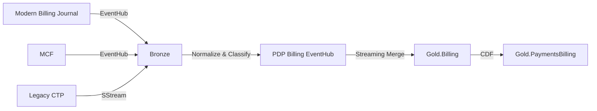
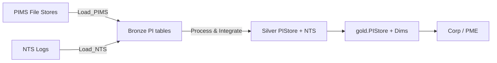
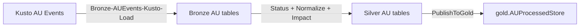
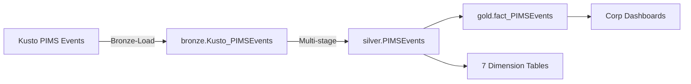
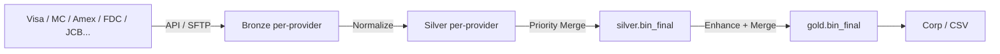

# PDP Data Flow and Lineage

## Overview

Data flows through PDP in a medallion pattern: **Bronze → Silver → Gold**.
Each domain has its own flow, but all follow consistent patterns.

## Streaming vs Batch Paths

### Streaming Path (Near Real-Time)
```
Source → EventHub → Spark Structured Streaming → Bronze Delta → Silver Delta → Gold Delta
```
- Latency: Minutes
- Used by: PaymentsJournal, BillingService (Modern), parts of PMT
- Trigger: `processingTime` (continuous) or `availableNow` (micro-batch)

### Batch Path (Scheduled)
```
Source → Blob/API/SStream → Synapse Pipeline → Bronze Delta → Silver Delta → Gold Delta
```
- Latency: Hours
- Used by: COP, BIN, parts of PMT, Legacy Billing
- Trigger: Synapse schedule triggers, Databricks cron jobs

## Per-Domain Data Flows

### Payment Transactions / Payments Journal (PMT/PJ)
```
EventHub (pdp-eventhub-prod-westus2-big) → Spark Streaming
  → bronze.payments_journal_v2
    → Silver Stage1 (Parse, Dedupe, Response Codes)
      → Silver Stage2-Enrich (BIN enrichment)
        → Silver Stage2-IntermediateStates (state flagging, 15-min trigger)
          → Silver Stage3-Final (Dynamic retry classification)
            → silver.payments_journal
              → gold.payments_journal (vNext schema, 0-sec microbatches)
              → gold.payments_journal_core (core dataset, 5-sec microbatches)
```

Secondary source: Cosmos historical data → `Bronze-Cosmos-Journals-to-EventHub.py`



- 3-stage Silver pipeline (Stage1-Parse → Stage2-Enrich/IntermediateStates → Stage3-Final)
- Supporting mapping tables: BIN map, payment method mappings, country codes, provider response codes, exchange rates
- Continuous streaming jobs via Databricks Asset Bundles

### Cost of Payments (COP)
```
Amex EPA Files  ─┐
Fiserv FDC Files ├→ Synapse Pipeline → Bronze (per-provider tables)
Recon Parquet   ─┤     → bronze.ReconNormalizedFeeData / _V2
EventHub (cop)  ─┘     → bronze.AmexFeeData
                        → bronze.FiservFeeData
  → Silver Stage1 (Fiserv Domestic: FDC003→FDC021 record types)
    → Silver Stage1 (Fiserv International: VCard, Interchange)
      → Silver Stage2 (Aggregate + Dedup)
        → silver.epafiles (Enriched with transaction match via MRN)
          → gold.BilledFees_v2 (EPA fee records)
          → gold.transactions_with_fees (transactions joined with fees)
          → gold.fact_transactions_with_fees (star schema fact)
          → 8 dimension tables (dim_fees_cop, dim_billing_cop, dim_bin_cop, etc.)
            → Kusto + Power BI Semantic Model
```



- Multi-provider ingestion (Amex, Fiserv Domestic/International, Recon Parquet, EventHub)
- Fiserv FDC record type parsing (FDC003 through FDC021)
- Star schema output with 8 dimension tables for the COP semantic model

### BillingService
```
Modern Billing Journal → EventHub → Bronze
  → Normalize (BillingTransformation) → PDP Billing EventHub
    → Gold.Billing (streaming merge via BillingGoldProcessor)

MCF (Modern Cash Flow) → EventHub → Bronze
  → Normalize → PDP Billing EventHub
    → Gold.Billing

Legacy CTP → SStream → Bronze
  → Normalize (LegacyClassifier → LegacyNormalizer → Publisher) → PDP Billing EventHub
    → Gold.Billing

Gold.Billing → CDF → Gold.PaymentsBilling
```

The **PDP Billing EventHub** acts as a Silver-equivalent normalization bus — all three
billing sources (Modern, MCF, Legacy) are normalized to a common schema before
publishing to this internal EventHub. This replaces a traditional Silver Delta table
with an event-driven pattern.



**Key modules in the normalization step:**
- **BillingTransformation** — schema mapping and field standardization
- **BillingDeduplication** — cross-source dedup before Gold merge
- **BillingEnrichment** — MCF ↔ ModernCommercial enrichment via `billed_reported` events
- **LegacyClassifier / LegacyNormalizer / Publisher** — Legacy CTP pipeline stages

### Network Tokenization (NT)
```
PIMS File Stores (Legacy: PaymentInstrumentExtensionStore, Modern: PaymentInstrumentStore)
NTS Logs (RequestLogs, CosmosDB, NotificationLogs, CustomLogs)
  → Bronze (Load_PIMS.py + Load_NTS.py)
    → bronze.PaymentInstrumentExtensionStore (PIMS Legacy)
    → bronze.PaymentInstrumentStore (PIMS Modern)
    → bronze.NTS_RequestLogs / CosmosDBLogs / NotificationLogs / CustomLogs
  → Silver (ProcessPIMS.py + ProcessNTS_RequestLogs.py + Process_Integrate_PIMS_NTS.py)
    → silver.PIStore
    → silver.nts_requestlogs
    → silver.PIM_NTS_Integrate_Store
  → Gold
    → gold.PIStore (main PI fact table)
    → gold.dimCard, gold.dimStatus (dimensions)
    → gold.ntsapimetrics (NTS API metrics)
    → gold.fact_Tokenization_metrics
      → Corp (PiStoreGoldToCorp.py, PublishNTSGoldToCorp.py)
```



- Daily pipeline: `Network_Tokenization_Main_Pipeline_Databricks.yml`
- PIMS has Legacy and Modern variants with separate processing paths
- Integration step merges PI + NTS data for combined metrics

### Account Updater (AU)
```
Kusto AU Event Tables (9+ tables)
  → AUReadCandidateStoreEvents, AUCandidateSelectedEvents,
    AUInvalidPIEvents, AUCandidateSentToProcessorEvents,
    AUCandidateReceivedFromProcessorEvents, AUInstrumentReceivedEvents,
    AUPIUpdateEvents, AUPIMSPostIncomingCallEvents
  → Bronze (Bronze-AUEvents-Kusto-Load.py)
    → bronze.AUCandidateStoreEvents, bronze.AUCandidateSelectedEvents, etc.
  → Silver
    → silver.AUStatusStore (Silver-AUEventStatus-Process.py)
    → silver.AUProcessedStore (Silver-AUNormalizedEvents-Process.py)
    → silver.AUImpactedPIStore (Silver-AUImpactedEvents-Process.py)
  → Gold
    → gold.AUProcessedStore (Silver-AUNormalizedEvents-PublishToGold.py)
```



- Daily pipeline: `AccountUpdater_Daily_Databricks.yml` (01:00 AM PT)
- Source is Kusto (not EventHub) — reads from 9+ AU event tables
- Multi-step Silver: Status tracking → Normalization → Impact analysis → Gold publish

### Fraud / PIMS Events
```
Kusto PIMS Events table
  → Bronze (Bronze-Load-PIMSEvents-Process.py)
    → bronze.Kusto_PIMSEvents
  → Silver (multi-stage)
    → silver.PIMSEvents_AddCreditCardOperationUberEvent
    → silver.PIMSEvents (main processed events)
    → silver.PIMSEvents_Retry (retry handling)
  → Gold (star schema with 7 dimensions + 1 fact)
    → gold.fact_PIMSEvents (fact table)
    → gold.dim_pimsevents_addpi, _bin, _geo, _payment,
      _paymentmethod, _evaluationresult, _hasevaluationdetails
      → Corp (PublisFraudGoldToCorp.py)
```



- Source is Kusto (not EventHub) — reads from PIMS Events table
- Star schema output: 1 fact table + 7 dimension tables
- Part of the PaymentInstrument domain (same repo)

### BIN
```
10+ Card Network Providers (via API, SFTP, Files)
  Visa, MasterCard, Amex, FDC, JCB, Discover, ChinaUnionPay, ELO, Skype, BINBase
  → Bronze (per-provider download + load)
    → bronze.bin_visa, bronze.bin_mastercard, bronze.bin_amex, bronze.bin_fdc,
      bronze.bin_jcb, bronze.bin_discover, bronze.bin_cup, bronze.bin_elo, etc.
  → Silver (per-provider normalization)
    → silver.bin_visa, silver.bin_mastercard, silver.bin_amex, etc.
    → Silver-MergeProcessedBINFiles.py (priority-based merge, 11-level priority)
      → silver.binlist_all (all providers merged)
      → silver.bin_final
  → Gold (Gold-Bin_Final.py → BINProcessor → Enhancer → Merger)
    → gold.bin_final (main business-facing BIN table)
    → gold.bin_lineage (audit trail with source attribution)
    → gold.transactions_bin_history
      → Corp (PublishBINGoldToCorp_v2.py) + CSV export
```



- 10+ provider normalization workflows with provider-specific parsers
- Priority-based merge in Silver (ELO:100 → Skype:800) — higher priority wins
- Dual-table rollout strategy: active + shadow for canary testing
- Orchestrated via Synapse Master Pipeline (`BIN_Master_Databricks.json`)

## Lineage Tracking

- **Delta Lake time travel**: All tables support versioning via Delta Lake
- **CDF (Change Data Feed)**: Enabled on key tables for incremental downstream processing
- **Pipeline metadata**: Synapse pipeline run IDs and Databricks job run IDs tracked in records
- **Watermarks**: Processing watermarks stored in state tables for exactly-once semantics
